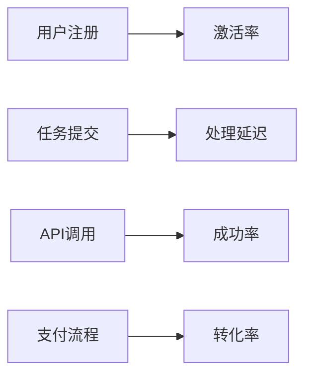
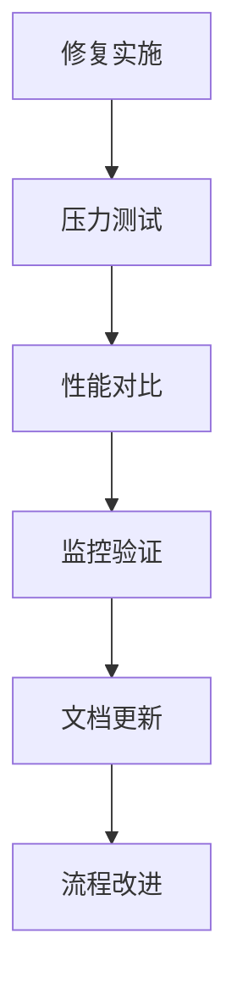

## 前言

在构建和维护MCP应用的过程中，我们常常专注于开发、部署和优化，却忽略了系统健康监控这一关键环节。就像建造了一座华丽的大桥却没安装桥面传感器一样，当问题出现时，我们只能被动应对而非主动预防。本文将深入探讨MCP系统的监控体系设计与故障排查实战经验，帮助大家构建真正可靠的MCP应用。

::: tip
监控不是成本，而是投资。良好的监控体系能将平均故障修复时间(MTTR)缩短60%以上。
:::

## MCP监控体系架构

### 监控金字塔模型

一个完整的MCP监控系统应该包含三个层次：

```
┌─────────────────────────────────┐
│      业务层监控                 │
│  - 用户体验指标                 │
│  - 业务关键流程                 │
└─────────────────────────────────┘
┌─────────────────────────────────┐
│      应用层监控                 │
│  - 服务响应时间                 │
│  - 错误率与异常                 │
│  - 资源利用率                   │
└─────────────────────────────────┘
┌─────────────────────────────────┐
│      基础设施监控               │
│  - 服务器性能                   │
│  - 网络延迟                     │
│  - 存储I/O                      │
└─────────────────────────────────┘
```

### 关键监控指标

#### 1. 技术指标

| 指标类型 | 监控工具 | 告警阈值 | 告警级别 |
|---------|---------|---------|---------|
| 服务响应时间 | Prometheus + Grafana | >2s | 警告 |
| 错误率 | ELK Stack | >5% | 严重 |
| 连接池使用率 | 自定义脚本 | >80% | 警告 |
| 内存泄漏 | JProfiler/Valgrind | 持续增长 | 严重 |

#### 2. 业务指标



## 实战：MCP故障排查五步法

### 第一步：问题定位

当收到告警时，立即执行以下操作：

```bash
# 检查服务状态
systemctl status mcp-service

# 查看最近日志
tail -f /var/log/mcp/error.log | grep -i "ERROR"

# 检查资源使用
top -p $(pgrep -f mcp-service)
```

### 第二步：根因分析

使用"5个为什么"技术深入分析：

1. 为什么服务响应慢？→ 数据库查询超时
2. 为什么数据库查询慢？→ 缺少索引
3. 为什么缺少索引？→ 部署脚本遗漏
4. 为什么遗漏？→ 自动化测试覆盖不足
5. 为什么覆盖不足？→ 测试策略设计缺陷

### 第三步：临时缓解

在找到根本解决方案前，实施临时措施：

```yaml
# 配置降级策略
circuit_breaker:
  enabled: true
  failure_threshold: 5
  recovery_timeout: 30s
  fallback_service: "legacy-mcp"
```

### 第四步：永久修复

根据根因分析实施修复：

1. 优化数据库索引
2. 增加缓存层
3. 重构慢查询逻辑
4. 完善自动化测试

### 第五步：验证与预防



## 典型故障案例分析

### 案例1：内存泄漏导致的雪崩

**现象**：服务响应时间从50ms逐步恶化至5s，最终超时

**排查过程**：
1. 使用`jmap -histo`分析内存快照
2. 发现`HashMap`对象持续增长
3. 定位到未关闭的数据库连接池

**解决方案**：
```java
// 修复前
public void processData() {
    Connection conn = dataSource.getConnection();
    // 使用conn但不关闭
}

// 修复后
public void processData() {
    try (Connection conn = dataSource.getConnection()) {
        // 使用conn
    } catch (SQLException e) {
        log.error("Connection error", e);
    }
}
```

### 案例2：网络分区导致的脑裂

**现象**：服务集群出现不一致状态

**排查过程**：
1. 检查ZooKeeper节点状态
2. 发现网络分区导致节点间通信中断
3. 验证CAP理论下的取舍问题

**解决方案**：
```yaml
# 配置分区容忍策略
mcp:
  cluster:
    partition_tolerance: "majority"
    heartbeat_interval: 2s
    session_timeout: 10s
```

## 监控工具链推荐

### 开源监控栈

1. **指标收集**：Prometheus + Node Exporter
2. **日志聚合**：ELK Stack (Elasticsearch + Logstash + Kibana)
3. **可视化**：Grafana + Mimir
4. **APM**：SkyWalking + Jaeger

### 商业解决方案

| 工具 | 适用场景 | 优势 |
|------|---------|------|
| Datadog | 全栈监控 | AI异常检测 |
| New Relic | 应用性能 | 深度代码追踪 |
| Dynatrace | 智能运维 | 自动根因分析 |

## 结语

构建完善的MCP监控系统不是一蹴而就的工作，而是一个持续演进的过程。记住：

> 监控系统的价值不在于记录问题，而在于预防问题。当你的监控系统不再频繁告警时，才是它真正发挥作用的时刻。

建议从今天开始，为你的MCP应用添加至少三个关键监控指标，并建立告警机制。随着系统规模扩大，逐步完善监控体系，最终实现从被动响应到主动预防的转变。

::: right
"监控不是终点，而是持续优化的起点" —— 来自运维团队的经验之谈
:::