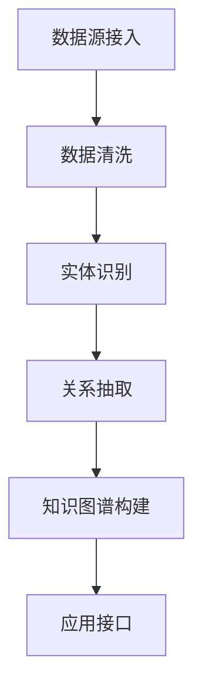

## 前言

最近在处理企业客户的数据整合项目时，我遇到了一个典型挑战：如何将分散在各个系统中的非结构化数据（如文档、邮件、聊天记录等）转化为有价值的知识资产。~~说实话，传统方法真的让人头大，各种ETL工具和脚本写到手软~~。幸运的是，MCP平台提供了一套优雅的解决方案，让我能够构建高效的知识图谱系统。

今天我想和大家分享如何利用MCP处理非结构化数据并构建知识图谱，这可能是企业数字化转型中最有价值的应用之一。

## 为什么非结构化数据处理如此重要？

在大多数企业中，超过80%的数据是非结构化的，包括：

- 📄 文档和报告（Word、PDF、PPT等）
- 💬 邮件和即时消息
- 📝 会议记录和笔记
- 🖼️ 图像和视频
- 🎵 音频内容

这些数据蕴含着大量业务洞察，但传统的关系型数据库难以有效处理它们。

::: tip
非结构化数据处理的关键挑战在于：如何从无序的数据中提取有意义的信息，并将其转化为结构化的知识。
:::

## MCP在非结构化数据处理中的优势

MCP平台在处理非结构化数据方面具有独特优势：

### 1. 统一的数据接入层

```markdown
MCP提供了标准化的数据连接器，可以轻松接入各种非结构化数据源：

- 文档存储系统（SharePoint、Google Drive等）
- 企业通信工具（Slack、Teams、邮件系统等）
- 内容管理系统（CMS、Wiki等）
- 数据库中的非结构化字段
```

### 2. 智能数据提取能力

通过MCP的内置AI引擎，我们可以：

- **实体识别**：自动识别文本中的人名、地名、组织名等
- **关系抽取**：发现实体之间的关联关系
- **语义理解**：理解文本的深层含义和上下文
- **情感分析**：判断文本的情感倾向

### 3. 灵活的数据处理流程

MCP允许我们构建复杂的数据处理管道：



## 使用MCP构建知识图谱的实践指南

### 第一步：数据接入与预处理

```python
# 示例：使用MCP接入企业文档
from mcp import DocumentConnector, DataProcessor

# 初始化文档连接器
doc_connector = DocumentConnector(
    source_type="sharepoint",
    connection_params={
        "site_url": "https://enterprise.sharepoint.com/sites/docs",
        "credentials": "service_account"
    }
)

# 获取文档列表
documents = doc_connector.get_documents(document_types=[".docx", ".pdf", ".txt"])
```

### 第二步：实体与关系提取

```python
# 使用MCP的NLP引擎提取实体和关系
nlp_processor = DataProcessor("nlp")

for doc in documents:
    # 提取实体
    entities = nlp_processor.extract_entities(doc.content)
    
    # 提取关系
    relations = nlp_processor.extract_relations(doc.content, entities)
    
    # 存储到临时数据库
    store_entities_and_relations(entities, relations)
```

### 第三步：知识图谱构建

```python
# 使用MCP的知识图谱组件构建图谱
from mcp import KnowledgeGraphBuilder

kg_builder = KnowledgeGraphBuilder(
    graph_type="neo4j",  # 可选neo4j、amazon Neptune等
    connection_params={
        "uri": "bolt://kg-server:7687",
        "credentials": {"username": "neo4j", "password": "password"}
    }
)

# 构建知识图谱
kg_builder.build_from_entities(entities, relations)
```

### 第四步：知识应用与查询

```python
# 示例：查询知识图谱
from mcp import KnowledgeGraphQuery

kg_query = KnowledgeGraphQuery(connection_params=...)

# 查询特定实体的相关信息
entity_info = kg_query.query_entity_info("产品X")

# 查询实体间的关系
relations = kg_query.query_relations("部门A", "部门B")
```

## 实际应用场景

### 1. 企业知识管理

通过构建企业知识图谱，可以实现：

- 📚 **智能问答**：基于企业知识库的智能问答系统
- 🔍 **知识发现**：发现隐藏在文档中的知识关联
- 📈 **决策支持**：基于知识图谱的业务决策支持

### 2. 客户服务优化

利用知识图谱可以：

- 💡 **智能客服**：基于知识图谱的智能客服系统
- 🎯 **客户画像**：构建360度客户视图
- 🔄 **服务流程优化**：识别服务瓶颈和优化机会

### 3. 研发知识管理

在研发领域，知识图谱可以：

- 🔬 **技术关联分析**：发现技术间的关联关系
- 📊 **创新趋势预测**：基于知识图谱的技术趋势分析
- 🛠️ **专利管理**：智能化的专利分析和挖掘

## 性能优化与最佳实践

在构建大规模知识图谱时，需要注意以下几点：

### 1. 数据分片与并行处理

```python
# 使用MCP的并行处理能力
from mcp import ParallelProcessor

parallel_processor = ParallelProcessor(
    workers=8,  # 根据CPU核心数调整
    chunk_size=100
)

# 并行处理文档
processed_docs = parallel_processor.process(documents, nlp_processor.process)
```

### 2. 知识图谱更新策略

对于动态变化的非结构化数据，我们需要：

- **增量更新**：只处理新增或变更的数据
- **定期全量更新**：定期进行全量数据重新处理
- **版本控制**：维护知识图谱的版本历史

### 3. 查询优化

```python
# 使用MCP的查询优化功能
from mcp import QueryOptimizer

query_optimizer = QueryOptimizer()

# 优化复杂查询
optimized_query = query_optimizer.optimize(
    original_query="MATCH (p:Product)-[:RELATED_TO]->(t:Technology) WHERE t.name='AI' RETURN p",
    graph_schema=kg_schema
)
```

## 安全与合规考虑

在处理企业敏感数据时，必须考虑：

### 1. 数据脱敏

```python
# 使用MCP的数据脱敏功能
from mcp import DataAnonymizer

anonymizer = DataAnonymizer(
    patterns=[
        "PERSON_NAME",
        "EMAIL_ADDRESS",
        "PHONE_NUMBER"
    ]
)

anonymized_data = anonymizer.process(documents)
```

### 2. 访问控制

MCP提供了细粒度的访问控制机制：

- **基于角色的访问控制**：不同角色有不同的查询权限
- **数据分级**：敏感数据需要特殊权限才能访问
- **审计日志**：记录所有查询和操作

## 结语

通过MCP平台构建非结构化数据处理和知识图谱系统，企业可以：

1. **释放非结构化数据的价值**：将分散的文档和内容转化为结构化知识
2. **提升决策质量**：基于全面的知识图谱做出更明智的决策
3. **加速创新**：发现隐藏的知识关联，促进创新思维

在数字化转型过程中，知识将成为企业最重要的资产之一。MCP为我们提供了一套强大而灵活的工具，让构建智能知识系统变得前所未有的简单。

> 正如一位行业专家所说："未来的企业竞争，本质上是知识获取和应用能力的竞争。"

如果你正在考虑如何更好地利用企业中的非结构化数据，MCP的知识图谱构建能力绝对值得一试！

---

*本文是基于实际项目经验的分享，如果你有任何问题或想进一步讨论，欢迎在评论区留言交流！* 🤝