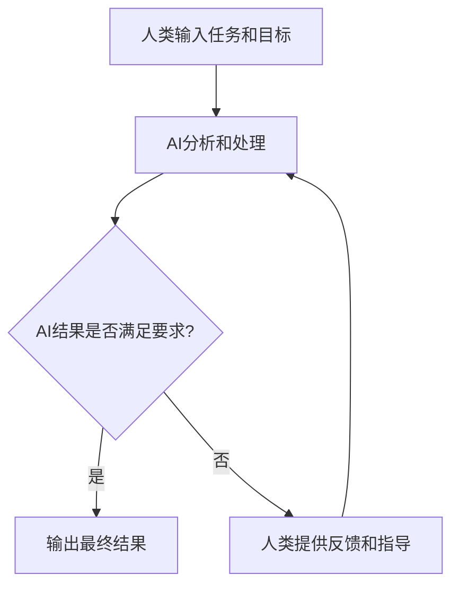

## 前言

随着人工智能技术的快速发展，我们常常听到关于AI将取代人类工作的担忧。然而，一个更现实且更有前景的方向是探索AI与人类如何协作，形成互补的智能系统。在这种协作模式中，AI负责处理大规模数据分析、模式识别和重复性任务，而人类则提供创造力、伦理判断和情境理解。

> "真正的智能不是人类或机器单独拥有的，而是当它们有效结合时产生的。" — AI研究先驱

本文将探讨AI与人类协作的重要性、实现方式以及未来发展方向。

## 为什么需要AI与人类协作

### 1. 互补优势

人类和AI各自拥有独特的优势：

- **人类优势**：
  - 创造力和直觉
  - 伦理判断和价值观
  - 情境理解和常识推理
  - 适应性和灵活性

- **AI优势**：
  - 处理大规模数据的能力
  - 高速计算和模式识别
  - 不受疲劳和情绪影响
  - 可扩展性和一致性

通过协作，我们可以结合这些优势，创造出比任何一方单独工作更强大的系统。

### 2. 复杂问题解决

当今世界面临的许多问题（如气候变化、疾病防控、资源分配）极其复杂，需要多学科知识和综合判断。AI与人类的协作能够提供更全面的解决方案。

### 3. 伦理和责任

AI系统在做出重要决策时（如医疗诊断、司法判决），需要人类的伦理监督和责任承担。协作模式确保了AI决策的透明度和可解释性。

## AI与人类协作的实现方式

### 1. 人机交互界面设计

有效的人机协作始于良好的交互设计：

- **直观的界面**：设计易于理解的AI输出，使人类能够快速把握关键信息。
- **反馈机制**：允许人类对AI的决策提供反馈，并用于改进系统。
- **可解释性**：AI系统应能解释其决策过程，增强人类的信任和理解。

### 2. 协作算法

技术层面，有几种实现AI与人类协作的算法模式：

- **主动学习**：AI识别其不确定性高的区域，并主动请求人类输入。
- **人机混合决策**：AI提供建议，人类做出最终决策。
- **强化学习与人类反馈**：RLHF，如ChatGPT等大模型采用的训练方法，通过人类反馈优化AI行为。

### 3. 协作工作流

建立有效的人机协作工作流：

## 实际应用案例

### 1. 医疗诊断

在医疗领域，AI可以分析医学影像和患者数据，识别潜在疾病模式，而医生则结合临床经验和患者具体情况做出最终诊断和治疗决策。

### 2. 创意设计

设计师可以使用AI工具生成初步设计概念，然后基于这些概念进行创造性修改和完善，结合人类的审美和创意。

### 3. 科学研究

AI可以帮助科学家分析大量实验数据，发现潜在模式和关联，而科学家则提供假设验证和理论解释。

### 4. 客户服务

AI可以处理常见查询和简单任务，而人类客服则处理复杂情况和需要情感智能的互动。

## 挑战与解决方案

### 1. 信任建立

**挑战**：人类可能不信任AI的建议或决策。

**解决方案**：
- 提高AI系统的透明度和可解释性
- 展示AI的决策依据和置信度
- 逐步建立AI系统的可靠性和准确性记录

### 2. 技能差距

**挑战**：人类需要学习如何有效使用AI工具。

**解决方案**：
- 提供直观易用的AI工具
- 开展人机协作技能培训
- 设计"AI辅助"工作流程，降低使用门槛

### 3. 责任界定

**挑战**：在协作决策中，责任如何分配。

**解决方案**：
- 明确AI系统的决策边界和人类监督的必要性
- 建立人机协作的伦理准则和法规框架
- 设计可追溯的决策记录系统

## 未来展望

随着AI技术的不断进步，AI与人类协作将变得更加无缝和自然：

### 1. 更自然的交互

未来的AI系统将能够理解人类的自然语言、手势和表情，实现更直观的交互方式。

### 2. 自适应协作

AI系统将能够根据人类用户的特点和偏好，自动调整协作方式，提供个性化的支持。

### 3. 增强人类能力

AI将不仅是工具，还会成为人类能力的扩展，帮助我们突破认知和创造力的限制。

### 4. 集体智能

通过大规模的人机协作网络，我们可以形成超越个体和单一AI系统的集体智能，解决全球性挑战。

## 结语

AI与人类协作不是未来的科幻概念，而是正在实现的现实。通过合理设计和有效实施，我们可以创建真正互补的智能系统，在保留人类创造力和价值观的同时，利用AI的计算能力和效率。

> "技术的真正价值不在于替代人类，而在于增强人类的能力和可能性。" — AI伦理专家

作为开发者和使用者，我们有责任确保AI与人类的协作是公平、透明和有益的。这不仅需要技术创新，还需要跨学科合作和深思熟虑的伦理考量。

在这个人机协作的新时代，我们不应问"AI能取代什么工作"，而应问"我们如何与AI一起创造更美好的未来"。通过这种思维转变，我们可以共同构建一个人类和AI和谐共存的智能世界。