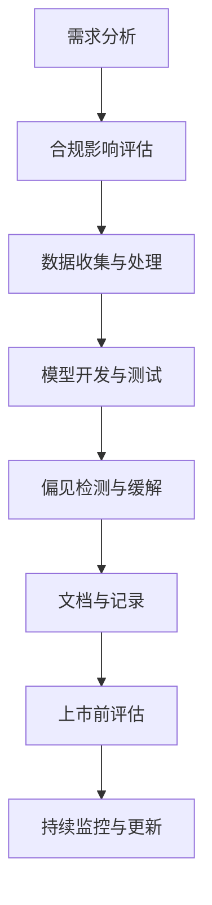

## 前言

随着人工智能技术的迅猛发展，各国政府、监管机构和国际组织正积极构建相应的法律和监管框架。作为AI从业者，我们不仅要关注技术创新，更要理解并适应这些不断演变的合规要求。本文将带你探索AI法律与监管的复杂世界，了解如何在这个日益规范化的环境中构建负责任的AI应用。

::: tip
"AI监管不是创新的障碍，而是确保技术向善的保障。"
:::

## 全球AI法律与监管概况

AI法律与监管正在全球范围内迅速发展，形成了多样化的监管模式：

### 欧盟模式：全面立法

欧盟走在AI监管的前沿，其《人工智能法案》(AI Act)采用了基于风险的分级监管方法：

- **不可接受风险**：禁止社会评分等完全不可接受的AI应用
- **高风险**：严格要求，包括上市前评估、数据治理、技术文档等
- **有限风险**：要求透明度义务，如聊天机器人必须表明自己是AI
- **最小风险**：基本不设限制，鼓励创新

### 美国模式：行业自律与有限监管

美国采取了更为分散的监管方式：

- **行业特定监管**：如FDA对医疗AI的监管
- **消费者保护法**：FTC对不公平AI实践的监管
- **行政命令**：拜登政府的AI行政命令提出了关键原则和领域

### 中国模式：发展与安全并重

中国的AI监管体现了发展与安全的平衡：

- 《生成式人工智能服务管理暂行办法》规范了生成式AI
- 《数据安全法》和《个人信息保护法》为AI数据使用提供框架
- 强调自主创新与安全可控

## 主要监管框架和原则

### 风险为本的监管框架

大多数监管框架都采用了风险为本的方法：

::: theorem
AI应用风险等级分类：
1. **高风险**：影响基本权利和安全的应用（如医疗诊断、自动驾驶）
2. **有限风险**：特定交互要求的应用（如聊天机器人）
3. **最小风险**：低风险应用，鼓励创新
:::

### 核心监管原则

尽管各国具体规定不同，但普遍遵循以下原则：

1. **透明度**：AI系统应能解释其决策过程
2. **公平性**：避免算法偏见和歧视
3. **问责制**：明确AI系统的责任归属
4. **数据保护**：确保数据收集和使用的合法合规
5. **人类监督**：保持人类对关键决策的最终控制权

### 数据治理要求

数据是AI的燃料，各国对数据治理提出了严格要求：

- **数据来源合法性**：确保训练数据的合法获取
- **数据质量**：要求数据准确、完整且相关
- **数据安全**：防止数据泄露和滥用
- **数据权利**：保障个人对自身数据的访问、更正和删除权

## 对AI企业的实际影响

### 合规成本增加

AI监管直接增加了企业的合规成本：

- **技术合规**：开发可解释AI系统、偏见检测工具等
- **人力成本**：设立合规团队、法务顾问等
- **认证成本**：产品上市前的评估和认证费用

### 产品开发流程重构

企业需要重新设计AI产品开发流程：

### 新的商业机会

监管同时也创造了新的商业机会：

- **合规咨询服务**：帮助企业理解和满足监管要求
- **AI审计工具**：开发检测AI系统偏见和风险的工具
- **隐私增强技术**：如联邦学习、差分隐私等技术
- **AI治理平台**：提供端到端的AI治理解决方案

## 未来发展趋势

### 监管技术的兴起

监管技术(RegTech)将成为重要发展方向：

- **AI监管沙盒**：提供受控环境测试创新AI应用
- **实时监控系统**：持续监控AI系统的性能和风险
- **合规自动化**：自动化合规检查和报告生成

### 国际合作与协调

随着AI应用的全球化，国际监管协调将变得日益重要：

- **AI标准制定**：如ISO/IEC JTC 1/SC 42人工智能标准化
- **跨境数据流动**：如APEC跨境隐私规则体系
- **全球AI治理框架**：类似气候变化的多边协议

### 行业自律与标准

除了政府监管，行业自律也将发挥重要作用：

- **行业最佳实践**：如IEEE的《人工智能伦理设计标准》
- **认证体系**：第三方AI系统认证
- **行业联盟**：如Partnership on AI等组织

## 结语

AI法律与监管正在从边缘走向主流，成为AI发展不可或缺的一部分。作为AI从业者，我们需要：

1. **主动学习**：持续关注监管动态，将其视为专业素养的一部分
2. **合规设计**：在产品开发早期就考虑合规要求
3. **透明沟通**：向用户和监管机构清晰解释AI系统的工作原理
4. **负责任创新**：在追求技术突破的同时，不忘社会责任

> "技术发展需要自由空间，但自由不等于无序。AI法律与监管不是创新的枷锁，而是确保技术造福人类的指南针。"

在这个AI与法律日益交织的时代，理解并适应监管框架将成为AI从业者的核心竞争力之一。让我们携手构建既创新又负责任的AI未来。

---

*本文仅为信息分享，不构成法律建议。具体合规问题请咨询专业法律顾问。*