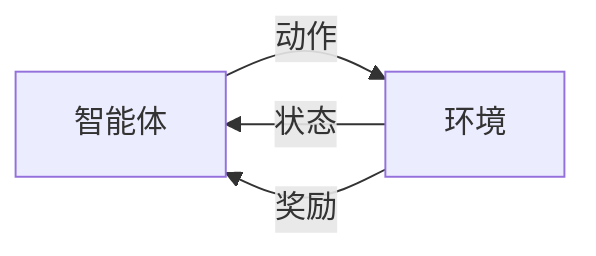

## 前言

在人工智能的宏伟蓝图中，我们已探索了机器学习的统计基石和深度学习的神经网络魔法。但AI的世界远不止于此——想象一个能通过不断试错自我提升的智能系统，这就是强化学习的魅力所在。今天，让我们揭开这个让AI学会"生存与进化"的神秘面纱。

> "强化学习不是教机器如何做事，而是让它学会如何做出正确的事。"  
> —— Richard Sutton & Andrew Barto

## 什么是强化学习？

强化学习（Reinforcement Learning, RL）是机器学习的一个重要分支，它不同于监督学习（需要标注数据）和无监督学习（发现数据结构），而是让智能体（Agent）通过与环境（Environment）交互来学习最优行为策略。

🎯 **核心思想**：智能体在环境中执行动作，获得奖励或惩罚，目标是最大化累积奖励



## 强化学习的核心要素

### 1. 智能体（Agent）
决策者，根据当前状态选择动作
- 🧠 大脑：策略函数（Policy）
- 🎯 目标：最大化长期奖励

### 2. 环境（Environment）
智能体交互的外部系统
- 🌍 提供状态（State）
- 📦 接收动作（Action）
- 💰 返回奖励（Reward）

### 3. 奖励信号（Reward）
学习的"指南针"
- 即时反馈：+1/-1
- 延迟奖励：围棋中的胜利
- 稀疏奖励：自动驾驶中的安全行驶

## 强化学习的算法家族

### 值函数方法
- Q-Learning：学习状态-动作值函数
- SARSA：考虑动作选择策略
- DQN：深度Q网络，处理高维状态空间

```python
# Q-Learning伪代码
for episode in range(total_episodes):
    state = env.reset()
    while not done:
        action = choose_action(state)  # ε-贪婪策略
        next_state, reward, done, _ = env.step(action)
        Q[state][action] += α * (reward + γ * max(Q[next_state]) - Q[state][action])
        state = next_state
```

### 策略梯度方法
- 直接优化策略参数
- 适用于连续动作空间
- 代表算法：REINFORCE, A2C, PPO

### 模型基础方法
- 学习环境模型进行规划
- 结合值函数和策略方法
- 代表算法：AlphaGo, MuZero

## 强化学习的应用场景

| 领域 | 应用案例 | 技术亮点 |
|------|----------|----------|
| 🎮 游戏 | AlphaGo击败李世石 | 蒙特卡洛树搜索 + 策略网络 |
| 🚗 自动驾驶 | 车道保持与决策 | 端到端强化学习 |
| 🤖 机器人 | 机械臂抓取 | 模拟训练 + 迁移学习 |
| 💹 金融 | 量化交易 | 风险调整奖励函数 |
| 🏥 医疗 | 治疗方案优化 | 多目标强化学习 |

## 实践挑战与解决方案

### 挑战1：探索与利用的平衡
- 🧭 **问题**：过度利用已知好动作 vs 冒险探索新动作
- 💡 **解决方案**：ε-贪婪策略、UCB算法、好奇心驱动探索

### 挑战2：奖励稀疏性
- 🎯 **问题**：任务完成前缺乏有效奖励信号
- 💡 **解决方案**：奖励塑形（Reward Shaping）、内在奖励机制

### 挑战3：样本效率
- 📉 **问题**：需要大量交互数据训练
- 💡 **解决方案**：模仿学习、离线强化学习、元学习

## 结语

强化学习为我们打开了通往通用人工智能的又一扇门。它教会我们：真正的智能不是被编程出来的，而是在与环境互动中"成长"出来的。从游戏AI到自动驾驶，从机器人到医疗决策，RL正在重塑我们与机器的协作方式。

> "强化学习不是让机器模仿人类，而是让机器学会如何成为更好的决策者。"  
> —— Jorgen

未来，随着多智能体强化学习、分层强化学习和可解释RL的发展，我们将见证更复杂、更可靠的AI系统诞生。准备好迎接这场由试错驱动的智能革命了吗？