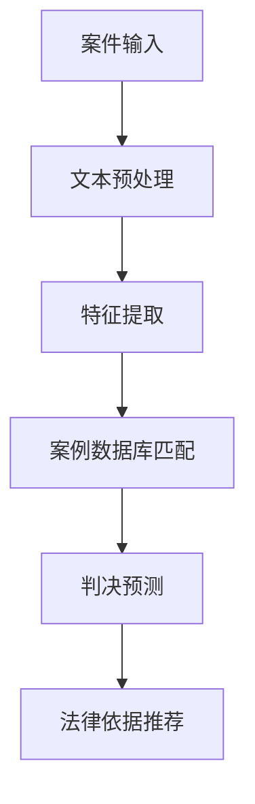

## 前言

随着人工智能技术的迅猛发展，各行各业都在经历深刻的变革。法律领域作为社会秩序的基石，其数字化转型和智能化升级显得尤为重要。在众多AI应用领域中，司法与法律领域的应用虽然起步较晚，但发展速度惊人，正以前所未有的方式重塑着法律实践、司法效率和法律服务模式。

> "法律不是静止的，而是随着社会的发展而不断演进的。AI技术为法律注入了新的活力，使其能够更好地适应数字时代的需求。" —— 法律科技先驱观点

本文将深入探讨AI在司法与法律领域的具体应用，分析其技术实现、应用场景、面临的挑战以及未来发展趋势，为法律从业者和AI技术爱好者提供全面的视角。

## AI在司法领域的应用

### 智能案件分析与预测

AI技术在案件分析方面的应用已经取得了显著成果。通过自然语言处理和机器学习算法，AI系统能够：

- **法律文本分析**：自动分析大量法律文书、判例和法规，提取关键信息
- **案例相似性匹配**：根据新案件的特征，快速匹配历史相似案例
- **判决结果预测**：基于历史数据预测可能的判决结果和量刑范围

### 智能证据审查与事实认定

在司法实践中，证据审查是案件处理的关键环节。AI技术可以：

- **电子证据分析**：从大量电子数据中提取有效证据
- **证言真实性评估**：通过语音分析和微表情识别辅助判断证言真实性
- **证据链完整性检查**：自动验证证据之间的逻辑关系和完整性

### 司法流程自动化

AI可以大幅提升司法流程的效率和一致性：

- **案件分配**：根据案件类型和法官专长自动分配案件
- **流程监控**：实时跟踪案件处理进度，自动提醒关键节点
- **文书生成**：自动生成标准格式的法律文书和判决书

## AI在法律实践中的应用

### 智能法律咨询

AI法律咨询系统正在改变传统的法律服务模式：

- **在线法律咨询机器人**：24/7提供基础法律咨询服务
- **法律问题分类**：自动识别用户问题的法律领域和紧急程度
- **解决方案推荐**：基于案例和法律条文推荐可能的解决方案

### 智能合同管理

智能合同是AI在法律领域的重要应用之一：

- **合同起草**：根据用户需求自动生成标准化合同
- **合同审查**：自动检测合同中的风险条款和不合规内容
- **合同执行监控**：跟踪合同履行情况，自动提醒履行义务

### 法律研究与知识管理

AI技术正在革新法律研究和知识管理方式：

- **法律文献检索**：语义搜索技术实现更精准的法律文献检索
- **知识图谱构建**：构建法律领域的知识图谱，展示法律概念之间的关系
- **最新法律动态追踪**：自动监控法律法规变化，及时推送更新信息

## 技术实现与案例分析

### 核心技术架构

一个完整的AI法律系统通常包含以下技术组件：

| 技术组件 | 功能描述 | 应用案例 |
|---------|---------|---------|
| 自然语言处理 | 法律文本理解和生成 | 判例分析、文书起草 |
| 机器学习 | 模式识别和预测 | 判决预测、风险评估 |
| 知识图谱 | 法律知识表示和推理 | 法律咨询、法规查询 |
| 数据挖掘 | 大规模法律数据分析 | 类案推荐、趋势分析 |
| 区块链 | 合同存证和执行 | 智能合约、证据保全 |

### 典型应用案例

1. **ROSS Intelligence**：首个将AI应用于法律研究的系统，能够理解自然语言法律问题并提供答案。

2. **DoNotPay**：被称为"世界上第一个机器人律师"，帮助用户处理停车罚单、租房纠纷等法律问题。

3. **中国"智慧法院"**：利用AI技术实现案件智能分流、文书自动生成和庭审语音转写等功能。

4. **IBM Watson for Law**：提供法律研究和合同分析功能，帮助律师提高工作效率。

## 挑战与伦理考量

### 技术挑战

AI在法律领域的应用面临诸多技术挑战：

- **法律知识的表示与推理**：法律知识的复杂性和模糊性给AI系统带来挑战
- **数据质量与隐私**：法律数据的敏感性和质量直接影响AI系统性能
- **系统可解释性**：AI决策过程的不透明性影响法律应用的信任度

### 伦理与法律问题

AI在法律领域的应用也引发了一系列伦理和法律问题：

- **责任归属**：当AI系统提供错误法律建议时，责任如何界定
- **算法偏见**：AI系统可能继承训练数据中的偏见，影响司法公正
- **职业影响**：AI是否会取代律师和法官的工作

### 监管与规范

为确保AI在法律领域的健康发展，需要建立相应的监管框架：

- **技术标准**：制定AI法律系统的技术标准和评估方法
- **伦理准则**：明确AI在法律应用中的伦理边界和责任
- **法律保障**：完善相关法律法规，保障AI应用的合法性和安全性

## 未来发展趋势

### 深度学习与法律推理的结合

随着深度学习技术的发展，AI系统将更好地理解和应用复杂的法律推理过程：

- **法律逻辑建模**：构建更精确的法律逻辑模型
- **多模态法律分析**：结合文本、图像和视频等多种形式的法律证据
- **动态法律知识更新**：实时学习和更新法律知识，适应法律变化

### 人机协作的法律服务模式

未来的法律服务将是人机协作的模式：

- **AI辅助决策**：AI提供数据支持和建议，人类做出最终决策
- **个性化法律服务**：结合AI的效率和人类律师的个性化理解
- **普惠法律服务**：通过AI技术降低法律服务的成本，提高可及性

### 跨领域融合的法律科技

AI法律应用将与其他技术深度融合：

- **区块链+法律**：构建去中心化的法律服务和证据系统
- **元宇宙+法律**：虚拟环境中的法律问题解决机制
- **生物识别+法律**：更精确的身份认证和行为分析

## 结语

AI在司法与法律领域的应用正处于快速发展阶段，它正在深刻改变传统的法律实践和服务模式。尽管面临技术、伦理和法律等多方面的挑战，但AI无疑为法律领域带来了前所未有的机遇。

未来，随着技术的不断进步和应用的深入，AI将更加智能、可靠和可解释，为法律行业带来更大的价值。法律从业者需要积极拥抱这一变革，掌握相关技术，与AI系统协同工作，共同构建更加高效、公正和普惠的法律服务体系。

正如一位法律科技专家所言："AI不会取代律师，但使用AI的律师将取代不使用AI的律师。"在这个智能化时代，法律行业的未来属于那些能够将AI技术与法律专业知识深度融合的创新者。

---

## 个人建议

对于想要进入AI法律领域的从业者或开发者，我建议：

1. **跨学科学习**：同时掌握法律知识和AI技术，成为复合型人才
2. **关注实际需求**：从法律实践中的痛点出发，寻找AI应用的切入点
3. **重视伦理考量**：在技术开发过程中始终关注法律和伦理问题
4. **持续学习更新**：AI和法律领域都在快速发展，保持学习的热情和能力

通过共同努力，我们可以期待AI技术在法律领域发挥更大的积极作用，推动法治社会的进步和发展。