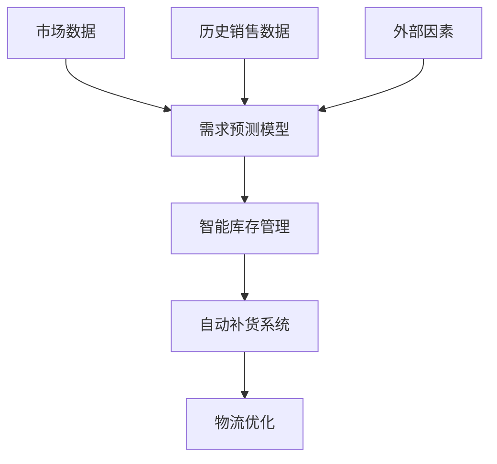

## 前言

作为一名长期关注AI技术发展的从业者，我常常思考：AI除了在互联网、医疗、金融等热门领域大放异彩外，还能在哪些传统行业掀起革命性的变革？🤔 最近，我有幸参观了几家智能工厂，亲眼见证了AI如何重塑制造业的每一个环节，这让我深受震撼！

制造业作为国民经济的支柱产业，正面临着劳动力成本上升、效率要求提高、个性化需求增加等多重挑战。而AI技术的引入，正在为这些挑战提供创新的解决方案。今天，我想和大家分享AI在制造业中的革命性应用，以及它如何重塑工业生产的新范式。

## 制造业的AI转型之路

### 传统制造业的痛点

在我参观的几家传统制造企业中，我看到了几个普遍存在的痛点：

1. **设备故障难以预测**：生产设备突然停机导致的生产中断，往往造成巨大损失
2. **质量控制依赖人工**：人工检测效率低、易疲劳，难以保证100%的准确率
3. **生产计划调整困难**：面对订单波动，生产计划的优化调整往往滞后
4. **能源消耗高**：设备空转、能源浪费现象普遍存在
5. **供应链响应慢**：需求预测不准确导致库存积压或缺货

这些问题看似传统，但正是AI技术可以大显身手的地方！

### AI赋能制造业的三大方向

::: tip
AI在制造业的应用主要围绕三大核心方向：预测性维护、智能质量控制和生产优化。这三大方向相互关联，共同构建了智能制造的生态系统。
:::

## AI在制造业的核心应用场景

### 1. 预测性维护：从"事后维修"到"事前预警"

传统制造业中，设备维护通常是"坏了再修"的模式，这种被动维护不仅成本高，还可能导致生产中断。而AI驱动的预测性维护正在改变这一现状。

#### 技术实现

通过在生产设备上安装各种传感器（温度、振动、声音等），AI系统可以实时监测设备状态，并通过机器学习算法分析历史数据，预测可能发生的故障。🔧

**实际案例**：一家汽车零部件制造商通过部署AI预测性维护系统，将设备意外停机时间减少了65%，每年节省维护成本超过200万美元。

### 2. 智能质量控制：从"人工检测"到"机器视觉"

质量是制造业的生命线。传统的人工检测不仅效率低下，还容易受到主观因素影响。AI视觉检测技术的出现，正在彻底改变这一局面。

#### 技术实现

AI视觉检测系统通常包括以下几个关键组件：

1. **高清摄像头**：捕捉产品图像
2. **图像预处理**：去噪、增强等
3. **深度学习模型**：如CNN、YOLO等用于缺陷检测
4. **决策系统**：根据检测结果分类产品

**优势**：
- 检测速度比人工快10-100倍
- 准确率达到99.5%以上
- 可检测人眼难以发现的微小缺陷
- 24小时不间断工作

::: theorem
AI视觉检测的准确率与训练数据的质量和数量直接相关。通常需要至少10,000张标注图像才能训练出可靠的检测模型。
::>

### 3. 生产优化：从"经验驱动"到"数据驱动"

生产优化是AI在制造业中最复杂也最有价值的应用之一。通过分析生产过程中的各种数据，AI可以实时优化生产计划、调度和资源配置。

#### 关键技术

1. **数字孪生(Digital Twin)**：创建物理工厂的虚拟副本，用于模拟和优化
2. **强化学习**：用于动态调整生产参数
3. **运筹优化算法**：解决复杂的调度问题
4. **边缘计算**：实现实时决策

**实际应用**：
- 优化生产排程，提高设备利用率15-30%
- 减少换线时间，提高生产灵活性
- 动态调整生产参数，提高产品质量一致性
- 能源消耗优化，降低生产成本

### 4. 供应链智能：从"被动响应"到"主动预测"

制造业的供应链管理是复杂且动态的。AI可以通过分析历史数据、市场趋势、天气变化等多种因素，实现更精准的需求预测和库存管理。

#### 技术实现

**应用场景**：
- 精准预测产品需求，减少库存积压
- 优化物流路线，降低运输成本
- 供应商风险评估和管理
- 端到端供应链可视化

## 案例分析：AI在汽车制造业的深度应用

让我分享一个我深入了解的案例：一家全球领先的汽车制造商如何通过AI技术实现智能制造转型。

### 背景

这家汽车制造商面临着以下挑战：
1. 生产线复杂度高，涉及数千个工序
2. 个性化订单增加，传统生产线难以适应
3. 质量要求极高，任何缺陷都可能导致严重后果
4. 需要实现柔性生产，快速切换不同车型

### AI解决方案

#### 1. 智能制造执行系统(MES)

该制造商部署了基于AI的MES系统，实现了：
- 生产过程的实时监控和优化
- 动态调整生产顺序，减少换线时间
- 资源智能分配，提高设备利用率
- 异常检测和自动报警

#### 2. AI视觉质量检测

在车身焊接、涂装等关键工序，部署了AI视觉检测系统：
- 检测焊点质量和一致性
- 识别涂装缺陷
- 确保零部件装配精度
- 自动分类合格品和次品

#### 3. 预测性维护

在生产设备上部署了预测性维护系统：
- 实时监测设备状态
- 预测可能的故障
- 自动生成维护工单
- 优化维护计划，减少停机时间

### 成果

经过AI转型，该制造商取得了显著成果：
- 生产效率提升25%
- 产品质量缺陷率降低70%
- 设备停机时间减少40%
- 能源消耗降低15%
- 生产柔性显著提高，可快速切换不同车型

## AI在制造业应用的挑战与对策

尽管AI在制造业前景广阔，但在实际应用中仍面临诸多挑战：

### 1. 数据质量与整合问题

**挑战**：
- 工业设备数据格式多样，难以统一
- 历史数据质量不高，标注困难
- 数据孤岛现象严重

**对策**：
- 建立统一的数据标准和接口
- 实施数据治理策略，提高数据质量
- 采用边缘计算，实现数据预处理和本地分析

### 2. 技术人才短缺

**挑战**：
- 既懂AI又懂制造业的复合型人才稀缺
- 传统制造业员工对新技术接受度不一
- 培训成本高，周期长

**对策**：
- 与高校合作培养专业人才
- 分阶段实施培训计划
- 建立内部知识分享机制

### 3. 投资回报周期长

**挑战**：
- AI系统前期投入大
- 见效周期长，ROI计算复杂
- 中小企业资金有限

**对策**：
- 选择高价值场景优先实施
- 采用云服务降低初始投入
- 寻求政府补贴和产业基金支持

### 4. 系统集成复杂

**挑战**：
- 与现有系统集成难度大
- 不同厂商系统兼容性问题
- 系统升级维护成本高

**对策**：
- 采用模块化设计，逐步实施
- 选择开放标准的解决方案
- 建立专业的IT运维团队

## 未来展望：AI与制造业的深度融合

展望未来，AI在制造业的应用将呈现以下几个趋势：

### 1. 自主制造系统

随着AI技术的进步，未来的制造系统将更加自主，能够自我优化、自我修复，甚至自我学习。🤖

### 2. 人机协作新模式

AI不是要取代人类，而是要与人类协作，发挥各自优势。未来的工厂将看到更多"人机协作"的场景，人类负责创造性工作，AI负责重复性和精确性工作。

### 3. 虚实融合的智能制造

数字孪生技术将与AI深度融合，实现物理世界与虚拟世界的无缝连接，使制造过程更加透明、可控。

### 4. 绿色智能制造

AI将帮助制造业实现可持续发展，通过优化能源使用、减少浪费、降低排放，推动绿色制造。

### 5. 个性化大规模生产

AI将使"大规模个性化生产"成为可能，满足消费者日益增长的个性化需求，同时保持规模生产的效率。

## 结语

AI在制造业的应用正从单点突破向系统化、全面化发展。从预测性维护到智能质量控制，从生产优化到供应链管理，AI正在重塑制造业的每一个环节。

作为一名技术爱好者，我深感兴奋的是，AI不仅提高了生产效率和质量，更重要的是，它正在释放制造业的创新潜能，使传统产业焕发新的活力。🚀

对于制造业企业而言，拥抱AI不是选择题，而是必答题。那些能够率先实现AI转型的企业，将在未来的竞争中占据先机。而对于我们每个人来说，理解AI如何改变制造业，也有助于我们更好地把握技术变革带来的机遇。

> AI不是要取代工人，而是要赋予工人新的能力。在智能工厂中，人类将从重复性劳动中解放出来，专注于更有创造性和价值的工作。这才是AI与制造业融合的真正意义。

让我们一起期待AI与制造业深度融合带来的美好未来！💪

---

希望这篇文章能够帮助大家了解AI在制造业的革命性应用。如果你有任何想法或问题，欢迎在评论区留言讨论！😊