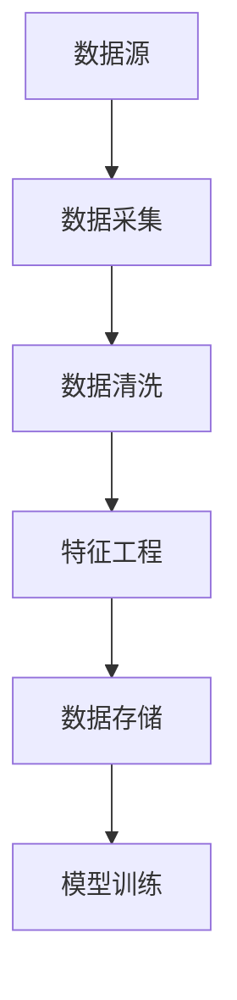

## 前言

在人工智能领域，我们常常将目光聚焦于算法的创新和模型的性能突破。然而，一个不容忽视的事实是：**理论上的模型突破**并不等同于实际业务价值的实现。如何将AI模型从实验室环境成功部署到生产系统，并持续创造价值，是许多组织面临的真实挑战。

::: tip
"一个AI系统的价值不仅在于其模型精度，更在于其稳定性、可扩展性和业务集成能力。"
:::

纵观您的博客内容，已经涵盖了AI的各个核心技术领域，从机器学习基础到大模型应用，从计算机视觉到自然语言处理。然而，缺少一个关键的桥梁——**AI系统架构与工程**，这正是连接AI研究与实际应用的纽带。

## AI系统架构的核心组件

一个完整的AI系统架构通常包含以下几个关键组件：

### 1. 数据层

数据是AI系统的燃料，一个健壮的数据层应具备以下特性：

- **多源数据集成**：能够整合结构化和非结构化数据
- **数据质量管理**：确保数据的准确性、一致性和完整性
- **数据版本控制**：追踪数据变化，支持模型回溯
- **隐私保护**：确保数据处理符合隐私法规要求



### 2. 计算层

计算层负责提供AI模型训练和推理所需的计算资源：

- **训练环境**：支持大规模分布式训练的高性能计算集群
- **推理服务**：低延迟、高并发的模型推理服务
- **资源调度**：智能的GPU/CPU资源分配与管理
- **弹性扩展**：根据负载自动扩展计算资源

### 3. 模型层

模型层关注AI模型本身的生命周期管理：

- **模型注册**：集中存储和管理不同版本的模型
- **模型评估**：自动化评估模型性能和业务指标
- **模型版本控制**：追踪模型变更历史
- **模型监控**：实时监控模型性能和漂移情况

### 4. 服务层

服务层是AI系统与外部世界的接口：

- **API网关**：统一管理AI服务的访问入口
- **服务编排**：协调多个AI模型的协同工作
- **负载均衡**：确保服务的高可用性和稳定性
- **限流熔断**：保护系统免受异常流量冲击

## 数据管道与特征工程

### 数据管道设计

一个高效的数据管道应遵循以下原则：

1. **批处理与流处理结合**：根据业务需求选择合适的数据处理模式
2. **容错机制**：确保数据管道在出现故障时能够自动恢复
3. **监控告警**：实时监控数据管道的健康状态
4. **数据血缘**：追踪数据从源头到最终使用的完整路径

```python
# 示例：使用Apache Airflow构建数据管道
from airflow import DAG
from airflow.operators.python import PythonOperator
from datetime import datetime

def extract_data():
    """从数据源提取数据"""
    pass

def transform_data():
    """数据转换和清洗"""
    pass

def load_data():
    """加载数据到存储系统"""
    pass

with DAG('ai_data_pipeline', start_date=datetime(2023, 1, 1)) as dag:
    extract_task = PythonOperator(task_id='extract', python_callable=extract_data)
    transform_task = PythonOperator(task_id='transform', python_callable=transform_data)
    load_task = PythonOperator(task_id='load', python_callable=load_data)
    
    extract_task >> transform_task >> load_task
```

### 特征工程最佳实践

特征工程是AI系统成功的关键因素：

- **特征存储**：建立统一的特征存储，避免特征重复开发
- **特征自动化**：实现特征生成的自动化流程
- **特征监控**：监控特征质量和分布变化
- **特征版本管理**：确保特征的一致性和可追溯性

## 模型训练与评估

### 训练流水线设计

一个高效的模型训练流水线应包含：

1. **实验跟踪**：记录每次训练的超参数、代码和数据版本
2. **分布式训练**：支持大规模数据和模型的并行训练
3. **自动超参数优化**：自动化寻找最优超参数组合
4. **模型选择**：基于多指标评估选择最佳模型

```bash
# 示例：使用MLflow管理模型训练实验
mlflow run --experiment-name "nlp_sentiment_analysis" \
           --entry-point train_model \
           --param learning_rate=0.001 \
           --param batch_size=32
```

### 模型评估策略

模型评估不应仅关注技术指标，还应考虑业务价值：

- **离线评估**：使用历史数据评估模型性能
- **在线评估**：通过A/B测试评估模型在实际环境中的表现
- **业务指标**：将模型性能与业务目标关联
- **公平性评估**：确保模型在不同群体间的公平性

## 模型部署与监控

### 部署策略选择

根据业务需求选择合适的部署策略：

1. **蓝绿部署**：零停机时间部署，适合关键业务系统
2. **金丝雀发布**：逐步将流量切换到新模型，降低风险
3. **影子部署**：新模型与旧模型并行运行，不实际处理请求
4. **滚动更新**：逐步替换旧实例，适合微服务架构

### 模型监控体系

一个全面的模型监控系统应包括：

- **性能监控**：跟踪推理延迟、吞吐量等指标
- **数据漂移检测**：监控输入数据分布的变化
- **概念漂移检测**：监控模型预测行为的变化
- **业务指标监控**：跟踪模型对实际业务指标的影响

```python
# 示例：使用Evidently检测数据漂移
from evidently.report import Report
from evidently.metrics import DataDriftMetric

data_drift_report = Report(metrics=[
    DataDriftMetric(),
])

data_drift_report.run(reference_data=reference_df, current_data=current_df)
data_drift_report.show()
```

## 性能优化与扩展

### 计算优化技术

提高AI系统性能的关键技术：

1. **模型量化**：减少模型大小和计算量
2. **模型剪枝**：移除不必要的模型参数
3. **知识蒸馏**：将大模型知识迁移到小模型
4. **硬件加速**：利用GPU、TPU等专用硬件

### 系统扩展策略

随着数据量和用户增长，AI系统需要具备扩展能力：

- **水平扩展**：增加更多计算节点
- **垂直扩展**：提升单个节点的计算能力
- **异步处理**：将非关键路径任务异步化
- **缓存策略**：缓存频繁访问的计算结果

## 安全性与合规性

### AI安全挑战

AI系统面临的安全挑战包括：

- **对抗攻击**：恶意样本导致模型做出错误预测
- **数据隐私**：训练数据中的敏感信息泄露
- **模型窃取**：通过查询接口窃取模型参数
- **滥用风险**：AI技术被用于不当目的

### 合规性要求

确保AI系统符合相关法规和标准：

- **数据保护法规**：GDPR、CCPA等数据保护要求
- **行业特定规定**：金融、医疗等行业的特殊要求
- **算法透明度**：提高AI决策的可解释性
- **审计追踪**：记录AI系统的决策过程

## 结语

构建生产级的AI系统是一项复杂的系统工程，需要综合考虑技术、业务、安全等多个维度。~~仅仅追求模型精度的时代已经过去~~，现代AI系统架构强调的是**端到端的价值实现**。

随着AI技术的不断发展，AI系统架构也在演进。未来，我们将看到更多自动化、智能化的AI工程工具，帮助组织更高效地构建和维护AI系统。

> "AI系统的真正价值不在于模型本身，而在于它如何与业务流程无缝集成，持续创造价值。"

---

*本文是AI技能系列的一部分，旨在帮助读者从技术理论学习过渡到实际应用落地。如果您对AI系统架构的特定方面有深入兴趣，欢迎在评论区留言讨论。*