## 前言

在Android开发的世界里，我们常常面临这样的困境：应用刚发布就发现了关键bug，或者需要紧急修复安全问题。传统的应用更新流程需要重新打包、审核、发布，用户体验中断，业务损失难以估量。🤔

今天，我将带大家深入探索Android热更新与动态化技术，这些技术能够让我们在不重新发布应用的情况下修复bug、更新功能，甚至实现模块的动态加载。这不仅是提升用户体验的关键，更是现代Android架构设计的核心能力之一。🚀

::: tip
"热更新与动态化技术是现代Android应用架构的'超能力'，它让我们的应用拥有了'自我修复'和'动态进化'的能力。"
:::

## 热更新技术原理

### 热更新的核心机制

Android热更新的核心思想是通过动态加载技术替换运行中的代码或资源。当应用检测到需要更新时，会从服务器下载补丁包，然后在运行时动态加载这些补丁，实现无缝更新。

```mermaid
graph LR
A[用户发现bug] --> B[开发热更新补丁]
B --> C[服务器发布补丁]
C --> D[客户端下载补丁]
D --> E[动态加载补丁]
E --> F[问题修复完成]
```



### 主流热更新方案对比

| 方案 | 原理 | 优势 | 劣势 |
|------|------|------|------|
| Tinker | Native层替换 | 成熟稳定，兼容性好 | 补丁体积较大 |
| Sophix | 类加载机制 | 补丁体积小，性能好 | 需要定制Android框架 |
| Robust | Instant Run机制 | 支持方法级替换 | 需要侵入式编译 |
| AndFix | 方法替换 | 实时生效 | 兼容性问题较多 |

> 💡 **选择建议**：对于大多数应用，Tinker是较为稳妥的选择；对于追求极致性能和补丁体积的场景，可以考虑Sophix。

## 动态化架构实战

### 模块化动态加载架构

现代Android应用普遍采用模块化架构，但真正的动态化架构需要实现以下特点：

1. **基础模块与业务模块分离**
2. **业务模块可独立开发、测试**
3. **运行时动态加载业务模块**

```kotlin
// 动态加载业务模块示例
fun loadBusinessModule(moduleName: String) {
    val dexPath = "$filesDir/modules/$moduleName.jar"
    val optimizedDexPath = "$filesDir/odex"
    
    val classLoader = DexClassLoader(
        dexPath,
        optimizedDexPath,
        null,
        this.javaClass.classLoader
    )
    
    val businessClass = classLoader.loadClass("com.example.BusinessModule")
    val instance = businessClass.newInstance() as IBusinessModule
    instance.init(this)
}
```

### 插件化开发实践

插件化是实现动态化的终极方案，它允许我们将应用拆分为多个可独立运行的"插件"：

```kotlin
// 插件接口定义
interface IPlugin {
    fun attach(context: Context)
    fun start()
    fun stop()
}

// 插件管理器
class PluginManager {
    private val loadedPlugins = mutableMapOf<String, IPlugin>()
    
    fun loadPlugin(pluginName: String, apkPath: String) {
        // 加载插件APK并初始化
        val plugin = loadPluginFromApk(pluginName, apkPath)
        loadedPlugins[pluginName] = plugin
        plugin.attach(context)
    }
    
    fun startPlugin(pluginName: String) {
        loadedPlugins[pluginName]?.start()
    }
}
```

## 实战案例：热更新修复崩溃

### 场景描述

我们的应用刚发布了一个新版本，但上线后立即收到大量崩溃报告，问题出在一个新功能上。我们需要立即修复这个问题，但应用商店审核流程需要7天。

### 解决方案

1. **创建热更新补丁**
   ```bash
   # 使用Tinker命令生成补丁
   ./gradlew tinkerPatchDebugRelease
   ```

2. **补丁包结构**
   ```
   app/build/outputs/tinkerPatch/
   ├── patch_signed.apk        # 签名后的补丁包
   ├── patch_signed_7zip.apk   # 7zip压缩格式
   └── manifest/               # 补丁清单
   ```

3. **客户端集成**
   ```kotlin
   // Application中初始化Tinker
   class MyApp : Application() {
       override fun onCreate() {
           super.onCreate()
           TinkerInstaller.install(this)
       }
   }
   
   // 检查并应用补丁
   TinkerPatch.with(this)
       .patchListener { patchResult ->
           when (patchResult) {
               is TinkerPatchResult.Success -> {
                   Toast.makeText(this, "补丁应用成功", Toast.LENGTH_SHORT).show()
               }
               is TinkerPatchResult.Fail -> {
                   Toast.makeText(this, "补丁应用失败", Toast.LENGTH_SHORT).show()
               }
           }
       }
       .fetchPatchUpdate(true)  // 立即检查更新
   }
   ```

## 安全与兼容性考量

### 热更新安全机制

1. **签名验证**：所有补丁必须使用与APK相同的签名
2. **版本控制**：补丁必须与当前应用版本匹配
3. **防篡改机制**：补丁包完整性校验

```kotlin
// 补丁签名验证示例
fun verifyPatchSignature(patchFile: File): Boolean {
    val cert = getCertificateFromApk(patchFile)
    return cert.equals(originalAppCertificate)
}
```

### 兼容性解决方案

1. **多渠道适配**：为不同厂商定制补丁加载逻辑
2. **降级机制**：当热更新失败时自动回退
3. **版本检查**：避免错误版本应用补丁

```kotlin
// 降级处理示例
class TinkerPatchService : IntentService("TinkerPatchService") {
    override fun onHandleIntent(intent: Intent?) {
        try {
            TinkerInstaller.onReceiveUpgradePatch(this, intent?.data)
        } catch (e: Exception) {
            // 记录错误并回退
            Tinker.with(application).cleanPatch()
            // 通知用户
            showUpdateFailedNotification()
        }
    }
}
```

## 未来展望

随着Android系统不断演进，热更新与动态化技术也在不断发展：

1. **Android Instant Apps**：无需安装即可运行应用，天然支持动态更新
2. **Jetpack Compose**：声明式UI框架为动态UI更新提供新可能
3. **Kotlin Multiplatform**：跨平台动态化解决方案

🤷‍♂️ ~~其实最好的热更新就是不热更新，写出没有bug的代码~~ —— 但现实总是骨感的，掌握这些技术能让我们在关键时刻力挽狂澜！

## 结语

热更新与动态化技术是现代Android开发者的必备技能，它不仅能够提升应用的用户体验，还能极大提高开发效率。通过合理应用这些技术，我们可以构建出更加灵活、可维护的Android应用架构。

记住，技术只是工具，真正的价值在于如何用这些工具解决实际问题。希望今天的分享能给大家带来启发，在未来的项目中实现更优雅的架构设计！

> "在快速迭代的移动时代，动态化能力就是应用的'免疫系统'，它让我们的应用能够快速响应变化，持续进化。"