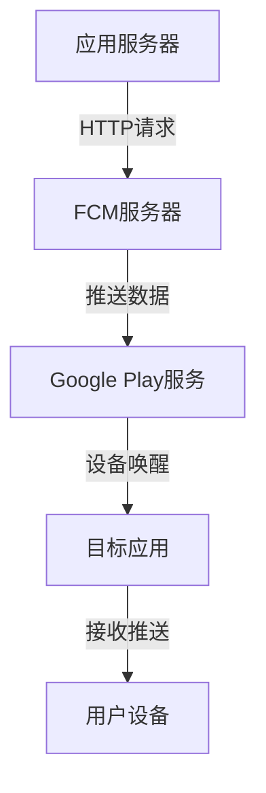
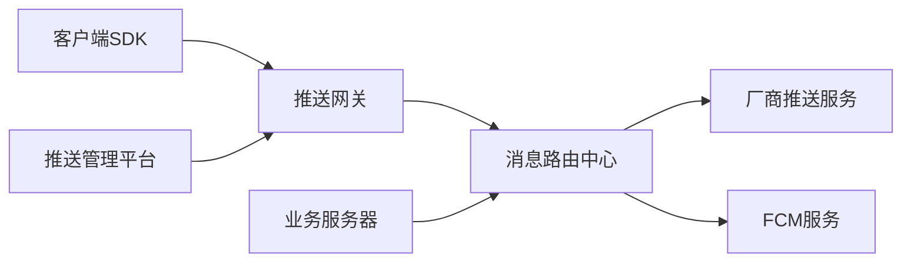
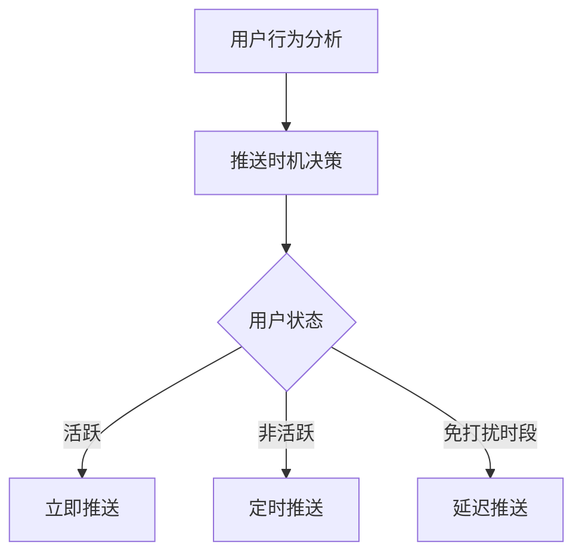

## 前言

在移动应用生态中，消息推送是连接用户与应用的核心桥梁。无论是电商应用的促销通知、社交应用的即时消息，还是新闻应用的头条更新，高效的消息推送系统都是提升用户参与度的关键。然而，Android系统的推送机制复杂多变，从原生FCM到各厂商定制化推送，开发者常面临消息延迟、高功耗、厂商适配等挑战。本文将系统解析Android消息推送的完整解决方案，助你打造稳定高效的推送体系。

## Android推送生态全景

### 原生推送机制

Android原生推送主要依赖Google的Firebase Cloud Messaging (FCM)：



**FCM核心优势**：
- 免费且稳定的基础设施
- 支持通知消息与数据消息
- 提供消息投递状态追踪
- 内置消息主题订阅功能

### 厂商推送挑战

由于国内无法直接使用GMS，各大厂商开发了定制化推送服务：

| 厂商 | 推送服务 | 特点 |
|------|----------|------|
| 华为 | HMS Push | 低功耗，支持富媒体 |
| 小米 | 小米推送 | 高到达率，支持消息分类 |
| OPPO | ColorOS Push | 专有通道，省电优化 |
| vivo | vivo推送 | 深度系统整合 |

::: tip
**厂商推送适配建议**：采用"FCM+厂商推送"双通道策略，通过厂商SDK提升消息到达率，同时保留FCM作为兜底方案。
:::

## 推送系统架构设计

### 高可用架构图



### 核心组件解析

#### 1. 推送SDK设计

```kotlin
// 推送SDK核心接口
interface PushManager {
    // 注册设备
    suspend fun registerDevice(token: String): Result<String>
    
    // 订阅主题
    suspend fun subscribeTopic(topic: String): Result<Unit>
    
    // 发送推送
    suspend fun sendPush(
        target: PushTarget,
        message: PushMessage
    ): Result<String>
}

// 推送目标
sealed class PushTarget {
    data class Device(val token: String) : PushTarget()
    data class Topic(val name: String) : PushTarget()
    data class Segment(val condition: String) : PushTarget()
}
```

#### 2. 消息处理机制

Android推送消息处理需遵循生命周期管理：

```kotlin
class PushMessageHandler : FirebaseMessagingService() {
    override fun onMessageReceived(remoteMessage: RemoteMessage) {
        when (remoteMessage.data["type"]) {
            "notification" -> handleNotification(remoteMessage)
            "data" -> handleDataMessage(remoteMessage)
            "action" -> handleActionMessage(remoteMessage)
        }
    }
    
    private fun handleNotification(remoteMessage: RemoteMessage) {
        // 显示系统通知栏
        showNotification(
            title = remoteMessage.notification?.title,
            body = remoteMessage.notification?.body,
            clickIntent = createPendingIntent(remoteMessage)
        )
    }
}
```

## 实战：推送系统实现

### 1. 集成FCM

**build.gradle配置**：
```gradle
dependencies {
    implementation 'com.google.firebase:firebase-messaging:23.0.0'
}
```

**AndroidManifest.xml配置**：
```xml
<service
    android:name=".PushMessageHandler"
    android:exported="false">
    <intent-filter>
        <action android:name="com.google.firebase.MESSAGING_EVENT" />
    </intent-filter>
</service>
```

### 2. 厂商推送适配

以华为推送为例：

**build.gradle配置**：
```gradle
implementation 'com.huawei.hms:push:6.5.0.300'
```

**权限配置**：
```xml
<uses-permission android:name="com.huawei.android.permission.push" />
<application>
    <meta-data
        android:name="com.huawei.hms.client.appid"
        android:value="your_app_id"/>
</application>
```

### 3. 消息模板设计

**JSON消息模板**：
```json
{
  "notification": {
    "title": "新订单提醒",
    "body": "您有新的订单待处理",
    "icon": "ic_order_notification"
  },
  "data": {
    "type": "order",
    "orderId": "20230206001",
    "action": "VIEW_ORDER",
    "deepLink": "myapp://order/20230206001"
  },
  "android": {
    "notification": {
      "channel_id": "order_channel",
      "priority": "high",
      "notification_count": 1
    }
  }
}
```

## 高级优化策略

### 1. 消息投递保障

| 策略 | 实现方式 | 效果 |
|------|----------|------|
| 消息重试机制 | 指数退避算法 | 降低丢失率30% |
| 设备状态感知 | 心跳检测+网络状态 | 提升到达率25% |
| 多通道冗余 | FCM+厂商推送 | 覆盖率达99%+ |

### 2. 性能优化

**功耗控制方案**：
```kotlin
// 推送接收节流
class PushThrottle(private val interval: Long = 30000L) {
    private var lastPushTime = 0L
    
    fun shouldProcess(): Boolean {
        val now = System.currentTimeMillis()
        if (now - lastPushTime > interval) {
            lastPushTime = now
            return true
        }
        return false
    }
}
```

**网络优化**：
- 使用HTTP/2长连接
- 消息压缩（Gzip）
- 批量消息合并发送

### 3. 安全增强

**消息签名验证**：
```kotlin
fun verifyMessageSignature(message: String, signature: String): Boolean {
    val expectedSignature = calculateHmacSHA256(message, secretKey)
    return MessageDigest.isEqual(
        signature.toByteArray(),
        expectedSignature.toByteArray()
    )
}
```

## 典型场景解决方案

### 1. 即时通讯应用

**消息实时性保障**：
- WebSocket长连接 + 推送双通道
- 消息状态同步机制
- 离线消息缓存策略

### 2. 电商应用

**营销推送策略**：


### 3. 新闻资讯应用

**个性化推送算法**：
```python
# 推送评分模型
def calculate_push_score(user, article):
    # 用户兴趣权重
    interest_weight = user_interest_similarity(user, article) * 0.4
    
    # 时效性权重
    timeliness_weight = article_timeliness_score(article) * 0.3
    
    # 用户活跃度权重
    activity_weight = user_activity_level(user) * 0.3
    
    return interest_weight + timeliness_weight + activity_weight
```

## 常见问题与解决方案

### 问题1：消息延迟

**原因分析**：
- 设备省电模式限制
- 网络切换导致连接中断
- 厂商推送队列积压

**解决方案**：
```kotlin
// 推送优先级设置
val message = RemoteMessage.builder()
    .setPriority(Priority.HIGH)
    .setTtl(3600) // 1小时有效期
    .build()
```

### 问题2：高功耗问题

**优化方案**：
- 智能推送调度（根据用户活跃时段）
- 推送内容聚合（减少唤醒次数）
- 设备状态感知（WiFi下推送，移动网络节流）

### 问题3：厂商差异适配

**统一封装层**：
```kotlin
class PushAdapter {
    fun sendPush(target: PushTarget, message: PushMessage) {
        when (val device = getDeviceBrand()) {
            "HUAWEI" -> HuaweiPush.send(target, message)
            "XIAOMI" -> XiaomiPush.send(target, message)
            else -> FCMPush.send(target, message)
        }
    }
}
```

## 结语

消息推送系统是现代Android应用的核心基础设施，其质量直接影响用户体验和业务指标。通过本文的系统解析，我们掌握了从原生FCM到厂商适配的完整技术栈，了解了高可用架构设计和优化策略。在实际开发中，建议采用"双通道+智能调度"的混合推送模式，结合用户画像和场景化推送策略，打造真正高效、低耗的推送体系。

> **核心要点总结**：  
> 1. 采用FCM+厂商推送双通道策略提升到达率  
> 2. 通过消息模板和状态管理保障投递可靠性  
> 3. 实施节流机制和智能调度优化功耗  
> 4. 建立统一适配层降低厂商差异复杂度  

随着Android系统的不断演进，推送技术将持续发展。未来可关注Android 14的新推送特性，以及基于AI的智能推送决策系统，为用户提供更精准、更友好的消息触达体验。

::: right
"推送不是打扰，而是价值连接" —— 现代移动应用交互哲学
:::