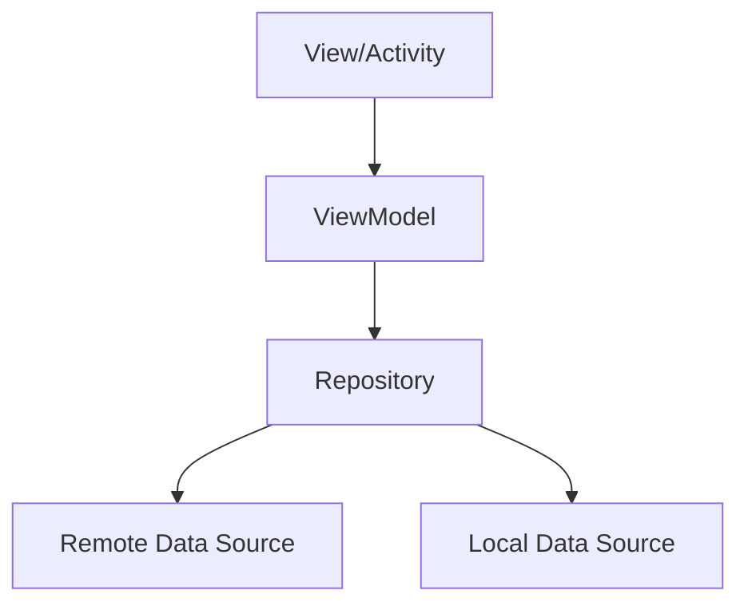

## 前言

作为一名Android开发者，我一直在寻找能够提升开发效率、简化代码结构的方法。~~记得刚开始写Android应用的时候，Activity和Fragment的逻辑简直是一团糟，各种回调嵌套，维护起来简直是个噩梦~~。后来随着Google推出了一系列架构组件和Jetpack库，我们的开发体验得到了质的飞跃。

::: tip
Android架构组件与Jetpack是Google官方推出的库和工具集，旨在帮助开发者构建健壮、可测试且可维护的应用程序。
:::

本文将深入探讨Android架构组件与Jetpack的核心内容，以及如何在实际项目中应用它们来构建现代化的Android应用。

## 什么是Android架构组件与Jetpack？

Android Jetpack是一套库、工具和指导原则，旨在帮助开发者更轻松地编写高质量的Android应用。而架构组件则是Jetpack中专门用于帮助开发者设计健壮、可测试且可维护应用的一组组件。

::: theorem
架构组件提供了生命周期感知的组件，帮助开发者构建响应式UI，并处理数据持久化，同时减少内存泄漏和配置更改相关的问题。
:::

## 核心架构组件

### 1. ViewModel

ViewModel是架构组件中最核心的部分之一，它负责为UI准备数据并持有与UI相关的数据，使其在配置更改（如屏幕旋转）时能够存活。

```kotlin
class UserProfileViewModel : ViewModel() {
    private val userId: String = "123"
    
    private val _user = MutableLiveData<User>()
    val user: LiveData<User> = _user
    
    init {
        fetchUser()
    }
    
    private fun fetchUser() {
        // 从网络或数据库获取用户数据
        viewModelScope.launch {
            val result = repository.getUser(userId)
            _user.value = result
        }
    }
}
```

ViewModel的主要优势：
- 在配置更改时自动保留数据
- 提供了`viewModelScope`，方便管理协程生命周期
- 与UI控制器（Activity/Fragment）解耦

### 2. LiveData

LiveData是一种可观察的数据持有类，它遵循观察者模式。与普通可观察类不同，LiveData具有生命周期感知能力，它只会在活跃生命周期状态（STARTED或RESUMED）的观察者上更新数据。

```kotlin
// 在ViewModel中
val userName: LiveData<String> = Transformations.map(user) { user ->
    "${user.firstName} ${user.lastName}"
}

// 在Activity/Fragment中
viewModel.userName.observe(this) { name ->
    textView.text = name
}
```

LiveData的优势：
- 确保UI与数据状态同步
- 不会发生内存泄漏
- 不会因Activity停止而崩溃
- 自动管理配置更改

### 3. Room

Room是一个持久性库，它提供了一个抽象层，在SQLite上运行，允许更强大的数据库访问，同时充分利用SQLite的全部功能。

```kotlin
@Entity
data class User(
    @PrimaryKey val id: Int,
    val firstName: String,
    val lastName: String
)

@Dao
interface UserDao {
    @Query("SELECT * FROM user WHERE id = :userId")
    suspend fun getUserById(userId: Int): User
    
    @Insert
    suspend fun insertUser(user: User)
}

@Database(entities = [User::class], version = 1)
abstract class AppDatabase : RoomDatabase() {
    abstract fun userDao(): UserDao
}
```

Room的优势：
- 编译时验证SQL查询
- 简化数据库迁移过程
- 支持RxJava、Flow和协程
- 提供DAO接口进行数据库操作

### 4. Data Binding

Data Binding库允许您在布局文件中绑定UI组件到应用数据源，从而减少样板代码并提高可维护性。

```xml
<!-- layout_profile.xml -->
<layout xmlns:android="http://schemas.android.com/apk/res/android">
    <data>
        <variable
            name="viewModel"
            type="com.example.UserProfileViewModel" />
    </data>
    
    <LinearLayout
        android:layout_width="match_parent"
        android:layout_height="match_parent"
        android:orientation="vertical">
        
        <TextView
            android:layout_width="wrap_content"
            android:layout_height="wrap_content"
            android:text="@{viewModel.userName}" />
            
        <Button
            android:layout_width="wrap_content"
            android:layout_height="wrap_content"
            android:text="Refresh"
            android:onClick="@{() -> viewModel.refreshUser()}" />
    </LinearLayout>
</layout>
```

Data Binding的优势：
- 减少Activity/Fragment中的样板代码
- 布局和逻辑分离
- 支持双向数据绑定
- 提供表达式语言进行复杂操作

## Jetpack其他重要组件

### 1. Navigation Component

Navigation组件帮助您实现应用内的导航，处理Fragment之间的导航、动画和深层链接。

```kotlin
// 在导航图中定义
<navigation xmlns:android="http://schemas.android.com/apk/res/android"
    xmlns:app="http://schemas.android.com/apk/res-auto"
    android:id="@+id/nav_graph">
    
    <fragment
        android:id="@+id/profileFragment"
        android:name="com.example.ProfileFragment"
        android:label="Profile">
        <action
            android:id="@+id/action_profile_to_settings"
            app:destination="@id/settingsFragment" />
    </fragment>
</navigation>

// 在Activity中使用
val navController = findNavController(R.id.nav_host_fragment)
navController.navigate(R.id.action_profile_to_settings)
```

### 2. WorkManager

WorkManager是用于调度可保证执行的、延迟的、异步任务的库，即使在应用退出或设备重启后也能保证任务执行。

```kotlin
// 定义Worker
class UploadWorker(appContext: Context, workerParams: WorkerParameters)
    : CoroutineWorker(appContext, workerParams) {
    
    override suspend fun doWork(): Result {
        // 执行上传任务
        uploadFile()
        return Result.success()
    }
}

// 调度任务
val uploadWorkRequest = OneTimeWorkRequestBuilder<UploadWorker>()
    .setConstraints(constraints)
    .build()

WorkManager.getInstance(context).enqueue(uploadWorkRequest)
```

### 3. Hilt（依赖注入）

Hilt是Google推出的依赖注入框架，基于Dagger 2构建，专为Android应用设计。

```kotlin
@AndroidEntryPoint
class MainActivity : AppCompatActivity() {
    @Inject
    lateinit var userRepository: UserRepository
    
    override fun onCreate(savedInstanceState: Bundle?) {
        super.onCreate(savedInstanceState)
        setContentView(R.layout.activity_main)
        
        // userRepository已经由Hilt注入
        val user = userRepository.getUser("123")
    }
}

@Module
@InstallIn(SingletonComponent::class)
object AppModule {
    
    @Provides
    @Singleton
    fun provideUserRepository(): UserRepository {
        return UserRepositoryImpl()
    }
}
```

## 架构模式：MVVM

使用架构组件，我们可以轻松实现Model-View-ViewModel（MVVM）架构模式：

- **Model**：表示数据和业务逻辑层，通常包括Repository和Data Sources
- **View**：表示UI层，通常是Activity和Fragment
- **ViewModel**：作为View和Model之间的桥梁，处理UI相关的逻辑



这种架构的优势：
- 关注点分离
- 提高可测试性
- 促进代码复用
- 便于团队协作

## 实战案例：用户信息展示应用

让我们通过一个简单的用户信息展示应用来展示如何使用这些组件：

### 1. 添加依赖

```gradle
// build.gradle (Module)
dependencies {
    def lifecycle_version = "2.6.1"
    def room_version = "2.5.2"
    def nav_version = "2.5.3"
    
    // ViewModel
    implementation "androidx.lifecycle:lifecycle-viewmodel-ktx:$lifecycle_version"
    
    // LiveData
    implementation "androidx.lifecycle:lifecycle-livedata-ktx:$lifecycle_version"
    
    // Room
    implementation "androidx.room:room-runtime:$room_version"
    kapt "androidx.room:room-compiler:$room_version"
    implementation "androidx.room:room-ktx:$room_version"
    
    // Navigation
    implementation "androidx.navigation:navigation-fragment-ktx:$nav_version"
    implementation "androidx.navigation:navigation-ui-ktx:$nav_version"
    
    // Data Binding
    buildFeatures {
        dataBinding true
    }
}
```

### 2. 创建数据模型

```kotlin
@Entity(tableName = "users")
data class User(
    @PrimaryKey val id: String,
    @ColumnInfo(name = "name") val name: String,
    @ColumnInfo(name = "email") val email: String,
    @ColumnInfo(name = "avatar_url") val avatarUrl: String
)
```

### 3. 创建DAO和数据库

```kotlin
@Dao
interface UserDao {
    @Query("SELECT * FROM users WHERE id = :userId")
    suspend fun getUser(userId: String): User?
    
    @Insert(onConflict = OnConflictStrategy.REPLACE)
    suspend fun insertUser(user: User)
}

@Database(entities = [User::class], version = 1)
abstract class AppDatabase : RoomDatabase() {
    abstract fun userDao(): UserDao
    
    companion object {
        @Volatile
        private var INSTANCE: AppDatabase? = null
        
        fun getDatabase(context: Context): AppDatabase {
            return INSTANCE ?: synchronized(this) {
                val instance = Room.databaseBuilder(
                    context.applicationContext,
                    AppDatabase::class.java,
                    "app_database"
                ).build()
                INSTANCE = instance
                instance
            }
        }
    }
}
```

### 4. 创建Repository

```kotlin
class UserRepository(private val userDao: UserDao) {
    
    suspend fun getUser(userId: String): User {
        // 先从数据库查询
        var user = userDao.getUser(userId)
        
        // 如果数据库中没有，从网络获取
        if (user == null) {
            user = apiService.getUser(userId)
            userDao.insertUser(user)
        }
        
        return user
    }
}
```

### 5. 创建ViewModel

```kotlin
@HiltViewModel
class UserProfileViewModel @Inject constructor(
    private val userRepository: UserRepository
) : ViewModel() {
    
    private val _user = MutableLiveData<User>()
    val user: LiveData<User> = _user
    
    fun loadUser(userId: String) {
        viewModelScope.launch {
            try {
                val user = userRepository.getUser(userId)
                _user.value = user
            } catch (e: Exception) {
                // 处理错误
            }
        }
    }
}
```

### 6. 创建布局并绑定数据

```xml
<!-- layout_profile.xml -->
<layout xmlns:android="http://schemas.android.com/apk/res/android"
    xmlns:app="http://schemas.android.com/apk/res-auto"
    xmlns:tools="http://schemas.android.com/tools">
    
    <data>
        <variable
            name="viewModel"
            type="com.example.UserProfileViewModel" />
    </data>
    
    <androidx.constraintlayout.widget.ConstraintLayout
        android:layout_width="match_parent"
        android:layout_height="match_parent"
        tools:context=".ProfileActivity">
        
        <ImageView
            android:id="@+id/avatarImageView"
            android:layout_width="100dp"
            android:layout_height="100dp"
            android:layout_marginTop="32dp"
            app:imageUrl="@{viewModel.user.avatarUrl}"
            app:layout_constraintEnd_toEndOf="parent"
            app:layout_constraintStart_toStartOf="parent"
            app:layout_constraintTop_toTopOf="parent"
            tools:src="@tools:sample/avatars" />
            
        <TextView
            android:id="@+id/nameTextView"
            android:layout_width="wrap_content"
            android:layout_height="wrap_content"
            android:layout_marginTop="16dp"
            android:text="@{viewModel.user.name}"
            android:textSize="18sp"
            android:textStyle="bold"
            app:layout_constraintEnd_toEndOf="parent"
            app:layout_constraintStart_toStartOf="parent"
            app:layout_constraintTop_toBottomOf="@id/avatarImageView"
            tools:text="John Doe" />
            
        <TextView
            android:id="@+id/emailTextView"
            android:layout_width="wrap_content"
            android:layout_height="wrap_content"
            android:layout_marginTop="8dp"
            android:text="@{viewModel.user.email}"
            app:layout_constraintEnd_toEndOf="parent"
            app:layout_constraintStart_toStartOf="parent"
            app:layout_constraintTop_toBottomOf="@id/nameTextView"
            tools:text="john.doe@example.com" />
            
        <ProgressBar
            android:id="@+id/progressBar"
            android:layout_width="wrap_content"
            android:layout_height="wrap_content"
            android:visibility="@{viewModel.user == null ? View.VISIBLE : View.GONE}"
            app:layout_constraintBottom_toBottomOf="parent"
            app:layout_constraintEnd_toEndOf="parent"
            app:layout_constraintStart_toStartOf="parent"
            app:layout_constraintTop_toTopOf="parent" />
    </androidx.constraintlayout.widget.ConstraintLayout>
</layout>
```

### 7. 创建Activity

```kotlin
@AndroidEntryPoint
class ProfileActivity : AppCompatActivity() {
    
    private lateinit var binding: ActivityProfileBinding
    private val viewModel: UserProfileViewModel by viewModels()
    
    override fun onCreate(savedInstanceState: Bundle?) {
        super.onCreate(savedInstanceState)
        
        binding = DataBindingUtil.setContentView(this, R.layout.activity_profile)
        binding.viewModel = viewModel
        binding.lifecycleOwner = this
        
        val userId = intent.getStringExtra("USER_ID") ?: "default"
        viewModel.loadUser(userId)
    }
}
```

## 最佳实践

### 1. 单一职责原则

每个组件应该只负责一项任务：
- ViewModel：管理UI相关的数据和逻辑
- Repository：管理数据源（网络、数据库等）
- Data Source：处理具体的数据获取逻辑

### 2. 依赖注入

使用Hilt或Dagger进行依赖注入，而不是手动创建对象实例：

```kotlin
@Module
@InstallIn(SingletonComponent::class)
object AppModule {
    
    @Provides
    @Singleton
    fun provideApiService(): ApiService {
        return Retrofit.Builder()
            .baseUrl("https://api.example.com/")
            .build()
            .create(ApiService::class.java)
    }
    
    @Provides
    @Singleton
    fun provideUserRepository(apiService: ApiService, userDao: UserDao): UserRepository {
        return UserRepository(apiService, userDao)
    }
}
```

### 3. 错误处理

在ViewModel中处理错误，并通知UI：

```kotlin
private val _error = MutableLiveData<String>()
val error: LiveData<String> = _error

fun loadUser(userId: String) {
    viewModelScope.launch {
        try {
            val user = repository.getUser(userId)
            _user.value = user
        } catch (e: Exception) {
            _error.value = "Failed to load user: ${e.message}"
        }
    }
}
```

### 4. 测试策略

架构组件使测试变得更加容易：

```kotlin
class UserProfileViewModelTest {
    private lateinit var viewModel: UserProfileViewModel
    private val mockRepository: UserRepository = mock()
    
    @Before
    fun setup() {
        viewModel = UserProfileViewModel(mockRepository)
    }
    
    @Test
    fun `when loadUser is called, user should be updated`() = runTest {
        // Given
        val userId = "123"
        val expectedUser = User(userId, "John Doe", "john@example.com", "")
        whenever(mockRepository.getUser(userId)).thenReturn(expectedUser)
        
        // When
        viewModel.loadUser(userId)
        
        // Then
        assertEquals(expectedUser, viewModel.user.value)
    }
}
```

## 结语

Android架构组件与Jetpack为我们提供了一套强大而灵活的工具，帮助我们构建高质量、可维护的Android应用。通过合理使用ViewModel、LiveData、Room等组件，我们可以实现关注点分离，提高代码的可测试性，并大大减少样板代码。

::: right
"优秀的架构不是一蹴而就的，而是随着项目的发展不断演进的。"
:::

在我个人的开发经历中，采用这些架构组件后，代码的可维护性和可读性都有了显著提升。虽然刚开始可能会觉得增加了一些复杂性，但长远来看，这绝对是值得的投资。

如果你还没有尝试过这些组件，我强烈建议你从简单的项目开始实践，逐步将它们应用到你的开发流程中。相信我，一旦你习惯了这种开发方式，就再也无法回到"回调地狱"的日子了！

> "架构不是关于工具，而是关于如何使用工具构建更好的软件。"

希望本文能帮助你更好地理解和使用Android架构组件与Jetpack，构建出更加出色的Android应用！