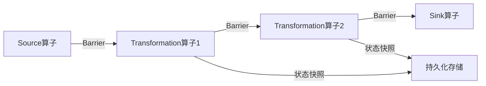

```yaml
---
title: Flink状态管理与容错机制-构建可靠的数据处理管道
date: 2023-11-15 10:30:00
permalink: /pages/flink-state-fault-tolerance/
categories: 
  - 大数据
  - Flink
tags:
  - Flink
  - 状态管理
  - 容错机制
  - Checkpoint
author: 
  name: Jorgen
  link: https://github.com/jorgen-zhao
---

## 前言

在流处理的世界里，数据不丢失且计算结果正确是基本要求。想象一下，如果你的银行交易系统因为网络波动而丢失了一笔转账记录，那后果不堪设想！🤯 这就是为什么状态管理和容错机制在Flink中如此重要的原因。

在我之前的Flink系列文章中，我们已经了解了Flink的基本架构和配置，但还没有深入探讨Flink如何保证在分布式环境下的数据一致性。今天，我将带大家一起探索Flink的状态管理与容错机制，看看它是如何构建可靠的数据处理管道的。

::: tip
状态管理是流处理框架的核心能力，容错机制则是保证系统可靠性的基石。理解这两者对于构建生产级的Flink应用至关重要。
:::

## 什么是状态管理？

在流处理应用中，状态(State)是指算子为了处理连续事件而需要维护的数据。例如，计算窗口内平均值时，我们需要保存当前窗口的和与计数；或者检测用户行为模式时，我们需要记录用户的历史行为。

### 状态类型

Flink主要支持两种类型的状态：

1. **托管状态(Managed State)**
   - 由Flink runtime管理，存储在Flink内部的数据结构中
   - 具有更好的可移植性和优化能力
   - 包括：ValueState、ListState、MapState、ReducingState、AggregatingState等

2. **原始状态(Raw State)**
   - 由用户自己管理，存储在任意数据结构中
   - Flink仅将状态数据作为字节数组进行持久化和恢复
   - 具有更高的灵活性，但可移植性较差

::: theorem
托管状态是Flink推荐使用的方式，因为它能够更好地与Flink的检查点机制集成，并且Flink可以对其进行优化。
:::

### 状态后端

状态后端(State Backend)决定了状态数据的存储方式和位置。Flink提供了三种内置的状态后端：

1. **MemoryStateBackend**
   - 状态存储在TaskManager的内存中
   - 适合小规模状态和快速处理
   - 不支持检查点持久化（仅保存到JobManager内存）

2. **FsStateBackend**
   - 状态存储在TaskManager内存中，但检查点保存在文件系统中
   - 适合大规模状态和需要容错的场景
   - 检查点恢复时需要从文件系统加载状态

3. **RocksDBStateBackend**
   - 状态存储在RocksDB数据库中（本地文件系统）
   - 适合超大规模状态
   - 支持增量检查点，减少检查点时间

## 容错机制与检查点

Flink通过分布式快照技术实现容错，核心机制是**检查点(Checkpoint)**。

### 检查点原理

Flink的检查点机制基于Chandy-Lamport算法的变种，主要流程如下：

1. **检查点协调器(Coordinator)启动检查点**：JobManager中的检查点协调器向所有Source算子发送 barriers（屏障）
2. ** barriers传播**：barriers在算子间传递，确保每个算子处理完barrier之前的数据后才会继续处理barrier之后的数据
3. **状态快照**：当算子接收到barrier时，会将自己的状态保存到持久化存储中
4. **确认通知**：算子完成状态快照后，向协调器发送确认
5. **完成检查点**：当所有算子都确认完成，协调器认为检查点成功



### 检查点配置

在Flink中，可以通过以下方式配置检查点：

```java
// 开启检查点并设置间隔
StreamExecutionEnvironment env = StreamExecutionEnvironment.getExecutionEnvironment();
env.enableCheckpointing(5000); // 每5秒进行一次检查点

// 高级配置
env.getCheckpointConfig().setCheckpointingMode(CheckpointingMode.EXACTLY_ONCE);
env.getCheckpointConfig().setMinPauseBetweenCheckpoints(1000); // 最小间隔
env.getCheckpointConfig().setCheckpointTimeout(60000); // 超时时间
env.getCheckpointConfig().setMaxConcurrentCheckpoints(1); // 最大并发数
env.getCheckpointConfig().enableExternalizedCheckpoints(CheckpointConfig.ExternalizedCheckpointCleanup.RETAIN_ON_CANCELLATION); // 取消作业时保留检查点
```

### 检查点恢复

当作业失败时，Flink可以通过最近的检查点恢复：

1. JobManager通知所有算子停止处理数据
2. 算子从持久化存储中加载最近一次成功检查点的状态
3. Source算子从检查点保存的位置重新读取数据
4. 算子从保存的offset继续处理数据

::: tip
检查点机制确保了Flink应用能够从故障中恢复，并保持"精确一次"(Exactly-Once)的处理语义。
:::

## 高级容错机制

除了基本的检查点机制，Flink还提供了一些高级容错特性：

### 保存点(Savepoints)

保存点是检查点的一种特殊形式，具有以下特点：

- 由用户手动触发，不受自动检查点间隔限制
- 不依赖于作业的停止和重启
- 可以用于作业升级、迁移或A/B测试

创建保存点：
```bash
flink savepoints -p <jobId> -d <targetDirectory>
```

### 两阶段提交(Two-Phase Commit, 2PC)

对于需要精确一次语义的外部系统（如Kafka、JDBC等），Flink支持两阶段提交机制：

1. **预提交(Pre-commit)**：算子将事务日志写入检查点，但不提交实际操作
2. **提交(Commit)**：检查点成功完成后，算子提交所有事务

实现两阶段提交需要实现`TwoPhaseCommitSinkFunction`接口。

### 端到端精确一次语义

Flink通过以下机制实现端到端的精确一次语义：

1. **源(Source)**：可重置偏移量的源（如Kafka）
2. **Flink内部**：检查点机制
3. **汇(Sink)**：支持两阶段提交的汇（如Kafka、关系型数据库）

## 实战示例：状态管理与检查点

下面我们通过一个简单的示例来展示如何在Flink中使用状态管理和检查点：

```java
public class StateManagementExample {
    public static void main(String[] args) throws Exception {
        // 创建执行环境
        StreamExecutionEnvironment env = StreamExecutionEnvironment.getExecutionEnvironment();
        
        // 启用检查点
        env.enableCheckpointing(5000); // 每5秒一次检查点
        env.getCheckpointConfig().setCheckpointingMode(CheckpointingMode.EXACTLY_ONCE);
        
        // 从Kafka读取数据
        Properties properties = new Properties();
        properties.setProperty("bootstrap.servers", "localhost:9092");
        properties.setProperty("group.id", "state-example");
        
        DataStream<String> stream = env
            .addSource(new FlinkKafkaConsumer<>("input-topic", new SimpleStringSchema(), properties))
            .uid("kafka-source");
            
        // 使用KeyedState进行状态管理
        stream
            .keyBy(value -> value.split(",")[0]) // 按第一个字段分组
            .process(new KeyedProcessFunction<String, String, String>() {
                private ValueState<Integer> countState;
                
                @Override
                public void open(Configuration parameters) {
                    // 初始化状态
                    ValueStateDescriptor<Integer> descriptor = 
                        new ValueStateDescriptor<>("count", Integer.class);
                    countState = getRuntimeContext().getState(descriptor);
                }
                
                @Override
                public void processElement(String value, Context ctx, Collector<String> out) {
                    // 获取当前状态
                    Integer currentCount = countState.value();
                    if (currentCount == null) {
                        currentCount = 0;
                    }
                    
                    // 更新状态
                    currentCount++;
                    countState.update(currentCount);
                    
                    // 输出结果
                    out.collect("Key: " + ctx.getCurrentKey() + ", Count: " + currentCount);
                }
            })
            .uid("keyed-process")
            .print();
            
        // 执行作业
        env.execute("State Management Example");
    }
}
```

## 性能优化

在状态管理和容错机制方面，可以通过以下方式进行性能优化：

1. **状态后端选择**：
   - 小规模状态：MemoryStateBackend
   - 大规模状态：RocksDBStateBackend

2. **检查点配置优化**：
   - 调整检查点间隔，避免过于频繁或过于稀疏
   - 增加检查点超时时间，确保有足够时间完成
   - 使用增量检查点减少检查点时间

3. **状态访问优化**：
   - 避免在每条记录中访问状态
   - 批量访问状态减少网络开销
   - 合理设计状态结构，减少状态大小

4. **异步快照**：
   - 启用异步快照，减少对处理延迟的影响

## 总结

通过今天的分享，我们深入了解了Flink的状态管理和容错机制：

1. **状态管理**：托管状态和原始状态两种类型，以及三种状态后端
2. **容错机制**：基于检查点的分布式快照技术
3. **高级特性**：保存点、两阶段提交和端到端精确一次语义
4. **实际应用**：如何在代码中使用状态管理和配置检查点

状态管理和容错机制是构建可靠流处理应用的基础，理解并掌握这些机制对于开发生产级的Flink应用至关重要。希望今天的分享能够帮助大家更好地理解和使用Flink的状态管理与容错机制！

> "在流处理的旅程中，状态是记忆，容错是保障。只有拥有可靠的状态管理和容错机制，我们的数据管道才能穿越风雨，始终如一。"

如果你有任何问题或建议，欢迎在评论区留言交流！👇

::: right
"状态管理是流处理的核心，容错是可靠性的保证。"
- Jorgen
:::
```