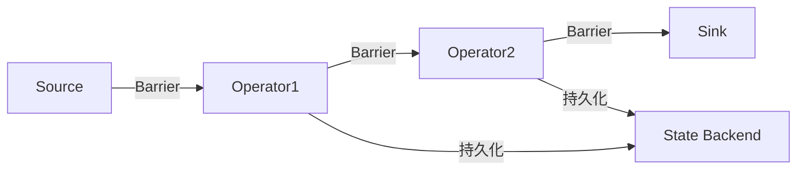

```markdown
---
title: Flink状态管理与容错机制：构建可靠的数据处理管道
date: 2023-10-15 14:30:00
permalink: /pages/abc123/
categories: 
  - 大数据
tags:
  - Flink
  - 状态管理
  - 容错机制
  - Checkpoint
author: 
  name: Jorgen
  link: https://github.com/jorgen-zhao
---

## 前言

在分布式流处理的世界中，**数据一致性**和**系统可靠性**是衡量框架成熟度的核心指标。当我们深入Flink架构时，会发现其强大的状态管理能力正是支撑这些特性的基石。🤔 现有文章已经覆盖了Flink架构原理和配置管理，但缺少了对状态与容错机制的系统性探讨——这恰恰是生产环境中保障数据不丢失、不重复的关键所在。

::: tip
> "没有状态管理的流处理就像没有刹车的高速赛车，看似飞驰却随时可能失控" —— 流处理领域共识
:::

## 为什么状态管理如此重要？

在实时处理场景中，许多业务逻辑需要维护中间状态：
- 实时统计：计算过去1分钟的订单总额
- 异常检测：识别连续5次失败的登录尝试
- 会话分析：跟踪用户30分钟内的行为轨迹

没有状态管理，这些场景将无法实现。而Flink通过**有状态计算**（Stateful Computation）模型，让状态成为计算的一等公民。

## Flink状态管理核心概念

### 1. 状态类型

Flink支持两种核心状态类型：

```markdown
| 状态类型 | 特点 | 适用场景 |
|---------|------|---------|
| **ValueState** | 单值状态 | 存储单个值，如计数器 |
| **ListState** | 列表状态 | 存储多个值，如历史记录 |
| **MapState** | 键值状态 | 存储键值对，如会话信息 |
| **ReducingState** | 聚合状态 | 自动聚合更新，如求和 |
| **AggregatingState** | 自定义聚合 | 复杂聚合逻辑 |
```

### 2. 状态后端（State Backend）

Flink提供三种状态后端实现：

```markdown
- **MemoryStateBackend**  
  - 优点：速度快，适合本地调试  
  - 缺点：无法容错，状态大小受限  
  - 适用：开发测试环境  

- **FsStateBackend**  
  - 优点：支持大状态，可持久化到文件系统  
  - 缺点：需要读写磁盘，延迟较高  
  - 适用：生产环境大状态场景  

- **RocksDBStateBackend**  
  - 优点：支持超大状态，增量检查点  
  - 缺点：需要额外部署RocksDB  
  - 适用：TB级状态生产环境
```

## 容错机制：Checkpoint详解

### Checkpoint工作原理

Flink的容错机制基于**分布式快照**（Distributed Snapshot）技术，核心流程如下：



::: theorem
**Barrier机制**：Flink通过特殊事件（Barrier）在数据流中插入检查点边界，确保所有状态在Barrier之前完成持久化
:::

### Checkpoint配置实战

```java
// 开启Checkpoint
StreamExecutionEnvironment env = StreamExecutionEnvironment.getExecutionEnvironment();
env.enableCheckpointing(5000); // 每5秒一次

// 配置精确一次语义
env.getCheckpointConfig().setCheckpointingMode(CheckpointingMode.EXACTLY_ONCE);

// 设置超时和最小间隔
env.getCheckpointConfig().setCheckpointTimeout(60000);
env.getCheckpointConfig().setMinPauseBetweenCheckpoints(30000);

// 配置状态后端
env.setStateBackend(new RocksDBStateBackend("hdfs:///checkpoints"));
env.getCheckpointConfig().setCheckpointStorage("hdfs:///checkpoints");

// 保留最近3个检查点
env.getCheckpointConfig().setMaxConcurrentCheckpoints(1);
env.getCheckpointConfig().setExternalizedCheckpointCleanup(
    ExternalizedCheckpointCleanup.RETAIN_ON_CANCELLATION);
```

## 生产环境最佳实践

### 1. Checkpoint调优策略

| 问题现象 | 解决方案 |
|---------|---------|
| Checkpoint频繁失败 | 增加超时时间，调整并行度 |
| 状态恢复慢 | 使用增量检查点，优化状态设计 |
| 磁盘IO压力大 | 使用SSD，调整RocksDB列族配置 |

### 2. 状态设计原则

```markdown
1. **状态最小化**  
   - 只保存必要的状态信息
   - 使用增量更新而非全量存储

2. **状态分区设计**  
   - 按业务键分区，避免热点问题
   - 合理设置TTL自动清理过期状态

3. **监控告警**  
   - 监控Checkpoint完成率
   - 设置状态大小增长告警
```

## 结语

Flink的状态管理与容错机制是其成为企业级流处理引擎的核心竞争力。通过合理设计状态后端、精确配置Checkpoint参数，我们能够构建既高效又可靠的数据处理管道。🚀 在实际项目中，建议从MemoryStateBackend开始验证业务逻辑，再逐步迁移到FsStateBackend或RocksDBStateBackend，同时建立完善的监控体系保障系统稳定性。

> "优秀的流处理系统不仅要能跑得快，更要能在故障中优雅地恢复" —— 数据工程实践箴言

## 未来展望

随着Flink持续演进，我们可以期待：
- 更轻量的增量Checkpoint机制
- 原生支持云存储的状态后端
- 与Kafka等系统的深度集成优化
```

<details>
<summary>文件命名说明</summary>
<p>建议命名为：203.flink-state-management.md</p>
<p>说明：延续现有命名规则（数字递增），主题明确标注状态管理</p>
</details>