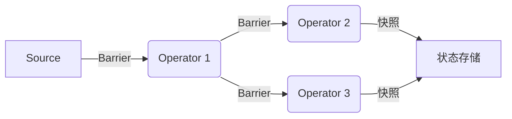

## 前言

在流处理的世界中，数据一致性是一个永恒的话题。当我们谈论流处理系统的可靠性时，Exactly-Once语义无疑是衡量一个系统成熟度的重要指标。🏗

> Exactly-Once语义意味着即使系统发生故障，每条数据也只会被精确处理一次，既不会丢失，也不会重复处理。

Apache Flink作为业界领先的流处理引擎，其Exactly-Once语义的实现机制是其核心竞争力之一。本文将深入探讨Flink如何实现端到端的Exactly-Once语义，以及在实际应用中如何配置和优化这一特性。

## Exactly-Once的重要性

在开始深入技术细节之前，我们先来理解为什么Exactly-Once如此重要：

1. **数据一致性**：确保业务逻辑的正确执行，避免因数据重复或丢失导致的计算错误
2. **业务准确性**：对于金融、电商等对数据准确性要求极高的场景，Exactly-Once是刚需
3. **系统可靠性**：提供故障恢复能力，同时保证数据处理的精确性

## Flink中的Exactly-Once实现机制

### 1. Checkpoint机制

Flink的Exactly-Once语义核心依赖于其强大的Checkpoint机制。💡

::: theorem
Checkpoint机制是Flink实现容错和状态恢复的基础，通过定期保存分布式数据流的快照，确保系统在故障后能够从一致的状态恢复。
:::

Checkpoint的工作流程如下：

1. **Barrier对齐**：Flink在数据流中插入特殊的Barrier，这些Barrier会随着数据一起流动
2. **状态快照**：当Operator接收到所有Barrier后，将其状态保存到持久化存储
3. **确认提交**：快照完成后，向JobManager确认提交



### 2. 两阶段提交协议(2PC)

对于需要与外部系统交互的场景，Flink通过两阶段提交协议(2PC)来实现端到端的Exactly-Once语义。

::: tip
端到端Exactly-Once不仅包括Flink内部的精确一次处理，还包括与外部系统(如Kafka、HDFS等)的精确一次交互。
:::

#### 2.1 预提交阶段

1. Flink向所有参与事务的外部系统发送"预提交"请求
2. 外部系统准备事务但不提交
3. Flink保存包含所有预提交信息的Checkpoint

#### 2.2 提交阶段

1. Checkpoint完成后，Flink通知所有外部系统提交事务
2. 如果系统恢复，Flink只会提交已成功保存的Checkpoint对应的事务

### 3. Kafka连接器的Exactly-Once支持

作为最常见的消息队列，Kafka与Flink的Exactly-Once集成尤为重要：

```java
Properties properties = new Properties();
properties.setProperty("bootstrap.servers", "localhost:9092");
properties.setProperty("group.id", "flink-exactly-once");
properties.setProperty("isolation.level", "read_committed"); // 读取已提交消息
properties.setProperty("enable.auto.commit", "false"); // 禁用自动提交

FlinkKafkaConsumer<String> kafkaSource = new FlinkKafkaConsumer<>(
    "topic",
    new SimpleStringSchema(),
    properties
);
kafkaSource.setStartFromLatest();
```

关键配置点：
- `isolation.level`: 设置为`read_committed`，只读取已提交的消息
- `enable.auto.commit`: 禁用自动提交，由Flink控制消费偏移量
- 使用Kafka事务API确保消息写入和偏移量更新的原子性

## 配置Exactly-Once语义

### 1. 启用Checkpoint

```java
StreamExecutionEnvironment env = StreamExecutionEnvironment.getExecutionEnvironment();

// 启用Checkpoint，每分钟执行一次
env.enableCheckpointing(60000);

// 设置语义为EXACTLY_ONCE
env.getCheckpointConfig().setCheckpointingMode(CheckpointingMode.EXACTLY_ONCE);

// 确保Checkpoint之间至少有500ms的间隔
env.getCheckpointConfig().setMinPauseBetweenCheckpoints(500);

// Checkpoint必须在10分钟内完成，否则超时
env.getCheckpointConfig().setCheckpointTimeout(600000);

// 同一个时间只能有一个Checkpoint在运行
env.getCheckpointConfig().setMaxConcurrentCheckpoints(1);

// 外部持久化存储路径
env.setStateBackend(new RocksDBStateBackend("file:///path/to/checkpoint"));
```

### 2. 使用支持Exactly-Once的外部系统

不同的外部系统对Exactly-Once的支持程度不同：

| 外部系统 | 支持程度 | 实现方式 |
|---------|---------|---------|
| Kafka | 完全支持 | 事务API + 幂等写入 |
| HDFS | 完全支持 | 原子重命名操作 |
| Elasticsearch | 部分支持 | 幂等写入 + 唯一键 |
| MySQL | 部分支持 | 幂等写入 |

### 3. 实现幂等写入

对于不支持原生事务的外部系统，我们需要通过业务逻辑实现幂等写入：

```java
// 使用业务主键作为唯一标识，避免重复写入
DataStream<Tuple2<String, Integer>> result = ...;

result.addSink(new RichSinkFunction<Tuple2<String, Integer>>() {
    private transient PreparedStatement insertStatement;
    private transient PreparedStatement updateStatement;
    
    @Override
    public void open(Configuration parameters) throws Exception {
        Connection connection = getDbConnection();
        
        // 插入语句（使用ON DUPLICATE KEY UPDATE实现幂等）
        insertStatement = connection.prepareStatement(
            "INSERT INTO metrics (metric_key, metric_value) VALUES (?, ?) " +
            "ON DUPLICATE KEY UPDATE metric_value = ?"
        );
    }
    
    @Override
    public void invoke(Tuple2<String, Integer> value, Context context) throws Exception {
        // 无论是否已存在，执行相同的插入操作
        insertStatement.setString(1, value.f0);
        insertStatement.setInt(2, value.f1);
        insertStatement.setInt(3, value.f1);
        insertStatement.executeUpdate();
    }
});
```

## Exactly-Once的性能考量

实现Exactly-Once语义通常会带来一定的性能开销，我们需要在一致性和性能之间找到平衡点：

### 1. Checkpoint频率

- **频繁Checkpoint**：提高数据安全性，但增加I/O开销
- **稀疏Checkpoint**：减少I/O开销，但增加故障恢复时的数据重放量

### 2. 异步Checkpoint

Flink支持异步Checkpoint，将状态快照与数据处理分离：

```java
env.getCheckpointConfig().setCheckpointingMode(CheckpointingMode.EXACTLY_ONCE);
env.getCheckpointConfig().enableUnalignedCheckpoints(); // 启用非对齐Checkpoint
```

非对齐Checkpoint可以减少Barrier对齐带来的延迟，特别适合处理背压严重的场景。

### 3. 增量Checkpoint

对于大规模状态，可以使用增量Checkpoint减少存储空间和I/O开销：

```java
env.setStateBackend(new RocksDBStateBackend("file:///path/to/checkpoint", true)); // 启用增量Checkpoint
```

## Exactly-Once vs At-Least-Once

理解Exactly-Once与At-Least-Once的区别对于系统设计至关重要：

| 特性 | Exactly-Once | At-Least-Once |
|------|-------------|---------------|
| 数据处理 | 每条数据精确处理一次 | 每条数据至少处理一次 |
| 适用场景 | 金融、交易、计费 | 日志分析、监控 |
| 实现复杂度 | 高 | 低 |
| 性能开销 | 较高 | 较低 |
| 外部系统依赖 | 需要支持事务或幂等写入 | 无特殊要求 |

## Exactly-Once的最佳实践

### 1. 合理设置Checkpoint间隔

根据业务需求和SLA要求，选择合适的Checkpoint间隔：
- 高延迟容忍场景：5-10分钟
- 中等延迟容忍场景：1-5分钟
- 低延迟容忍场景：30秒-1分钟

### 2. 监控Checkpoint指标

密切关注以下关键指标：
- Checkpoint完成时间
- Checkpoint失败率
- 状态大小变化趋势
- Checkpoint引起的背压情况

### 3. 使用外部系统的事务功能

尽可能使用外部系统原生的事务支持，如Kafka事务、HDFS原子操作等。

### 4. 实现幂等设计

对于不支持事务的外部系统，在应用层实现幂等操作，确保重复写入不会导致数据不一致。

## 结语

Exactly-Once语义是构建高可靠流处理应用的核心，它确保了数据在分布式环境下的精确一致性。🤔

通过深入理解Flink的Checkpoint机制、两阶段提交协议以及与外部系统的集成方式，我们可以在保证数据一致性的同时，最大限度地降低性能开销。

在实际应用中，我们需要根据业务场景、SLA要求和系统资源，在Exactly-Once和At-Least-Once之间做出合理选择，并通过监控和调优不断优化系统性能。

> "在流处理的世界中，没有绝对的一致性，只有适合业务场景的权衡。" —— 流处理哲学

通过合理配置和设计，Flink能够为大多数业务场景提供可靠的Exactly-Once语义支持，成为构建下一代实时数据管道的理想选择。