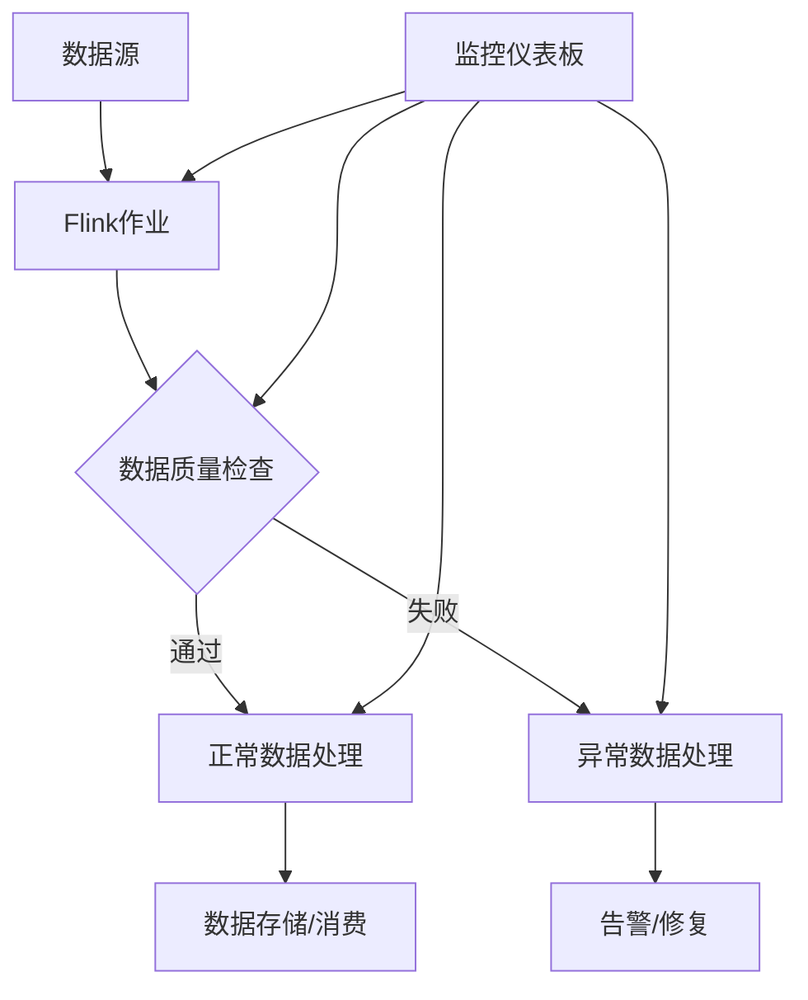

## 前言

大家好，我是Jorgen！在之前的博客中，我们已经深入探讨了Flink的架构原理、状态管理、容错机制等多个方面。今天，我想和大家聊聊一个在流处理系统中至关重要的主题——**数据质量保证**。🤔

随着数据量的爆炸式增长和数据来源的多样化，确保流处理系统中的数据质量变得越来越具有挑战性。想象一下，如果我们的实时推荐系统基于错误的数据做出决策，或者金融风控系统处理了不完整的数据，那后果将不堪设想！💥

::: tip
数据质量是流处理系统的生命线，没有高质量的数据，再复杂的算法和架构也只是一纸空文。
:::

在本文中，我将带大家深入了解如何在Flink中实施数据质量保证策略，构建可靠的数据处理管道。

## 数据质量挑战

在开始讨论解决方案之前，让我们先了解一下流处理中面临的数据质量挑战：

1. **数据完整性问题**：数据缺失、字段不完整
2. **数据一致性问题**：数据重复、数据不一致
3. **数据时效性问题**：数据延迟、乱序
4. **数据准确性问题**：数据错误、格式错误
5. **数据合规性问题**：隐私数据泄露、不符合行业规范

这些问题在批处理中可以通过多次重试和校验来解决，但在流处理环境中，数据是持续不断涌入的，我们需要在数据流动的过程中实时保证质量。📡

## Flink中的数据质量保证策略

### 1. 数据验证与清洗

在Flink中，我们可以使用`ProcessFunction`或`KeyedProcessFunction`来实现自定义的数据验证逻辑：

```java
public class DataValidationProcessFunction extends KeyedProcessFunction<String, SensorReading, SensorReading> {
    
    @Override
    public void processElement(SensorReading reading, Context ctx, Collector<SensorReading> out) {
        // 数据验证逻辑
        if (reading.getTemperature() < -50 || reading.getTemperature() > 150) {
            // 温度值异常，记录到死信队列
            ctx.output(deadLetterTag, reading);
            return;
        }
        
        // 数据清洗逻辑
        reading.setTimestamp(System.currentTimeMillis());
        
        // 输出处理后的数据
        out.collect(reading);
    }
}
```

### 2. 数据一致性保证

在分布式流处理系统中，数据一致性是一个复杂的问题。Flink提供了多种机制来保证数据一致性：

::: theorem
Exactly-Once语义
:::

Flink通过以下机制实现端到端的Exactly-Once语义：

1. **两阶段提交（2PC）**：与外部系统（如Kafka）配合，确保数据处理的原子性
2. **检查点（Checkpoint）**：定期保存状态的一致性快照
3. **事务性输出**：使用`TwoPhaseCommitSinkFunction`实现事务性输出

```java
DataStream<String> input = ...;
DataStream<String> result = input.process(new TwoPhaseCommitSinkFunction<String, ...>() {
    @Override
    protected void invoke(String transaction, String value, Context context) throws Exception {
        // 实现事务逻辑
    }
});
```

### 3. 数据监控与告警

实时监控数据质量是保证数据可靠性的关键。Flink提供了丰富的监控工具：

1. **指标收集**：使用`getRuntimeContext().getMetricGroup()`收集自定义指标
2. **侧输出（Side Output）**：将异常数据路由到不同的处理路径
3. **集成外部监控系统**：如Prometheus、Grafana等

```java
// 定义侧输出标签
OutputTag<BadRecord> badRecordsTag = new OutputTag<BadRecord>("bad-records") {};

DataStream<SensorReading> validatedStream = inputStream.process(new ValidationProcessFunction(badRecordsTag));

// 获取侧输出数据
DataStream<BadRecord> badRecords = validatedStream.getSideOutput(badRecordsTag);

// 将异常数据写入死信队列
badRecords.addSink(new DeadLetterQueueSink());
```

### 4. 数据质量规则引擎

为了实现灵活的数据质量检查，我们可以构建一个规则引擎：

```java
public interface DataQualityRule {
    boolean validate(Object record);
    String getRuleName();
}

public class TemperatureRangeRule implements DataQualityRule {
    private final double min;
    private final double max;
    
    public TemperatureRangeRule(double min, double max) {
        this.min = min;
        this.max = max;
    }
    
    @Override
    public boolean validate(Object record) {
        SensorReading reading = (SensorReading) record;
        return reading.getTemperature() >= min && reading.getTemperature() <= max;
    }
    
    @Override
    public String getRuleName() {
        return "TemperatureRangeRule";
    }
}
```

### 5. 数据质量仪表板

构建一个实时数据质量仪表板，帮助我们监控数据质量状况：



## 实战案例：IoT数据质量保证

让我们通过一个IoT数据质量保证的案例来理解上述策略的应用。

### 场景描述

我们有一个IoT设备数据流，包含温度、湿度、设备ID等信息。我们需要确保数据的质量，包括：

1. 数据完整性：所有字段必须存在
2. 数据范围：温度在-50°C到150°C之间，湿度在0%到100%之间
3. 数据时效性：数据延迟不超过5分钟
4. 数据唯一性：避免重复记录

### 实现方案

```java
// 定义数据质量规则
List<DataQualityRule> rules = Arrays.asList(
    new NonNullRule("deviceId"),
    new NonNullRule("temperature"),
    new NonNullRule("humidity"),
    new NumericRangeRule("temperature", -50.0, 150.0),
    new NumericRangeRule("humidity", 0.0, 100.0),
    new FreshnessRule("timestamp", 5 * 60 * 1000) // 5分钟
);

// 创建数据质量验证器
DataStream<IoTData> validatedStream = inputStream
    .keyBy(IoTData::getDeviceId)
    .process(new DataQualityValidationFunction(rules));

// 处理异常数据
validatedStream.getSideOutput(badRecordsTag)
    .addSink(new AlertSink()); // 发送告警

// 处理正常数据
validatedStream.addSink(new QualityDataSink()); // 存储高质量数据
```

### 数据质量监控指标

我们可以收集以下关键指标来监控数据质量：

1. **数据通过率**：(正常数据量 / 总数据量) * 100%
2. **异常数据量**：每分钟异常数据数量
3. **数据延迟**：数据从产生到处理的平均时间
4. **规则命中率**：各数据质量规则的触发频率

## 数据质量最佳实践

基于我的经验，以下是保证流处理数据质量的一些最佳实践：

1. **分层验证**：在数据流的多个层次进行验证，包括源端、处理端和消费端
2. **渐进式修复**：对可修复的数据进行自动修复，不可修复的数据标记为异常
3. **持续监控**：建立实时数据质量监控仪表板，及时发现异常
4. **定期审计**：定期对数据进行质量审计，调整数据质量规则
5. **文档化**：记录所有数据质量规则和异常处理流程

## 结语

数据质量保证是构建可靠流处理系统的核心支柱。通过本文的介绍，我们了解了在Flink中实现数据质量保证的各种策略和最佳实践。🏗

记住，数据质量不是一蹴而就的工作，而是一个持续改进的过程。随着业务需求的变化和数据源的变化，我们需要不断调整和优化数据质量策略。

> 数据质量不是技术问题，而是业务问题。高质量的数据是业务决策的基础，也是企业数据资产的核心价值所在。

希望本文能对大家有所帮助！如果你们有关于Flink数据质量保证的经验或问题，欢迎在评论区分享和讨论。😊

## 未来展望

随着数据治理需求的日益增长，未来Flink在数据质量保证方面可能会有以下发展方向：

1. **更丰富的内置数据质量函数**：提供更多预定义的数据质量检查函数
2. **机器学习辅助的数据质量检测**：使用机器学习技术自动发现异常模式
3. **跨系统数据质量一致性**：确保多个系统间的数据质量标准一致
4. **数据血缘与质量追踪**：实现数据从源头到消费的完整质量追踪

让我们一起期待Flink在数据质量保证方面的更多创新！🚀