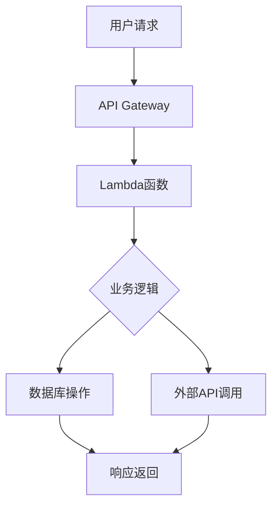

## 前言

在云计算发展的历程中，我们从物理服务器走到了虚拟机，又从虚拟机走到了容器化部署。而今天，一种更加革命性的计算模式——**Serverless架构**，正在改变我们构建和部署应用的方式。Serverless不仅是一种技术，更是一种全新的思维模式，它让开发者能够专注于业务逻辑，而无需关心底层基础设施的管理。

::: tip
Serverless架构是一种云服务模型，其中云服务提供商完全管理服务器，并动态分配机器资源。开发者只需编写和部署代码，而无需担心服务器、操作系统或容器的管理。
:::

## 什么是Serverless架构？

Serverless架构并不是真的"无服务器"，而是指开发者无需管理服务器基础设施。在这种架构下，云服务提供商负责所有底层资源的管理，包括服务器、操作系统、运行时环境等。

### Serverless的核心特点

1. **事件驱动**：应用程序由事件触发，如HTTP请求、数据库变更、文件上传等。
2. **自动扩展**：根据负载自动分配和释放资源，无需手动配置。
3. **按需付费**：只对实际使用的计算资源付费，没有闲置成本。
4. **高可用性**：云服务提供商通常提供内置的高可用性和容错机制。
5. **简化的部署**：只需部署代码，无需担心基础设施的配置和管理。

## Serverless与传统架构的区别

### 1. 架构模式对比

| 特性 | 传统架构 | 容器化架构 | Serverless架构 |
|------|---------|------------|---------------|
| 服务器管理 | 完全手动 | 部分自动化 | 完全自动化 |
| 扩展性 | 手动配置 | 自动扩展 | 自动扩展 |
| 成本模型 | 固定成本 | 按需付费 | 按使用量付费 |
| 开发焦点 | 基础设施+应用 | 容器化+应用 | 纯应用逻辑 |
| 部署复杂度 | 高 | 中 | 低 |

### 2. 资源利用率

- **传统架构**：资源预分配，常有过量配置，导致资源浪费。
- **容器化架构**：资源利用率提高，但仍需手动配置。
- **Serverless架构**：资源按需分配，几乎无闲置，资源利用率最高。

## Serverless的核心组件

### 1. 函数即服务(FaaS)

FaaS是Serverless架构的核心组件，允许开发者运行代码片段，而无需管理服务器。常见的FaaS服务包括：

- AWS Lambda
- Azure Functions
- Google Cloud Functions
- IBM Cloud Functions

### 2. 后端即服务(BaaS)

BaaS提供预构建的后端服务，如数据库、身份验证、存储等，开发者可以直接使用这些服务而无需构建自己的后端。

### 3. 事件源

触发Serverless函数的事件来源，包括：

- HTTP请求
- 数据库变更
- 文件上传
- 定时器
- 消息队列

## Serverless的应用场景

### 1. Web应用后端

Serverless非常适合构建Web应用的后端，特别是那些流量波动较大的应用。

### 2. 数据处理管道

Serverless可以构建高效的数据处理管道，适用于日志分析、数据转换等场景。

### 3. 实时应用

Serverless的事件驱动特性使其非常适合构建实时应用，如实时通知、聊天应用等。

### 4. IoT应用

在物联网场景中，Serverless可以处理来自大量设备的数据，实现实时分析和响应。

### 5. 微服务架构

Serverless可以作为微服务架构的一种实现方式，每个服务由一个或多个函数组成。

## 主流Serverless平台对比

| 特性 | AWS Lambda | Azure Functions | Google Cloud Functions | IBM Cloud Functions |
|------|------------|----------------|------------------------|---------------------|
| 编程语言 | 多种 | 多种 | 多种 | 多种 |
| 触发器 | 丰富 | 丰富 | 适中 | 适中 |
| 集成能力 | 强 | 强 | 强 | 中 |
| 监控工具 | CloudWatch | Application Insights | Cloud Monitoring | IBM Cloud Monitoring |
| 定价模型 | 按请求+计算时间 | 按执行+资源 | 按执行+外发流量 | 按执行+内存 |

## Serverless的挑战与解决方案

### 1. 冷启动问题

**挑战**：函数在长时间未调用后再次调用时，会出现冷启动延迟。

**解决方案**：
- 预热函数：定期调用函数保持活跃
- 优化函数代码：减少初始化时间
- 使用容器优化：减少容器启动时间

### 2. 调试困难

**挑战**：Serverless函数的调试比传统应用更困难。

**解决方案**：
- 使用云服务商提供的调试工具
- 实现详细的日志记录
- 使用本地开发环境模拟Serverless环境

### 3. vendor lock-in

**挑战**：不同云服务商的Serverless平台差异较大，迁移成本高。

**解决方案**：
- 使用抽象层封装云服务商特定API
- 选择支持开放标准的平台
- 构建可移植的函数设计

### 4. 状态管理

**挑战**：Serverless函数通常是无状态的，状态管理需要额外考虑。

**解决方案**：
- 使用外部存储服务(如数据库、缓存)
- 利用函数本地存储(有限)
- 设计有状态的函数模式

## Serverless的最佳实践

### 1. 函数设计原则

- **单一职责**：每个函数只做一件事
- **幂等性**：函数应该能够安全地重复执行
- **无状态**：避免在函数内部保存状态
- **轻量级**：保持函数代码简洁高效

### 2. 安全考虑

- 最小权限原则：只授予函数必要的权限
- 输入验证：严格验证所有输入数据
- 敏感数据保护：使用安全的方式存储和传递敏感信息
- 定期更新依赖：及时修复安全漏洞

### 3. 性能优化

- 减少冷启动时间
- 优化依赖项
- 使用异步处理
- 合理设置超时和内存限制

## Serverless的未来发展趋势

### 1. 多云Serverless

随着企业对多云战略的重视，跨云平台的Serverless解决方案将越来越受欢迎。

### 2. Serverless机器学习

Serverless与机器学习的结合将使AI应用的开发和部署更加简单。

### 3. 边缘Serverless

将Serverless能力扩展到边缘设备，实现更实时的数据处理。

### 4. Serverless框架的成熟

Serverless开发框架将更加成熟，提供更好的开发体验和工具支持。

## 结语

Serverless架构代表了云计算发展的一个重要方向，它不仅简化了应用的开发和部署，还提高了资源利用率和成本效益。虽然Serverless并非适用于所有场景，但在许多应用场景中，它都能带来显著的优势。

对于开发者和企业而言，了解并掌握Serverless架构，将是应对未来应用开发挑战的重要能力。随着技术的不断发展和成熟，Serverless有望成为构建现代化应用的主流范式。

> Serverless不仅仅是技术的革新，更是思维方式的转变。它让我们从关注基础设施转向关注业务价值，从手动管理转向自动化运维，从固定成本转向按需付费。在这个快速变化的时代，拥抱Serverless，就是拥抱更高效、更灵活、更经济的应用开发方式。