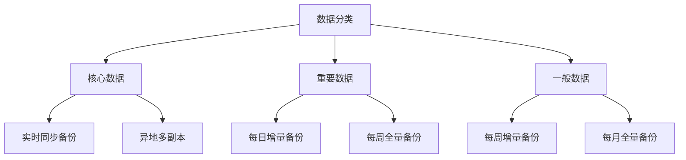

## 前言

在当今数字化转型的浪潮中，企业越来越依赖云平台来支撑其核心业务。然而，云环境并非"坚不可摧"，各种潜在威胁如硬件故障、网络中断、人为错误甚至自然灾害都可能导致服务中断。据Gartner研究，超过80%的企业经历过至少一次重大IT中断，平均每次损失超过50万美元。如何确保在云环境中实现高可用性并快速恢复业务，已成为企业云战略中不可或缺的一环。

::: tip
"灾难恢复不是要不要做的问题，而是如何做得更好的问题。在云时代，我们有更多工具和策略来构建真正弹性的系统。"
- 云架构专家
:::

## 云灾备的核心概念

云灾备(Cloud Disaster Recovery)是指利用云服务提供商的基础设施和技术，为企业的关键应用和数据提供备份、恢复和持续保护的能力。与传统的灾备方案相比，云灾备具有以下优势：

- **成本效益**：无需前期大量投资硬件设施，采用按需付费模式
- **弹性扩展**：可根据实际需求灵活调整资源
- **地理分布**：轻松实现跨区域部署，提高抗灾能力
- **快速部署**：相比传统方案，部署时间可从数周缩短至数小时

### 业务连续性规划(BCP)与灾备(DR)的关系

业务连续性规划(BCP)是一个更广泛的概念，涵盖了确保企业在各种中断情况下维持关键业务功能的整体策略。而灾备(DR)是BCP的技术实现部分，专注于IT系统和数据的恢复。

> 一个完整的BCP应该包括风险评估、业务影响分析、策略制定、测试和维护等环节，而DR计划则是其中的技术支柱。

## 云环境中的灾备策略

### 1. 多活架构

多活架构(Multi-active Architecture)是指将应用系统部署在多个地理上分散的数据中心，所有数据中心都可以处理生产流量。这种架构提供了最高的可用性，但实现复杂度也最高。

**适用场景**：
- 对可用性要求极高的关键业务系统
- 全球化业务，需要就近服务用户
- 预算充足的大型企业

**实施要点**：
- 数据同步机制设计
- 流量分发策略
- 一致性保证机制
- 故障自动切换逻辑

### 2. 主动-被动灾备

这是最常见的灾备架构，主数据中心处理所有生产流量，灾备数据中心处于待机状态，定期同步数据。当主数据中心发生故障时，流量切换到灾备中心。

**实施步骤**：
1. 在主区域部署生产环境
2. 在灾备区域部署相同的基础设施
3. 配置数据复制机制(如数据库同步、存储复制)
4. 设置自动化或半自动化的故障切换流程
5. 定期进行灾备演练

### 3. 云原生灾备

利用云原生技术特性构建的灾备方案，充分利用云计算的弹性、分布式和微服务优势。

**关键技术**：
- **容器编排**：使用Kubernetes实现应用的快速部署和迁移
- **无状态服务**：将应用设计为无状态，便于快速恢复
- **数据分层存储**：热数据、温数据、冷数据采用不同的存储策略
- **自动化运维**：通过CI/CD流水线实现灾备环境的自动更新

## 云灾备的关键技术实现

### 数据备份与恢复策略

#### 备份策略设计

合理的备份策略是灾备的基础，应考虑以下因素：

- **RPO(恢复点目标)**：可接受的数据丢失量
- **RTO(恢复时间目标)**：系统恢复的最大可接受时间
- **数据重要性分级**：对核心数据、重要数据和一般数据采用不同备份策略



#### 备份存储架构

在云环境中，可以采用分层备份存储架构：

1. **生产存储**：高性能存储，支持实时业务
2. **近线存储**：用于短期备份，通常为云存储服务
3. **归档存储**：用于长期保留，成本较低

### 应用层灾备技术

#### 无状态化改造

将应用改造为无状态是提高灾备效率的关键：

- 会话数据外部化(如存储在Redis中)
- 避免依赖本地文件系统
- 配置外部化，便于在不同环境间切换

#### 负载均衡与健康检查

通过负载均衡器实现应用的自动故障转移：

```yaml
# 示例：Kubernetes Service配置
apiVersion: v1
kind: Service
metadata:
  name: myapp-service
spec:
  selector:
    app: myapp
  ports:
    - protocol: TCP
      port: 80
      targetPort: 8080
  type: LoadBalancer
```

### 网络层灾备技术

#### 全球负载均衡(GSLB)

实现全球流量调度，根据用户位置、应用健康状况等因素智能路由：

- DNS负载均衡
- Anycast技术
- 应用层路由

#### 网络隔离与安全

确保灾备环境的安全性：

- 网络隔离：通过VPC、安全组等技术实现环境隔离
- 访问控制：严格的身份认证和权限管理
- 安全审计：记录所有访问和操作行为

## 云灾备的最佳实践

### 1. 定期演练与测试

灾备方案不是"一次性"工程，需要定期测试和演练：

- **桌面演练**：通过讨论验证流程的完整性
- **组件测试**：测试各个组件的恢复能力
- **全面演练**：模拟真实场景的端到端测试

### 2. 文档与流程标准化

完善的文档是成功灾备的关键：

- 灾备操作手册
- 联系人清单
- 决策树和流程图
- 常见问题处理指南

### 3. 性能与成本优化

在保证灾备能力的同时，也需要考虑成本和性能：

- 冷热数据分离存储
- 按需扩展资源
- 优化数据同步频率
- 利用云服务提供商的折扣计划

### 4. 合规性与风险管理

确保灾备方案符合行业规范和法律法规：

- 数据主权与隐私保护
- 行业合规要求(如金融、医疗行业)
- 风险评估与缓解措施

## 主流云服务商的灾备解决方案

### AWS 灾备服务

- **AWS Backup**：集中式备份管理服务
- **AWS Elastic Disaster Recovery (DRS)**：应用级灾备服务
- **AWS Global Accelerator**：全球流量优化
- **Route 53**：DNS故障转移

### Azure 灾备服务

- **Azure Site Recovery**：站点恢复服务
- **Azure Backup**：数据备份解决方案
- **Traffic Manager**：流量管理
- **Azure Arc**：混合环境统一管理

### Google Cloud 灾备服务

- **Cloud Storage**：对象存储与备份
- **Cloud SQL**：数据库备份与恢复
- **Cloud Load Balancing**：负载均衡与故障转移
- **Anthiflex**：混合云灾备解决方案

## 云灾备的未来趋势

### 1. AI驱动的智能灾备

人工智能技术正在改变传统的灾备模式：

- 智能预测性故障检测
- 自动化故障决策与切换
- 基于机器学习的恢复优化

### 2. 多云与混合云灾备

随着多云战略的普及，跨云灾备成为新趋势：

- 跨云平台的一致性灾备体验
- 统一的灾备管理平台
- 避免单一云厂商锁定

### 3. 边缘计算与灾备

边缘计算的兴起带来了新的灾备挑战：

- 分布式边缘节点的灾备策略
- 边缘-中心协同灾备架构
- 低延迟场景下的灾备优化

## 结语

在云时代，灾备与业务连续性已从传统的"成本中心"转变为企业的核心竞争力。通过合理的架构设计、技术选型和最佳实践，企业可以构建真正弹性的云环境，在面对各种挑战时保持业务连续性。

记住，没有绝对的"零中断"，只有通过不断的规划、测试和优化，才能将业务中断的影响降到最低。正如一句IT界常说的话："没有测试过的灾备计划，只是一份文档而已。"

希望本文能为您在云灾备与业务连续性方面的实践提供有价值的参考。如果您有任何问题或经验分享，欢迎在评论区交流讨论。

::: right
"最好的灾备计划是那些从未被使用的计划。"
- 云架构师箴言
:::