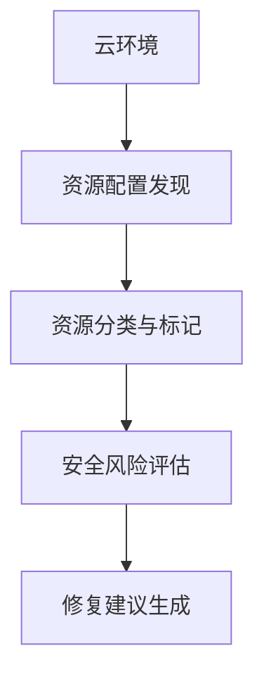

## 前言

随着企业加速向云迁移，云环境已经成为企业IT架构的核心组成部分。然而，云环境的复杂性、动态性和多变性也带来了前所未有的安全挑战。传统的安全工具和方法往往难以应对云环境的独特特性，导致安全盲区层出不穷。🤔

在这样的背景下，云安全态势管理(Cloud Security Posture Management, CSPM)应运而生，成为现代云安全架构中的关键组件。本文将深入探讨CSPM的概念、价值、核心功能以及实施策略，帮助您构建全面可控的云安全监控体系。

## 什么是云安全态势管理(CSPM)

云安全态势管理(CSPM)是一种云安全解决方案，专注于**持续监控**、**评估**和**改进**云环境的安全配置和合规状态。与传统安全工具不同，CSPM专门针对云环境的独特挑战而设计，能够自动发现云资源中的安全风险，并提供修复建议。

::: theorem
CSPM的核心价值在于：将安全左移，在云资源部署前和部署过程中主动发现和修复安全问题，而不是等到攻击发生后才被动应对。
:::

## CSPM的核心功能

### 1. 云资源配置发现与分类

CSPM能够自动发现云环境中的所有资源，包括虚拟机、存储桶、容器、数据库等，并根据敏感度和重要性进行分类。这种全面的可视性是有效安全管理的第一步。

### 2. 合规性监控

CSPM能够持续监控云环境是否符合各种行业标准、法规要求，如PCI DSS、HIPAA、GDPR、ISO 27001等。这大大简化了合规审计工作，降低了合规风险。

### 3. 安全配置评估

CSPM能够评估云资源的配置是否符合安全最佳实践，例如：
- 检查存储桶是否公开可访问
- 验证安全组规则是否过于宽松
- 确认是否启用了多因素认证
- 检查是否禁用了不安全的协议

### 4. 风险可视化与报告

CSPM提供直观的仪表板和报告，帮助安全团队快速了解云环境的安全态势，识别高风险区域，并跟踪安全改进的进展。

## 为什么需要CSPM

### 1. 弥补传统安全工具的不足

传统安全工具主要针对传统IT环境设计，难以适应云环境的动态性和复杂性。CSPM专门针对云环境的安全挑战而设计，能够填补这一空白。

### 2. 应对云配置错误

研究表明，**云配置错误**是导致云数据泄露的主要原因之一。CSPM能够自动发现和修复这些配置错误，显著降低安全风险。

### 3. 支持多云和混合云环境

随着企业采用多云和混合云战略，统一的安全管理变得至关重要。CSPM能够提供跨云平台的一致安全监控，简化多云环境的安全管理。

### 4. 加速安全决策

CSPM提供实时、准确的安全态势信息，帮助安全团队快速识别和应对威胁，加速安全决策过程。

## 主流CSPM解决方案

市场上的CSPM解决方案多种多样，以下是一些主流选择：

| 解决方案 | 优势 | 适用场景 |
|---------|------|---------|
| Prisma Cloud | 全面的云安全功能，包括CSPM和CWPP | 需要全面云安全解决方案的企业 |
| Wiz | 强大的云安全发现和分析能力 | 中大型企业，特别是AWS环境 |
| Orca Security | 简单易用，部署快速 | 中小企业，需要快速部署CSPM |
| Lacework | 综合性的云安全平台 | 需要云安全监控和自动化的企业 |
| CloudSploit | 开源解决方案，成本较低 | 预算有限，需要定制化解决方案的企业 |

## 实施CSPM的最佳实践

### 1. 明确安全目标与范围

在实施CSPM之前，明确您的安全目标和监控范围至关重要。这包括：
- 确定需要监控的云资源类型
- 明确需要遵循的合规标准
- 设定安全基线和阈值

### 2. 分阶段实施

CSPM的实施应该分阶段进行，先从最关键和最高风险的资源开始，逐步扩展到整个云环境。这样可以降低实施风险，确保平稳过渡。

### 3. 集成现有安全工具

将CSPM与现有的安全工具（如SIEM、SOAR、EDR等）集成，形成完整的安全生态系统，提高安全运营效率。

### 4. 建立响应流程

建立明确的安全事件响应流程，确保当CSPM发现安全问题时，能够快速有效地进行响应和修复。

### 5. 持续优化

CSPM不是一次性的项目，而是一个持续的过程。定期评估CSPM的有效性，并根据需要调整监控策略和配置。

## CSPM与其他云安全工具的关系

CSPM是云安全架构的重要组成部分，与其他云安全工具协同工作，共同构建全面的云安全防护体系：

- **云工作负载保护平台(CWPP)**：保护云工作负载（如容器、服务器、无服务器函数等）的安全
- **云安全访问代理(CSP)**：保护应用程序之间的通信安全
- **云安全信息与事件管理(CSIEM)**：收集和分析云环境中的安全日志和事件
- **云安全态势管理(CSPM)**：监控和改进云环境的安全配置和合规状态

这些工具相互补充，共同构建全方位的云安全防护体系。

## 未来展望

随着云技术的不断发展，CSPM也在不断演进。未来，我们可以期待以下发展趋势：

### 1. AI驱动的CSPM

人工智能和机器学习将使CSPM更加智能，能够更准确地识别安全风险，减少误报，并提供更精准的修复建议。

### 2. 实时安全态势

未来的CSPM将提供更实时的安全态势信息，帮助安全团队更快地发现和应对威胁。

### 3. 零信任架构集成

CSPM将与零信任架构更紧密地集成，为云环境提供更强大的安全保护。

### 4. 自动化修复

未来的CSPM将提供更强大的自动化修复功能，能够自动修复常见的安全问题，提高安全运营效率。

## 结语

云安全态势管理(CSPM)是现代云安全架构中不可或缺的组件，它能够帮助企业持续监控、评估和改进云环境的安全态势，有效应对云环境的独特安全挑战。

通过实施CSPM，企业可以：
- 主动发现和修复云配置错误
- 确保云环境符合合规要求
- 提高云安全态势的可视性
- 加速安全决策和响应过程

在云安全日益重要的今天，投资于CSPM不仅是必要的，更是企业云战略成功的关键因素之一。希望本文能够帮助您更好地理解CSPM，并在您的云环境中成功实施这一关键安全组件。

> "云安全不是一次性的项目，而是一个持续的过程。CSPM是这个过程中的重要工具，它将安全左移，使安全成为云架构的固有属性，而不是事后添加的补丁。" —— 云安全专家