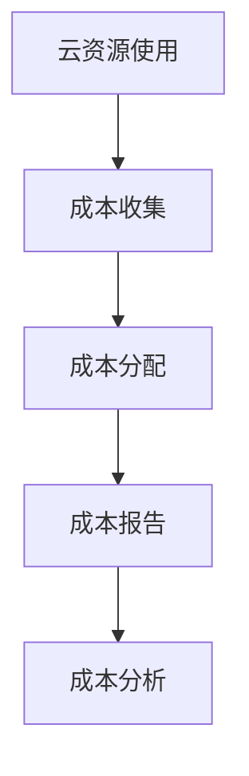

## 前言

大家好，我是Jorgen！👋 最近在帮公司优化云成本时，我接触到了一个非常有趣的概念——FinOps（Financial Operations）。说实话，一开始我也有点懵，这不就是云成本优化吗？但深入了解后，我发现FinOps远不止于此，它是一种全新的财务管理理念，将财务、技术和运营完美融合。💡

今天我想和大家分享一下我在实践FinOps过程中的一些经验和思考，希望能帮助大家更好地管理云成本，避免那种"月底看到账单时心惊肉跳"的尴尬局面。🤣

## 什么是FinOps？

::: tip
FinOps是一种云财务管理文化、实践和能力，它通过将财务责任赋予云资源的使用者，实现云支出的透明化、可预测性和优化。
::~

简单来说，FinOps就是让技术团队对云成本负责的一种管理模式。在传统模式下，IT部门负责技术决策，财务部门负责预算控制，两者之间往往存在脱节。而FinOps打破了这种壁垒，让开发、运维和产品团队都参与到成本管理中来。

想象一下，如果你知道你写的每一行代码、部署的每一个服务都会直接影响云账单，你会不会更加谨慎地使用资源？这就是FinOps的核心理念——**成本意识**。

## FinOps的核心原则

FinOps建立在三个核心原则之上：

### 1. 成本可见性
> **"你无法管理你看不见的东西。"**

在FinOps中，首要任务是确保所有云支出都是可见和可追踪的。这意味着我们需要：
- 建立详细的成本分配模型
- 实施标签策略，为所有资源添加业务上下文
- 提供实时成本报告和仪表板

### 2. 成本责任
> **"让每个人对自己的云使用负责。"**

FinOps将成本责任分配给实际使用资源的团队和个人。这包括：
- 为团队设定预算和成本目标
- 将成本指标纳入团队绩效评估
- 鼓励开发人员在设计阶段就考虑成本因素

### 3. 成本优化
> **"持续改进，永不止步。"**

有了可见性和责任感，下一步就是持续优化：
- 定期审查和清理未使用的资源
- 选择最合适的实例类型和存储选项
- 实施自动化策略，如自动关机、自动扩展等

## 实施FinOps的实践步骤

### 1. 建立成本可见性

实施步骤：
- 启用云提供商的成本管理服务（如AWS Cost Explorer、Azure Cost Management）
- 建立资源标签标准，确保所有资源都有适当的标签
- 创建自定义成本报告，按团队、项目、环境等维度分类
- 实施成本预警机制，当支出接近预算时自动通知

### 2. 制定成本分配模型

一个有效的成本分配模型应该考虑以下因素：

| 分配维度 | 说明 | 示例 |
|---------|------|------|
| 团队/部门 | 将成本分配给实际使用的团队 | 开发团队、运维团队、产品团队 |
| 项目/产品 | 按项目或产品分配成本 | 电商平台、CRM系统、数据分析平台 |
| 环境 | 按环境区分成本 | 开发环境、测试环境、生产环境 |
| 成本中心 | 按业务部门分配成本 | 研发部、市场部、销售部 |

### 3. 实施成本责任制

::: theorem
成本责任制不是简单的"谁使用，谁付费"，而是建立一种文化，让每个人都意识到自己的决策对成本的影响。
::~

实施策略：
- 为每个团队设定明确的预算和成本目标
- 将成本指标纳入团队和个人的OKR
- 定期举办FinOps评审会议，讨论成本趋势和优化机会
- 奖励成本节约行为，认可最佳实践

### 4. 持续成本优化

优化策略可以分为三个层次：

#### 1. 基础优化
- 删除未使用的资源
- 调整实例大小以匹配实际需求
- 使用预留实例或承诺使用折扣

#### 2. 架构优化
- 实施无服务器架构减少闲置资源
- 采用混合存储策略，将冷数据迁移到低成本存储
- 优化数据传输，减少不必要的数据移动

#### 3. 文化优化
- 培养成本意识文化
- 将成本指标纳入技术决策过程
- 鼓励创新性的成本优化实践

## FinOps工具与平台

实施FinOps离不开合适的工具支持。以下是一些常用的工具：

### 云提供商原生工具
- **AWS Cost Explorer**：AWS成本分析和可视化工具
- **Azure Cost Management**：Azure成本管理和优化工具
- **Google Cloud Cost Management**：Google Cloud成本分析和优化工具

### 第三方FinOps平台
- **CloudZero**：专注于成本分配和FinOps的SaaS平台
- **CloudHealth**：VMware的云管理平台，提供成本优化功能
- **Apptio**：IT财务管理平台，支持云成本管理

### 开源工具
- **Kubecost**：Kubernetes成本监控工具
- **OpenCost**：开源的云成本标准化项目
- **Prometheus + Grafana**：可配置为监控云成本

## FinOps成功案例

### 案例一：一家电商公司的FinOps实践

一家中型电商公司在实施FinOps后，实现了以下成果：
- 云成本降低了35%
- 资源利用率提高了40%
- 开发团队主动优化资源使用，减少了不必要的资源申请

关键成功因素：
- 高层管理支持，将FinOps纳入公司战略
- 建立清晰的成本分配模型
- 定期举办FinOps培训和工作坊
- 实施自动化成本监控和优化策略

### 案例二：一家金融科技公司的FinOps转型

一家金融科技公司通过FinOps实践，成功应对了云成本快速增长的问题：
- 实现了云成本的预测性管理
- 减少了30%的云浪费
- 提高了团队对成本的认识和责任感

关键成功因素：
- 建立了跨职能的FinOps团队
- 实施了详细的资源标签策略
- 将成本指标纳入CI/CD流程

## FinOps的挑战与解决方案

### 挑战1：缺乏成本可见性

**解决方案**：
- 实施全面的资源标签策略
- 建立成本数据仓库，整合多个云提供商的成本数据
- 开发自定义成本报告和仪表板

### 挑战2：团队抵制文化变革

**解决方案**：
- 从小规模试点开始，展示成功案例
- 提供培训和资源，帮助团队适应新的工作方式
- 将成本节约与团队激励挂钩

### 挑战3：技术债务导致的成本问题

**解决方案**：
- 将成本优化纳入技术债务管理流程
- 建立成本影响评估机制，评估技术决策对成本的影响
- 制定技术债务偿还计划，包括成本优化部分

## 结语

FinOps不仅仅是一种成本管理工具或技术，更是一种文化变革。它要求我们重新思考云资源的使用方式，将财务责任与技术决策紧密结合。🤔

通过实施FinOps，我们可以实现：
- 更好的成本控制，避免意外的云账单
- 更高的资源利用率，减少浪费
- 更好的跨部门协作，打破技术与财务之间的壁垒
- 更可持续的云战略，支持业务长期发展

正如一位FinOps专家所说："**云成本不是IT问题，而是业务问题。**" 只有将云成本管理与业务目标紧密结合，才能真正发挥FinOps的价值。

如果你正在面临云成本管理的挑战，不妨尝试引入FinOps理念，从小处着手，逐步建立成本可见性、责任感和优化文化。相信我，这不仅能帮你省钱，还能让整个团队更加高效和负责任。💪

---

> "在云时代，成本优化不是一次性的项目，而是一个持续的过程。FinOps教会我们，每一分钱的节省，都是对业务的直接贡献。" —— Jorgen