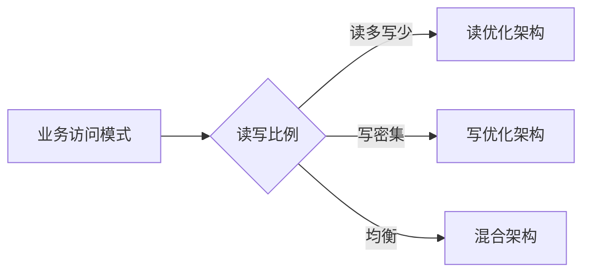
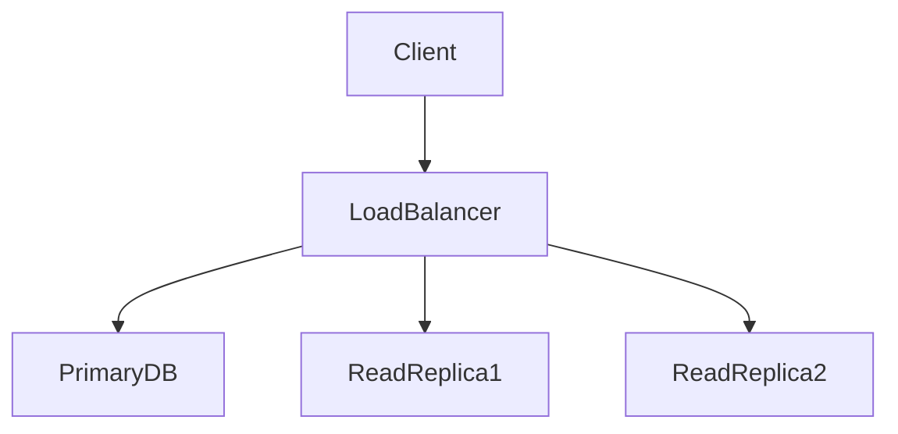

## 前言

在构建现代化云应用的过程中，数据存储往往是决定系统性能与可靠性的关键环节。~~虽然我们讨论了云数据管理，但似乎忽略了数据库这个核心组件~~ 🤔。今天，我想和大家聊聊云数据库管理这个常被忽视却至关重要的领域。

::: tip
"没有良好的数据库架构，再优秀的应用也只是空中楼阁"
:::

## 云数据库概述

云数据库服务彻底改变了传统数据库的部署模式，将数据库从基础设施层抽象为服务层。与自建数据库相比，云数据库提供了：

- **弹性扩展**：按需调整资源配置
- **高可用性**：多可用区自动故障转移
- **运维简化**：自动备份、打补丁、监控
- **成本优化**：按使用量付费模式

## 主流云数据库服务对比

| 服务类型 | 代表产品 | 适用场景 |
|---------|---------|---------|
| 关系型 | AWS RDS, Azure SQL Server | 事务密集型应用 |
| NoSQL | AWS DynamoDB, Cosmos DB | 高并发、灵活Schema |
| 时序 | InfluxDB, TimescaleDB | IoT监控、日志分析 |
| 图数据库 | Neptune, Neo4j | 复杂关系分析 |

## 云数据库选型策略

### 1. 性能需求分析


### 2. 成本考量因素
- 存储类型（SSD vs HDD）
- 计算规格（vCPU/内存）
- 网络带宽消耗
- 备份策略成本

## 云数据库优化实践

### 索引优化策略
```sql
-- 示例：复合索引设计
CREATE INDEX idx_user_activity 
ON user_activity(user_id, created_at DESC)
WHERE activity_type IN ('login', 'purchase');
```

### 连接池配置
```yaml
# 示例：连接池参数
spring:
  datasource:
    hikari:
      maximum-pool-size: 20
      minimum-idle: 5
      idle-timeout: 300000
      max-lifetime: 1800000
```

## 云数据库高可用架构

### 多主复制架构
```
[Region A]       [Region B]
  主库 ----------> 主库
    |              |
  从库 ----------> 从库
```

### 读写分离实现


## 云数据库迁移策略

### 迁移方法对比
| 方法 | 停机时间 | 数据一致性 | 适用场景 |
|------|---------|-----------|---------|
| 全量+增量 | 短 | 最终一致 | 非核心业务 |
| 双写同步 | 无 | 强一致 | 核心业务 |
| 逻辑复制 | 无 | 最终一致 | 大型系统 |

### 迁移风险评估清单
- [ ] 数据量估算
- [ ] 迁移窗口确定
- [ ] 回滚方案准备
- [ ] 监控告警配置
- [ ] 压力测试验证

## 结语

云数据库管理是构建现代化应用的关键环节，需要我们在性能、成本和可靠性之间找到平衡点。🏗️ 通过合理的架构设计和持续优化，我们可以构建出既高效又可靠的云端数据存储体系。

> "优秀的数据库架构如同稳固的地基，支撑着整个应用的持续演进"

希望今天的分享能帮助大家在云数据库管理方面少走弯路。如果你们有任何实践经验或问题，欢迎在评论区交流讨论！🙌

---

*注：本文基于云数据库管理实践整理，具体实施请结合实际业务场景调整。*