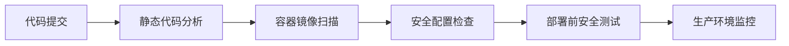

## 前言

在当今数字化转型的浪潮中，云服务已成为企业IT架构的核心组成部分。从我们之前讨论的云服务基础到云原生技术，再到物联网架构，云技术正在重塑我们的工作和生活方式。然而，随着越来越多的敏感数据和关键业务迁移到云端，云安全问题也日益凸显。🔐

正如我之前在项目中经历的那样，一次小小的安全漏洞就可能导致数百万的损失和品牌声誉的崩塌。今天，我想和大家一起深入探讨云安全防护的重要性，以及如何构建一个坚不可摧的云环境。

## 云安全的重要性

::: tip
云安全不是一次性的项目，而是一个持续的过程。它需要在整个云生命周期中不断关注和改进。
:::

在深入探讨云安全的具体措施之前，让我们先了解一下为什么云安全如此重要：

1. **数据保护**：云环境中存储了大量敏感数据，包括客户信息、财务数据、知识产权等。这些数据一旦泄露，后果不堪设想。

2. **合规要求**：各种行业和地区的法规（如GDPR、HIPAA、PCI DSS等）对数据安全和隐私保护提出了严格要求。

3. **业务连续性**：云安全威胁可能导致服务中断，影响业务连续性，造成直接和间接的经济损失。

4. **信任建立**：强大的安全措施有助于建立客户和合作伙伴对云服务的信任。

## 云安全的核心领域

云安全可以从以下几个核心领域进行考量：

### 身份与访问管理

身份与访问管理（IAM）是云安全的第一道防线。有效的IAM策略应该遵循最小权限原则：

```yaml
# IAM策略示例
{
  "Version": "2012-10-17",
  "Statement": [
    {
      "Effect": "Allow",
      "Action": "s3:GetObject",
      "Resource": "arn:aws:s3:::example-bucket/*",
      "Condition": {
        "IpAddress": {"aws:SourceIp": ["192.0.2.0/24"]}
      }
    }
  ]
}
```

### 数据安全

数据安全包括数据加密、密钥管理和数据分类：

- **静态数据加密**：确保存储在云端的数据是加密的
- **传输中数据加密**：确保数据在网络传输过程中是加密的
- **数据分类**：根据敏感度对数据进行分类，实施相应的保护措施

### 网络安全

网络安全涉及网络隔离、流量监控和威胁检测：

- **虚拟私有云（VPC）**：创建隔离的网络环境
- **安全组和网络ACL**：控制入站和出站流量
- **DDoS防护**：防止分布式拒绝服务攻击

### 合规性与审计

确保云环境符合相关法规要求，并保持完整的审计日志：

- **合规框架映射**：将云安全控制映射到相关合规框架
- **审计日志**：记录所有关键操作和访问尝试
- **定期评估**：定期进行安全评估和渗透测试

## 云安全最佳实践

基于我的经验，以下是一些云安全防护的最佳实践：

### 1. 采用云安全态势管理（CSPM）

CSPM工具可以帮助您持续监控云环境的安全配置和合规状态：

| CSPM工具 | 主要功能 | 适用场景 |
|---------|---------|---------|
| Prisma Cloud | 配置审计、威胁检测、合规监控 | 多云环境 |
| Wiz | 云安全态势管理、威胁检测 | AWS、Azure、GCP |
| Lacework | 安全态势管理、自动化响应 | 混合云环境 |

### 2. 实施DevSecOps流程

将安全集成到CI/CD流程中：



### 3. 建立安全意识培训

技术措施固然重要，但人员因素同样不可忽视：

- 定期进行安全意识培训
- 模拟钓鱼测试
- 建立安全事件响应流程

### 4. 采用零信任架构

零信任架构的核心原则是"从不信任，始终验证"：

- **最小权限访问**：只授予完成工作所需的最小权限
- **多因素认证**：实施强身份验证
- **持续验证**：定期重新验证所有访问请求

## 主流云平台的安全特性

不同的云平台提供了丰富的安全工具和服务：

### AWS安全服务

- **AWS Identity and Access Management (IAM)**：精细的访问控制
- **AWS WAF**：Web应用防火墙
- **AWS Shield**：DDoS防护
- **AWS Macie**：数据安全和隐私保护

### Azure安全服务

- **Azure Active Directory**：身份和访问管理
- **Azure Security Center**：统一的安全管理和威胁防护
- **Azure Sentinel**：云原生安全信息与事件管理(SIEM)
- **Azure Key Vault**：密钥管理服务

### Google Cloud安全服务

- **Cloud Identity**：身份和访问管理
- **Security Command Center**：安全态势管理和威胁检测
- **Cloud Armor**：Web应用防火墙和DDoS防护
- **Secret Manager**：密钥和秘密管理

## 云安全挑战与应对策略

尽管云平台提供了丰富的安全工具，但在实践中仍面临诸多挑战：

### 挑战1：安全责任共担模型

云安全责任共担模型意味着云提供商和客户都有安全责任：

::: theorem
责任共担模型核心原则：
- 云提供商负责云基础设施的安全
- 客户负责在云上部署的应用和数据的安全
:::

### 挑战2：配置错误

配置错误是云安全事件的主要原因之一。应对策略：

- 使用基础设施即代码（IaC）工具管理配置
- 实施配置漂移检测
- 定期进行安全配置审计

### 挑战3：影子IT

未经批准使用云服务可能导致安全风险。应对策略：

- 建立云服务目录
- 实施使用监控
- 提供自助服务门户，满足业务需求

## 结语

云安全不是一次性的项目，而是一个持续的过程。它需要在整个云生命周期中不断关注和改进。通过实施有效的身份与访问管理、数据保护、网络安全措施，并遵循最佳实践，我们可以构建一个坚不可摧的云环境。

记住，安全是一个团队运动，需要开发、运维、安全团队的紧密合作。只有将安全融入企业文化，才能真正实现云安全的目标。

> "安全不是功能，而是特性。它应该设计到系统中，而不是事后添加。"

希望这篇文章能帮助您更好地理解和实施云安全防护。如果您有任何问题或经验分享，欢迎在评论区留言交流！🤝