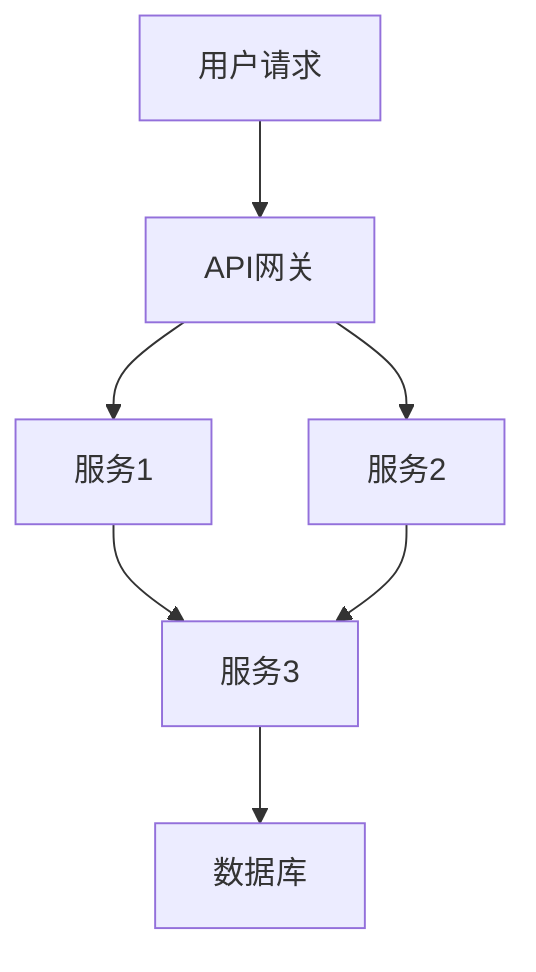

## 前言

最近，我正在全面优化公司的云原生应用交付流程，却发现了一个被忽视的环节：测试策略与质量保障。在云原生环境中，应用的开发、部署和运行方式都发生了根本性变化，但我们的测试方法却还停留在传统的单体应用时代。这让我意识到，构建一套完整的云原生测试策略对于保障应用质量和交付速度至关重要。

::: tip
云原生测试不仅是技术问题，更是流程和文化问题。它需要开发、测试和运维团队的紧密协作，共同构建一个贯穿整个软件生命周期的质量保障体系。
:::

## 云原生测试面临的挑战

在传统的单体应用测试中，我们通常关注单元测试、集成测试和端到端测试。然而，在云原生环境下，这些测试方法面临着前所未有的挑战：

### 1. 分布式系统的复杂性

云原生应用通常由多个微服务组成，这些服务可能独立部署、独立扩展，并且通过复杂的网络进行通信。这使得传统的集成测试变得异常困难。



### 2. 动态变化的环境

云原生环境是高度动态的，容器可能会被频繁创建、销毁和迁移，服务实例的数量也会根据负载自动调整。这使得测试环境难以稳定重现。

### 3. 快速迭代的需求

云原生开发强调快速迭代和持续交付，这要求测试方法必须能够跟上开发速度，提供即时反馈。

### 4. 多样化的技术栈

云原生应用通常采用多种技术栈，如Kubernetes、Service Mesh、Serverless等，每种技术都有其特定的测试挑战。

## 云原生测试策略框架

面对上述挑战，我们需要构建一个全面的云原生测试策略框架。这个框架应该覆盖从代码提交到生产部署的整个软件生命周期。

### 1. 单元测试

单元测试仍然是云原生应用测试的基础，但需要注意以下几点：

- **隔离性**：确保测试之间相互独立，避免共享状态
- **速度**：单元测试应该运行迅速，以便在代码提交时快速获得反馈
- **覆盖率**：设置合理的代码覆盖率目标，但不要盲目追求高覆盖率

```bash
# 示例：使用Jest进行单元测试
npm test -- --coverage --watch
```

### 2. 集成测试

云原生环境下的集成测试需要关注服务间的交互：

- **契约测试**：确保服务之间的API契约得到遵守
- **网络测试**：模拟各种网络条件，如延迟、丢包、分区等
- **依赖测试**：验证应用对依赖服务（如数据库、消息队列）的正确使用

### 3. 端到端测试

端到端测试在云原生环境中变得更加复杂，但也更加重要：

- **弹性测试**：验证系统在部分组件失败时的行为
- **性能测试**：评估系统在不同负载下的性能表现
- **安全测试**：检查系统是否安全，包括认证、授权、数据保护等

### 4. 混沌工程

混沌工程是云原生环境下的独特测试方法，它通过主动注入故障来验证系统的弹性：

- **故障注入**：在系统中模拟各种故障，如服务宕机、网络分区、资源耗尽等
- **监控响应**：观察系统如何响应这些故障，并从中学习
- **自动化**：将混沌测试自动化，定期执行，确保系统始终保持弹性

::: theorem
混沌工程的核心原则是：通过主动注入故障来发现系统的弱点，而不是等待故障发生时才发现问题。
:::

## 云原生测试工具与实践

### 1. 容器化测试

使用容器来封装测试环境，确保测试环境的一致性：

```dockerfile
# 示例：测试环境Dockerfile
FROM node:16
WORKDIR /app
COPY package*.json ./
RUN npm install
COPY . .
CMD ["npm", "test"]
```

### 2. Kubernetes测试

使用Kubernetes来管理测试环境：

```yaml
# 示例：测试环境Kubernetes部署
apiVersion: apps/v1
kind: Deployment
metadata:
  name: test-environment
spec:
  replicas: 1
  selector:
    matchLabels:
      app: test-environment
  template:
    metadata:
      labels:
        app: test-environment
    spec:
      containers:
      - name: test-app
        image: myapp:test
        ports:
        - containerPort: 8080
```

### 3. Service Mesh测试

使用Service Mesh（如Istio、Linkerd）来测试服务间的通信：

```yaml
# 示例：Istio虚拟服务配置
apiVersion: networking.istio.io/v1alpha3
kind: VirtualService
metadata:
  name: reviews
spec:
  hosts:
  - reviews
  http:
  - match:
    - headers:
        end-user:
          exact: jason
    route:
    - destination:
        host: reviews
        subset: v2
  - route:
    - destination:
        host: reviews
        subset: v3
```

### 4. Serverless测试

对于Serverless函数，需要特别关注其触发器和事件处理：

```javascript
// 示例：AWS Lambda函数测试
const { handler } = require('./lambda');

describe('Lambda function', () => {
  it('should process S3 event correctly', async () => {
    const event = {
      Records: [
        {
          s3: {
            bucket: {
              name: 'test-bucket'
            },
            object: {
              key: 'test-file.txt'
            }
          }
        }
      ]
    };
    
    const result = await handler(event);
    expect(result).toEqual({ status: 'success' });
  });
});
```

## 测试自动化与持续集成

在云原生环境中，测试自动化是必不可少的。我们需要将测试集成到CI/CD流程中，确保每次代码变更都经过充分的测试。

### 1. 测试自动化金字塔

构建一个分层的测试自动化策略：

- **底层**：大量的单元测试，快速执行
- **中层**：适量的集成测试，关注服务交互
- **顶层**：少量的端到端测试，验证关键业务流程

### 2. 测试数据管理

云原生环境中的测试数据管理是一个挑战，可以采用以下策略：

- **数据虚拟化**：使用工具如Mountebank或WireMock模拟数据服务
- **测试数据生成**：使用工具如Faker生成测试数据
- **数据快照**：定期捕获生产数据快照，用于测试

### 3. 测试环境管理

云原生测试环境应该：

- **自动化创建**：使用基础设施即代码（如Terraform）创建测试环境
- **隔离性**：确保测试环境之间相互隔离，避免测试数据污染
- **可重现性**：确保测试环境可以快速重现和销毁

## 质量度量与持续改进

测试不仅仅是发现问题，更是持续改进产品质量的过程。我们需要建立一套质量度量体系，监控测试效果并持续改进。

### 1. 质量度量指标

- **测试覆盖率**：代码被测试覆盖的程度
- **缺陷密度**：每千行代码的缺陷数量
- **逃逸率**：在生产环境中发现的缺陷数量
- **测试执行时间**：测试套件执行所需的时间
- **反馈周期**：从代码提交到测试完成的时间

### 2. 质量门禁

在CI/CD流程中设置质量门禁，确保只有达到质量标准的代码才能部署：

```yaml
# 示例：GitHub Actions质量门禁
jobs:
  test:
    runs-on: ubuntu-latest
    steps:
    - uses: actions/checkout@v2
    - name: Run tests
      run: npm test
    - name: Check coverage
      run: |
        npm run test:coverage
        if [ $(cat coverage/lcov.info | grep "SF:" | wc -l) -eq 0 ]; then
          echo "No source files found in coverage report"
          exit 1
        fi
        if [ $(cat coverage/lcov.info | grep "LF:" | awk '{print $2}') -eq 0 ]; then
          echo "No lines covered"
          exit 1
        fi
        coverage=$(cat coverage/lcov.info | grep "LF:" | awk '{print $2}')
        lines=$(cat coverage/lcov.info | grep "LH:" | awk '{print $2}')
        percentage=$((lines * 100 / coverage))
        if [ $percentage -lt 80 ]; then
          echo "Coverage is $percentage%, below threshold of 80%"
          exit 1
        fi
        echo "Coverage is $percentage%, above threshold of 80%"
```

### 3. 持续改进

基于测试结果和质量度量，持续改进测试策略和产品质量：

- **定期回顾**：定期回顾测试结果，识别改进机会
- **测试左移**：将测试活动尽可能提前到开发阶段
- **测试右移**：将测试活动扩展到生产环境，通过监控和日志分析发现问题

## 结语

云原生测试策略与质量保障是构建可靠云原生应用的关键环节。它不仅需要合适的工具和技术，更需要团队的协作和文化的转变。通过构建全面的测试策略，我们可以确保云原生应用在快速迭代的同时保持高质量和可靠性。

> 在云原生时代，测试不再是开发完成后的最后一道关卡，而是贯穿整个软件生命周期的质量保障体系。只有将测试融入到日常开发中，我们才能真正实现高质量、高效率的云原生应用交付。

未来，随着云原生技术的不断发展，测试策略也需要不断演进。我们需要持续关注新的测试工具和方法，并将其应用到实践中，以确保我们的云原生应用始终保持高质量和可靠性。

---

希望这篇文章能够帮助你在云原生旅程中构建更可靠的测试策略和质量保障体系！如果你有任何问题或建议，欢迎在评论区留言讨论。🙌