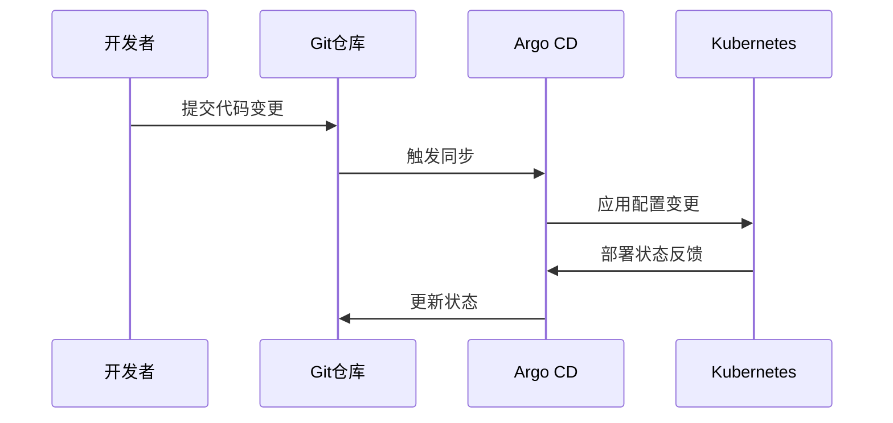

## 前言

在云原生技术栈中，虽然我们已经有了微服务架构、服务网格、容器编排等基础设施，但如何高效地构建、部署和管理云原生应用，仍然需要一套完整的开发框架和工具链。~~很多团队在云原生转型中只关注基础设施，却忽略了开发工具的适配性，导致开发效率不升反降~~。本文将探讨云原生应用开发框架与工具链如何成为连接开发者与云基础设施的桥梁，构建现代化应用开发的核心基础设施。

## 云原生应用开发框架

### 主流框架比较

| 框架名称 | 核心优势 | 适用场景 |
|---------|---------|---------|
| Spring Cloud | 成熟生态、企业级特性 | Java微服务开发 |
| Istio | 服务治理、流量控制 | 多语言微服务网格 |
| Knative | Serverless原生支持 | 事件驱动应用 |
| Quarkus | 极致启动性能、低内存占用 | 边缘计算场景 |

::: tip
选择框架时需考虑团队技术栈、业务复杂度及运维能力，避免过度设计
:::

### 框架选型关键因素

1. **开发者体验**
   - 本地开发环境一致性
   - 调试工具链支持
   - 学习曲线陡峭度

2. **运维友好性**
   - 可观测性集成
   - 自动扩缩容能力
   - 故障恢复机制

3. **生态兼容性**
   - 与现有CI/CD工具集成
   - 监控系统兼容性
   - 服务发现机制

## 工具链生态系统

### 开发阶段工具


- **代码质量保障**：SonarQube、ESLint
- **测试框架**：JUnit、TestNG、Pytest
- **容器化工具**：Buildpacks、Docker Buildx

### 部署运维工具链

1. **CI/CD平台**
   - GitLab CI/CD：内置Kubernetes集成
   - Argo CD：GitOps持续交付
   - Tekton：云原生CI/CD框架

2. **可观测性工具**
   - Prometheus + Grafana：监控与可视化
   - Jaeger：分布式追踪
   - Loki：日志聚合

3. **安全工具**
   - Trivy：容器漏洞扫描
   - Falco：运行时安全监控
   - Open Policy Agent：策略即代码

## 实践指南：构建完整工具链

### 1. 开发环境配置

```yaml
# .devcontainer/devcontainer.json
{
  "name": "云原生开发环境",
  "dockerComposeFile": "docker-compose.yml",
  "service": "workspace",
  "workspaceFolder": "/workspace",
  "features": {
    "docker-from-docker": "latest"
  }
}
```

### 2. GitOps工作流



### 3. 监控告警配置

```yaml
# prometheus-alerts.yaml
groups:
- name: 云原生应用
  rules:
  - alert: 高错误率
    expr: rate(http_requests_total{status=~"5.."}[5m]) > 0.1
    for: 5m
    labels:
      severity: critical
    annotations:
      summary: "服务错误率过高"
      description: "{{ $labels.service }} 错误率超过 10%"
```

## 未来发展趋势

1. **AI辅助开发**
   - 智能代码补全
   - 自动化测试生成
   - 性能优化建议

2. **低代码/无代码集成**
   - 可视化工作流编排
   - 拖拽式服务集成
   - 自动化文档生成

3. **开发者安全左移**
   - 内置安全扫描
   - 合规性检查
   - 密钥管理集成

## 结语

云原生应用开发框架与工具链是连接开发者与云基础设施的关键桥梁。通过选择合适的框架组合和构建完整的工具链，我们可以显著提升开发效率、系统可靠性和运维能力。🚀 未来，随着AI技术的融入，云原生开发工具链将变得更加智能化，帮助开发者专注于业务逻辑实现而非基础设施管理。

> 正如Kubernetes社区所说："让开发者专注于构建应用，而不是管理服务器"。云原生开发框架与工具链正是这一理念的最佳实践。

---

**建议阅读**：  
- [云原生微服务架构-构建现代化应用的核心架构模式](/pages/315/)  
- [云DevOps实践-构建高效可靠的云应用交付流水线](/pages/145/)  
- [云原生可观测性-构建透明可控的现代化应用监控体系](/pages/295/)