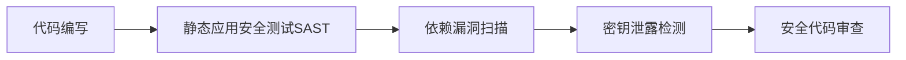

```markdown
---
title: 云原生DevSecOps实践-构建安全可靠的应用开发生命周期
date: 2026-02-06
tags:
  - 云原生安全
  - DevSecOps
  - 应用安全
---

## 前言

在云原生技术栈爆炸式增长的今天，我们享受着容器化、微服务、服务网格带来的敏捷与高效。然而~~安全往往被当作"最后考虑的环节"~~，直到某个凌晨收到告警邮件才惊觉："哦，原来我的API暴露在公网上了！"。DevSecOps（开发安全运维）正是解决这一痛点的关键实践，它将安全左移到开发全生命周期，让安全成为每个云原生应用的自然属性。

> "安全不是开发流程的附加项，而是云原生应用的DNA" —— 来自某云原生安全专家的金句

## 云原生DevSecOps的核心原则

### 🛡️ 安全左移
将安全检查前置到编码阶段，通过IDE插件、代码扫描工具实时检测漏洞，而不是等到部署后才进行安全测试。

### 🔍 持续验证
在CI/CD流水线中集成自动化安全扫描，每次提交、构建、部署都执行安全验证，建立"安全即代码"的持续验证机制。

### 🧩 基础设施即安全
将安全配置作为基础设施的一部分，通过IaC工具（如Terraform）定义安全基线，确保环境一致性。

## 实施DevSecOps的关键实践

### 1. 开发阶段安全


- **SAST工具**：SonarQube, Checkmarx
- **依赖扫描**：OWASP Dependency-Check
- **密钥检测**：GitGuardian, TruffleHog

### 2. 构建阶段安全
- 容器镜像扫描：Clair, Anchore
- 基础设施代码扫描：tfsec, Checkov
- 软件物料清单(SBOM)生成：Syft, CycloneDX

### 3. 部署阶段安全
- 网络策略验证：使用Calico/NetworkPolicy
- 工作负载身份认证：SPIFFE/SPIRE
- 运行时保护：Falco, Sysdig Secure

## 工具链与平台选择

### 推荐工具组合
| 阶段 | 工具类型 | 推荐工具 |
|------|----------|----------|
| 开发 | IDE插件 | Snyk Code, GitGuardian |
| 构建 | 容器安全 | Aqua Security, Sysdig |
| 部署 | 策略即代码 | Open Policy Agent (OPA) |
| 运行 | 威胁检测 | Falco, StackRox |

### 平台集成方案
```yaml
# Kubernetes Security Context示例
apiVersion: v1
kind: Pod
metadata:
  name: secure-app
spec:
  securityContext:
    runAsNonRoot: true
    seccompProfile:
      type: RuntimeDefault
  containers:
  - name: app
    image: secure-image:latest
    securityContext:
      allowPrivilegeEscalation: false
      readOnlyRootFilesystem: true
```

## 挑战与应对策略

### 挑战1：安全工具过载
**应对策略**：建立工具评估矩阵，优先选择能覆盖多场景的集成平台（如Snyk Platform），避免工具碎片化。

### 挑战2：团队安全意识不足
**应对策略**：
- 创建"安全沙盒"环境供团队实验
- 定期举办云原生安全工作坊
- 将安全知识融入入职培训

### 挑战3：合规审计复杂性
**应对策略**：
- 使用Compliance Operator管理Kubernetes合规
- 自动生成审计报告（如OpenSCAP）
- 建立合规即代码库（如Compliance-as-Code）

## 结语

云原生DevSecOps不是一次性项目，而是持续演进的安全文化。通过将安全嵌入每个环节，我们不仅能构建更安全的应用，还能在敏捷交付与安全合规之间找到平衡点。正如那句老话所说："在云原生时代，安全不是选择，而是生存的必要条件"。

> 最终，最好的安全策略是让安全变得"隐形"——它无处不在，却从不阻碍开发者的创造力。

---

**下一步行动**：
1. 从CI/CD流水线中添加SAST扫描
2. 为团队配置IDE安全插件
3. 建立容器镜像安全基线
```