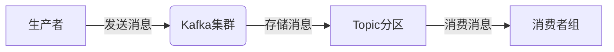
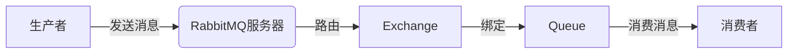
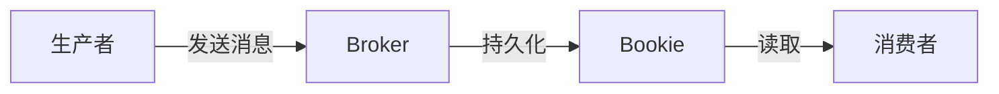

## 前言

在构建现代化云原生应用的过程中，服务间的通信是不可或缺的一环。📡 作为微服务架构的核心组件，分布式消息系统承担着服务解耦、异步处理、流量削峰等重要职责。然而，在我翻阅了博客中关于云原生、服务网格、事件驱动架构等多篇文章后，发现我们竟然没有一篇专门深入探讨云原生分布式消息系统的文章！这确实是一个不小的遗漏。

今天，我想和大家一起探索云原生环境下分布式消息系统的构建与应用，看看它如何成为我们现代化应用架构中的"隐形英雄"。

## 云原生分布式消息系统概述

### 什么是云原生分布式消息系统？

云原生分布式消息系统是一种专为云环境设计的消息中间件，它具备以下核心特性：

- **高可用性**：通过多副本、故障转移机制确保服务持续可用
- **水平扩展**：能够根据负载动态扩展处理能力
- **弹性伸缩**：应对流量波动，自动调整资源分配
- **容错性**：在节点故障时自动恢复，不丢失消息
- **可观测性**：提供全面的监控和诊断能力

与传统的消息中间件相比，云原生分布式消息系统更注重与容器化、微服务架构的集成，以及云原生生态的兼容性。

### 为什么云原生应用需要分布式消息系统？

在构建云原生应用时，我们面临着服务数量多、变化频繁、部署独立等挑战。分布式消息系统能够帮助我们：

1. **服务解耦**：服务之间通过消息进行通信，降低直接依赖
2. **异步处理**：允许长时间运行的任务不阻塞主流程
3. **流量削峰**：在流量高峰时缓冲请求，保护后端服务
4. **事件驱动**：支持基于事件的应用架构，提高响应速度

## 主流云原生分布式消息系统比较

目前，市场上有多款优秀的云原生分布式消息系统，各有特点和适用场景：

### Apache Kafka



**特点**：
- 高吞吐量，每秒可处理数百万条消息
- 基于分区的持久化日志模型
- 支持多种消费模式（队列、发布-订阅）
- 适合大数据场景和实时数据流处理

**适用场景**：
- 日志聚合与处理
- 用户行为跟踪
- 事件溯源系统
- 实时数据分析

### RabbitMQ



**特点**：
- 灵活的消息路由机制
- 支持多种消息协议（AMQP, MQTT, STOMP等）
- 丰富的消息特性（优先级、TTL、死信队列等）
- 管理界面友好，易于使用

**适用场景**：
- 企业应用集成
- 任务队列系统
- 实时通信应用
- 复杂路由场景

### Apache Pulsar



**特点**：
- 计算存储分离架构
- 多租户支持
- 原生地理复制
- 统一的API支持多种消息模型

**适用场景**：
- 全球化应用
- 多租户环境
- 混合工作负载
- 需要低延迟的场景

## 云原生环境下的消息系统实践

### 容器化部署

在云原生环境中，我们通常使用容器化部署消息系统。以Kafka为例，我们可以使用Strimzi这样的Operator来简化部署：

```yaml
apiVersion: kafka.strimzi.io/v1beta2
kind: Kafka
metadata:
  name: my-cluster
spec:
  kafka:
    replicas: 3
    listeners:
      - name: plain
        port: 9092
        type: internal
      - name: tls
        port: 9093
        type: internal
        tls: true
    config:
      offsets.topic.replication.factor: 3
      transaction.state.log.replication.factor: 3
      transaction.state.log.min.isr: 2
      log.retention.hours: 168
    storage:
      type: ephemeral
  zookeeper:
    replicas: 3
    storage:
      type: ephemeral
  entityOperator:
    topicOperator: {}
    userOperator: {}
```

### 水平扩展策略

云原生消息系统需要支持水平扩展，以应对不断增长的需求：

1. **分区扩展**：增加Kafka分区数以提高并行处理能力
2. **Broker扩展**：增加Broker节点以提高集群容量
3. **消费者扩展**：增加消费者实例以提高消费速度

### 监控与可观测性

构建完善的监控体系对于云原生消息系统至关重要：

```yaml
# Prometheus监控配置示例
- job_name: 'kafka'
  static_configs:
    - targets: ['kafka:9092']
  metrics_path: /metrics
  scrape_interval: 15s
```

关键监控指标包括：
- 消息生产/消费速率
- 分区Leader选举频率
- 磁盘使用情况
- 网络I/O
- JVM堆内存使用

### 安全与合规

在云环境中，消息系统的安全尤为重要：

1. **传输安全**：使用TLS加密通信
2. **访问控制**：基于角色的访问控制(RBAC)
3. **数据加密**：敏感数据加密存储
4. **审计日志**：记录所有访问和操作

## 云原生消息系统最佳实践

### 1. 合理设计Topic和分区

```java
// 代码示例：根据业务需求创建Topic
Properties props = new Properties();
props.put("bootstrap.servers", "kafka:9092");
props.put("key.serializer", "org.apache.kafka.common.serialization.StringSerializer");
props.put("value.serializer", "org.apache.kafka.common.serialization.StringSerializer");

Producer<String, String> producer = new KafkaProducer<>(props);
// 创建Topic
adminClient.createTopics(Collections.singleton(new NewTopic("orders", 6, (short) 3)));
```

**设计原则**：
- 根据业务需求确定分区数量
- 考虑消费者并行处理能力
- 避免分区热点问题

### 2. 消息幂等性处理

```java
// 消费者实现幂等性
public void processOrder(String orderId, Order order) {
    // 检查是否已处理
    if (orderRepository.existsById(orderId)) {
        return;
    }
    
    // 处理订单
    orderRepository.save(order);
    
    // 记录处理日志
    processingLogRepository.save(new ProcessingLog(orderId));
}
```

### 3. 死信队列处理

```yaml
# RabbitMQ死信队列配置示例
rabbitmq:
  queues:
    normal-queue:
      arguments:
        x-dead-letter-exchange: dead-letter-exchange
        x-dead-letter-routing-key: dead-letter-queue
    dead-letter-queue:
      durable: true
```

### 4. 消息顺序保证

```java
// Kafka分区键保证消息顺序
Properties props = new Properties();
// ... 其他配置
props.put("key.serializer", "org.apache.kafka.common.serialization.StringSerializer");

Producer<String, String> producer = new KafkaProducer<>(props);

// 使用订单ID作为分区键，保证同一订单的消息顺序一致
producer.send(new ProducerRecord<>("orders", order.getId(), order.toString()));
```

## 消息系统在微服务架构中的应用

### 事件驱动架构

在微服务架构中，消息系统是实现事件驱动架构的核心：

```java
// 订单服务发布订单创建事件
@Service
public class OrderService {
    
    @Autowired
    private KafkaTemplate<String, String> kafkaTemplate;
    
    public void createOrder(Order order) {
        // 保存订单
        orderRepository.save(order);
        
        // 发布订单创建事件
        OrderCreatedEvent event = new OrderCreatedEvent(order.getId(), order.getCustomerId());
        kafkaTemplate.send("order-events", event.toString());
    }
}

// 库存服务订阅订单创建事件
@Service
public class InventoryService {
    
    @KafkaListener(topics = "order-events")
    public void handleOrderCreated(String event) {
        OrderCreatedEvent orderEvent = parseEvent(event);
        // 更新库存
        inventoryRepository.updateInventory(orderEvent.getOrderId());
    }
}
```

### CQRS模式实现

消息系统是实现CQRS(命令查询职责分离)模式的重要组件：

```java
// 命令端处理写操作
@Service
public class OrderCommandService {
    
    @Autowired
    private KafkaTemplate<String, String> kafkaTemplate;
    
    public void createOrder(Order order) {
        // 发送命令到消息队列
        kafkaTemplate.send("order-commands", "CREATE:" + order.toString());
    }
}

// 查询端处理读操作
@Service
public class OrderQueryService {
    
    @Autowired
    private OrderReadRepository orderReadRepository;
    
    public Order getOrder(String orderId) {
        return orderReadRepository.findById(orderId);
    }
}
```

### Saga模式实现

对于分布式事务，消息系统可以实现Saga模式：

```java
// 订单Saga协调器
@Service
public class OrderSagaOrchestrator {
    
    @Autowired
    private KafkaTemplate<String, String> kafkaTemplate;
    
    public void createOrderSaga(Order order) {
        // 步骤1: 创建订单
        kafkaTemplate.send("order-saga", "CREATE_ORDER:" + order.toString());
        
        // 等待订单创建完成事件
        // ...
        
        // 步骤2: 扣减库存
        kafkaTemplate.send("order-saga", "RESERVE_INVENTORY:" + order.toString());
        
        // 等待库存预留完成事件
        // ...
        
        // 步骤3: 支付处理
        kafkaTemplate.send("order-saga", "PROCESS_PAYMENT:" + order.toString());
    }
}
```

## 未来发展趋势

云原生分布式消息系统正在不断发展，未来可能出现以下趋势：

### 1. 与Serverless的深度集成

消息系统将与Serverless计算平台更紧密地集成，实现事件驱动的无服务器架构：

```yaml
# Serverless函数与消息系统集成示例
functions:
  orderProcessor:
    handler: index.handler
    events:
      - kafka:
          topic: orders
          batchSize: 100
          maximumBatchingWindow: 20
```

### 2. 智能化运维

AI技术将被应用于消息系统的运维，实现自动化的容量规划、故障预测和性能优化。

### 3. 多云与混合云支持

随着企业多云战略的普及，消息系统将更好地支持跨云部署和数据同步。

### 4. 边缘计算集成

消息系统将与边缘计算平台集成，支持低延迟的本地消息处理和全局数据同步。

## 结语

云原生分布式消息系统是构建现代化应用架构的基石，它不仅解决了服务间通信的问题，更为我们构建弹性、可扩展、高可用的应用提供了可能。🚀

通过本文的探讨，我们了解了云原生消息系统的核心概念、主流产品、实践方法和应用场景。在实际项目中，我们需要根据业务需求、技术栈和团队经验选择合适的消息系统，并遵循最佳实践进行设计和实现。

未来，随着云原生技术的不断发展，消息系统也将继续演进，为我们提供更强大、更智能的通信能力。作为开发者，我们需要持续关注这些变化，不断学习和实践，才能构建出真正优秀的云原生应用。

> "在分布式系统中，没有银弹。选择合适的工具，遵循最佳实践，才能构建出真正可靠的消息系统架构。" —— 云原生架构师

希望这篇文章能够帮助大家更好地理解和应用云原生分布式消息系统。如果有任何问题或建议，欢迎在评论区交流讨论！👇