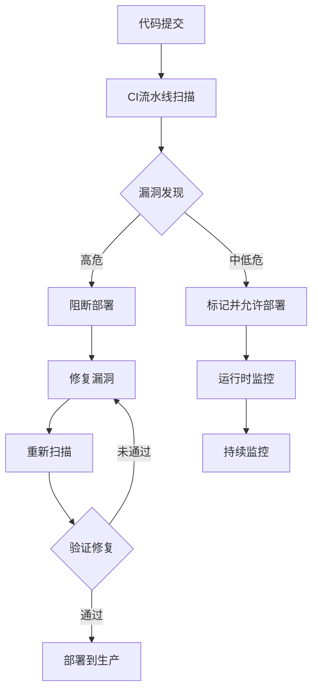

## 前言

随着云原生架构的普及，应用交付速度呈指数级增长，但安全测试往往成为交付流程中的瓶颈。在容器化、微服务和持续交付的环境下，传统的安全测试模式已无法满足现代应用开发的需求。本文将探讨如何在云原生环境中构建高效的安全测试与漏洞管理流程，确保安全与速度的平衡。

## 云原生环境下的安全挑战

云原生架构带来了前所未有的复杂性和动态性，同时也引入了新的安全挑战：

- **动态攻击面**：容器镜像、Kubernetes配置、服务间通信等构成了持续变化的攻击面
- **短暂生命周期**：容器的快速创建和销毁使传统安全扫描方式难以适应
- **分布式架构**：微服务拆分增加了系统组件数量，扩大了攻击面
- **供应链风险**：第三方依赖和基础镜像的安全隐患难以追踪

## 安全测试方法

在云原生环境中，我们需要采用多层次的安全测试策略：

### 1. 容器镜像安全扫描
```bash
# 使用Trivy扫描容器镜像
trivy image --exit-code 0 --severity HIGH,CRITICAL my-app:latest
```

### 2. Kubernetes配置安全检查
- 使用kube-bench检查Kubernetes集群配置
- 使用kube-hunter发现集群漏洞
- 应用安全配置管理（如PodSecurityPolicy）

### 3. 应用层安全测试
- **SAST（静态应用安全测试）**：在代码层面发现漏洞
- **DAST（动态应用安全测试）**：运行时测试应用安全
- **SCA（软件成分分析）**：扫描依赖包漏洞
- **IAST（交互式应用安全测试）**：结合SAST和DAST优势

## 漏洞管理流程

构建闭环的漏洞管理流程是云原生安全的关键：



## DevSecOps工具链集成

将安全测试无缝集成到CI/CD流程中：

### 1. GitLab CI/CD示例
```yaml
security_scan:
  stage: test
  image: docker:latest
  services:
    - docker:dind
  script:
    - docker build -t my-app .
    - trivy image --exit-code 0 --severity HIGH,CRITICAL my-app:latest
    - kubectl apply -f k8s-deployment.yaml
    - kube-score version
    - kube-score deployment k8s-deployment.yaml
```

### 2. 关键工具推荐
- **容器安全**：Trivy, Clair, Anchore
- **Kubernetes安全**：kube-bench, kube-hunter, Falco
- **SCA工具**：OWASP Dependency-Check, Snyk
- **运行时安全**：Falco, Sysdig Secure

## 实践案例：电商平台安全转型

某电商平台采用云原生架构后，面临以下安全挑战：
1. 每日发布多个版本，传统安全扫描耗时过长
2. 微服务数量超过200个，安全测试覆盖不全
3. 第三方组件漏洞频发，响应不及时

**解决方案**：
1. 在CI/CD流水线中集成自动化安全扫描
2. 建立漏洞优先级评分系统
3. 实施安全左移，在开发阶段引入安全测试
4. 部署运行时安全监控系统

**结果**：
- 安全测试时间从平均4小时减少到15分钟
- 高危漏洞修复周期从7天缩短到24小时
- 安全事件响应时间减少70%

## 未来展望

云原生安全测试将向以下方向发展：

1. **AI驱动安全测试**：利用机器学习预测潜在漏洞
2. **自适应安全策略**：根据应用环境动态调整安全规则
3. **零信任架构集成**：将安全测试与零信任模型深度结合
4. **供应链安全强化**：从代码到部署的全链路安全验证

## 结语

在云原生时代，安全不再是交付流程的障碍，而是质量保障的核心环节。通过构建自动化、集成化的安全测试与漏洞管理流程，我们可以在保持开发速度的同时，确保应用的安全性。记住：**安全不是一次性的检查，而是持续的过程**。只有将安全左移到开发流程的每个环节，才能真正构建安全可靠的云原生应用交付管道。

> "在DevOps的世界里，安全不是刹车，而是加速器。" —— 安全专家观点