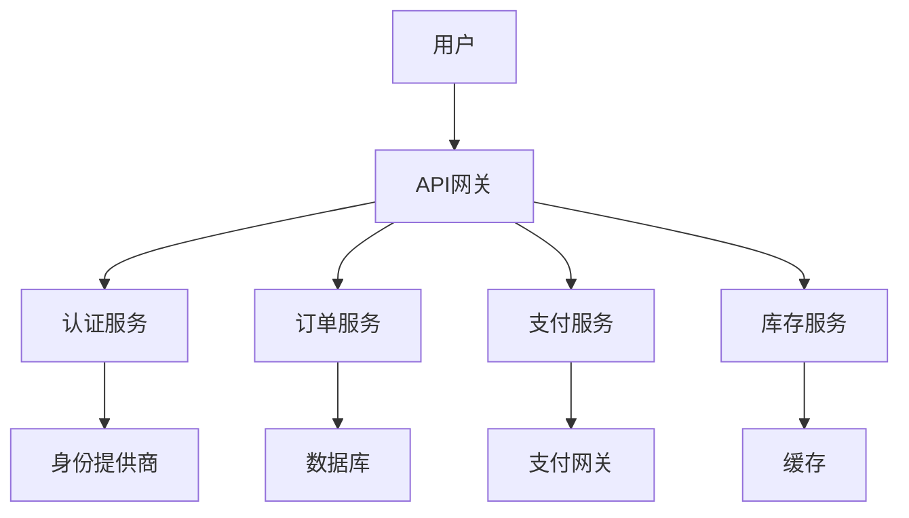
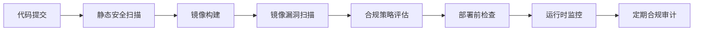
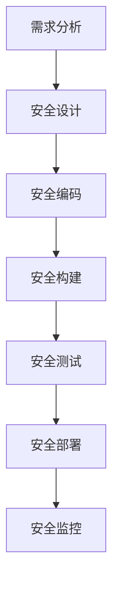

## 前言

在云原生技术蓬勃发展的今天，越来越多的企业将核心业务迁移到云端，构建现代化的应用架构。然而，随着应用上云，安全合规问题也日益凸显。特别是在金融、医疗、政府等严格监管的行业，如何在享受云原生技术带来便利的同时，确保应用符合各种法规要求，成为了每个技术团队必须面对的挑战。

::: tip
"安全不是云原生应用的附加功能，而是架构设计的核心组成部分。合规不是事后检查，而是贯穿整个开发生命周期的持续过程。"
:::

作为一名长期在云原生领域实践的技术人员，我深刻体会到安全合规对于云原生应用的重要性。本文将分享我在云原生应用安全合规方面的实践经验，希望能为正在面临类似挑战的团队提供一些参考。

## 云原生环境下的合规挑战

云原生环境与传统IT环境有着本质的区别，这给安全合规带来了新的挑战。

### 动态性与合规要求的矛盾

云原生应用的一个显著特点是动态性 - 容器可以随时创建、销毁和迁移，服务可以弹性伸缩。然而，大多数合规要求（如PCI DSS、HIPAA、GDPR等）都假设了一个相对静态的环境，要求对系统进行严格的配置管理和变更控制。

**我遇到的实际情况是**：在一次金融客户的审计中，审计人员要求我们提供过去3个月内所有容器镜像的完整变更记录。由于我们的CI/CD流程每天构建数十个镜像，手动记录几乎是不可能的任务。~~那一刻，我深刻体会到"技术债务"的可怕~~。

### 分布式架构与责任边界的模糊

微服务架构将应用拆分为多个独立服务，每个服务都有自己的安全责任边界。这种分布式的架构使得传统的安全边界变得模糊，合规责任也难以明确界定。



在上图中，合规责任如何划分？API网关是否需要对所有服务的合规性负责？每个服务是否需要独立满足合规要求？这些问题在实际项目中常常引发争议。

### 多云环境下的合规一致性

许多企业采用多云或混合云策略，以避免供应商锁定并提高可用性。然而，不同的云平台有不同的合规认证和安全机制，如何在多云环境下保持一致的合规状态，是一个巨大的挑战。

## 云原生应用安全合规框架

为了应对上述挑战，我建议采用以下框架来构建云原生应用的安全合规体系。

### 合规即代码 (Compliance as Code)

将合规要求转化为代码，实现自动化检查和持续监控。这种方法可以确保合规性贯穿整个开发生命周期。

```bash
# 示例：使用Open Policy Agent (OPA)定义合规策略
package system.example

# 确保容器镜像不包含已知漏洞
deny[msg] {
    input.container.image.ref = image_ref
    vulns = data.vulnerabilities[image_ref]
    count(vulns) > 0
    msg := sprintf("容器镜像 %v 包含 %d 个已知漏洞", [image_ref, count(vulns)])
}

# 确保敏感数据不被硬编码
deny[msg] {
    input.container.env[_] = env_var
    contains(env_var.value, "password")
    msg := sprintf("环境变量 %v 可能包含硬编码的密码", [env_var.name])
}
```

### 分层合规模型

将合规要求分解为多个层次，每个层次对应云原生架构的不同组件：

| 层次 | 组件 | 合规关注点 |
|------|------|------------|
| 基础设施层 | 容器运行时、Kubernetes集群 | 镜像安全、网络策略、访问控制 |
| 平台层 | CI/CD管道、配置管理 | 构建安全、密钥管理、变更控制 |
| 应用层 | 微服务、API | 数据保护、身份认证、审计日志 |
| 数据层 | 数据库、缓存 | 数据加密、访问控制、备份策略 |

### 合规自动化工具链

构建完整的合规自动化工具链，实现从开发到部署的全流程合规检查：



## 实践案例：金融行业云原生应用合规

### 背景

某大型金融机构计划将其核心交易系统迁移到云原生架构，同时需要满足PCI DSS v4.0和行业特定的监管要求。

### 挑战

1. 交易系统需要满足严格的实时交易性能要求
2. 必须确保所有交易数据的安全性和完整性
3. 需要满足审计和合规报告要求
4. 系统需要7x24小时高可用

### 解决方案

#### 1. 容器镜像安全

我们采用了以下策略确保容器镜像的安全性：

- **基础镜像安全**：使用经过安全加固的基础镜像，并定期更新
- **镜像扫描**：在构建过程中集成Trivy和Clair进行漏洞扫描
- **镜像签名**：使用Notary对镜像进行数字签名，确保来源可信

```yaml
# 示例：GitHub Actions中的镜像安全扫描
jobs:
  security-scan:
    runs-on: ubuntu-latest
    steps:
      - name: Checkout code
        uses: actions/checkout@v2
      
      - name: Run Trivy vulnerability scanner
        uses: aquasecurity/trivy-action@master
        with:
          scan-type: 'fs'
          scan-ref: '.'
          format: 'sarif'
          output: 'trivy-results.sarif'
      
      - name: Upload Trivy scan results to GitHub Security tab
        uses: github/codeql-action/upload-sarif@v1
        with:
          sarif_file: 'trivy-results.sarif'
```

#### 2. 网络安全

在Kubernetes集群中实施了以下网络安全措施：

- **网络策略**：使用NetworkPolicy限制Pod之间的通信
- **服务网格**：使用Istio实现细粒度的流量管理和安全控制
- **加密传输**：所有外部通信使用TLS 1.3，内部通信使用mTLS

```yaml
# 示例：Kubernetes网络策略
apiVersion: networking.k8s.io/v1
kind: NetworkPolicy
metadata:
  name: transaction-service-policy
spec:
  podSelector:
    matchLabels:
      app: transaction-service
  policyTypes:
  - Ingress
  - Egress
  ingress:
  - from:
    - podSelector:
        matchLabels:
          app: api-gateway
    ports:
    - protocol: TCP
      port: 8080
  egress:
  - to:
    - podSelector:
        matchLabels:
          app: database
    ports:
    - protocol: TCP
      port: 5432
```

#### 3. 数据保护

针对交易数据的保护，我们实施了以下措施：

- **数据加密**：静态数据使用AES-256加密，传输数据使用TLS
- **密钥管理**：使用HashiCorp Vault集中管理密钥，并实施严格的访问控制
- **数据脱敏**：在开发和测试环境中自动对敏感数据进行脱敏处理

#### 4. 审计日志

建立了完整的审计日志系统：

- **集中式日志收集**：使用EFK (Elasticsearch, Fluentd, Kibana) stack收集所有系统日志
- **日志完整性保护**：使用区块链技术确保日志不被篡改
- **实时监控**：设置异常检测规则，实时发现潜在的安全事件

### 成果

通过上述措施，该金融机构成功实现了云原生架构下的安全合规：

1. 满足了PCI DSS v4.0的所有要求
2. 系统性能提升了30%，同时安全性得到加强
3. 合规审计时间从原来的3周缩短到2天
4. 安全事件响应时间从小时级缩短到分钟级

## 云原生应用安全合规最佳实践

基于我的实践经验，以下是一些云原生应用安全合规的最佳实践：

### 1. 左移安全 (Shift Left Security)

将安全检查尽可能向开发流程的左侧移动，尽早发现和修复安全问题：



### 2. 持续合规监控

建立持续合规监控机制，确保系统始终符合合规要求：

- **实时监控**：使用Prometheus和Grafana设置合规指标监控
- **定期审计**：定期进行自动化合规审计，生成合规报告
- **合规仪表板**：建立统一的合规状态仪表板，实时展示合规状态

### 3. 安全培训与意识提升

安全合规不仅仅是技术问题，更是人的问题：

- **定期安全培训**：为开发团队提供云原生安全培训
- **安全编码规范**：制定云原生应用的安全编码规范
- **安全意识活动**：定期举办安全意识活动，如"安全编码月"

### 4. 合规自动化与DevSecOps

将合规检查集成到CI/CD流程中，实现DevSecOps：

```yaml
# 示例：GitLab CI/CD中的合规检查
stages:
  - build
  - test
  - security
  - deploy

build:
  stage: build
  script:
    - docker build -t $CI_REGISTRY_IMAGE:$CI_COMMIT_SHA .

security-scan:
  stage: security
  script:
    - trivy image --exit-code 1 --severity CRITICAL,HIGH $CI_REGISTRY_IMAGE:$CI_COMMIT_SHA
    - opa eval -d policy.rego "data.system.example.allow" --input input.json

compliance-check:
  stage: security
  script:
    - ansible-playbook -i inventory compliance.yml
    - lynis audit system --all

deploy:
  stage: deploy
  script:
    - kubectl apply -f k8s/
  only:
    - master
```

## 未来展望

随着云原生技术的不断发展，云原生应用安全合规也将面临新的挑战和机遇：

### 1. AI驱动的智能合规

人工智能技术将被广泛应用于合规自动化，实现智能化的合规监控和风险评估。

### 2. 区块链技术在合规中的应用

区块链技术将被用于确保审计日志的完整性和不可篡改性，提高合规的可信度。

### 3. 合规即代码的普及

合规即代码将成为主流实践，合规要求将以代码形式定义和执行，实现真正的自动化合规。

### 4. 跨云合规标准的统一

随着多云环境的普及，跨云合规标准将逐渐统一，降低多云环境下的合规复杂性。

## 结语

云原生应用安全合规是一个复杂而持续的挑战，需要技术、流程和文化的全方位变革。通过采用合规即代码、分层合规模型和自动化工具链，我们可以构建既安全又高效的云原生应用。

作为技术人员，我们不仅要关注技术的创新，更要重视技术的责任。在享受云原生技术带来便利的同时，我们也要确保应用的安全合规，为企业的数字化转型保驾护航。

::: right
"安全不是阻碍创新的障碍，而是创新的基础。合规不是束缚发展的枷锁，而是可持续发展的保障。"
:::

希望本文的分享能为您的云原生应用安全合规实践提供一些参考和启发。如果您有任何问题或建议，欢迎在评论区交流讨论！