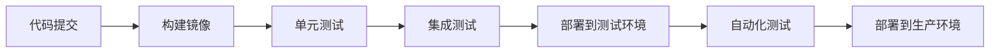

## 前言

大家好，我是Jorgen！👋 最近在项目中，我遇到了一个经典的问题：如何让我们的应用在不同的环境中保持一致的行为？~~又是一个"在我电脑上明明能跑"的悲剧~~ 😂 

经过一番折腾，我发现云原生技术可能是解决这个问题的最佳方案。今天，我想和大家聊聊云原生技术，特别是容器化和Kubernetes，这些技术如何帮助我们构建更现代化、更可靠的应用。

::: tip
云原生技术不仅仅是一组工具，更是一种构建和运行应用程序的方法论，充分利用了云计算的优势。
:::

## 传统部署的痛点

在深入云原生之前，我们先看看传统部署方式面临的挑战：

- **环境不一致**：开发、测试、生产环境差异导致的问题
- **资源利用率低**：物理服务器资源分配不均
- **扩展性差**：难以根据负载快速扩展或缩减
- **部署复杂**：手动部署过程容易出错
- **运维困难**：应用状态难以监控和管理

这些问题随着微服务架构的普及变得更加突出。我们需要一种新的方式来应对这些挑战。

## 云原生技术概述

云原生技术是一组实践和工具，帮助我们在云环境中构建和运行可弹性扩展的应用。🏗

### 云原生的核心组件

1. **容器化**：将应用及其依赖打包在一起
2. **编排系统**：自动化容器的部署、扩展和管理
3. **微服务架构**：将应用拆分为小型、独立的服务
4. **持续交付**：自动化构建、测试和部署流程
5. **声明式API**：描述期望状态而非具体操作

::: theorem
云原生计算基金会(CNCF)定义：云原生技术有利于各组织在公有云、私有云和混合云等新型动态环境中，构建和运行可弹性扩展的应用。
:::

## 容器化技术

容器化是云原生的基石，它将应用程序及其依赖打包在一个轻量级、可移植的容器中。

### Docker：容器化的代表

Docker是最流行的容器化平台之一，它简化了容器的创建和管理。

```bash
# 构建Docker镜像
docker build -t myapp:latest .

# 运行容器
docker run -d -p 8080:80 myapp:latest

# 查看运行中的容器
docker ps
```

容器相比传统虚拟机的优势：

| 特性 | 虚拟机 | 容器 |
|------|--------|------|
| 启动时间 | 分钟级 | 秒级甚至毫秒级 |
| 资源占用 | GB级 | MB级 |
| 隔离级别 | 完全隔离 | 进程级隔离 |
| 部署密度 | 低 | 高 |

### 容器编排：从手动到自动

当容器数量增多时，手动管理变得不切实际。这时就需要容器编排工具。📡

## Kubernetes：容器编排的事实标准

Kubernetes(简称K8s)是目前最流行的容器编排平台，它自动化了容器的部署、扩展和管理。

### Kubernetes核心概念

- **Pod**：K8s中最小的部署单元，包含一个或多个容器
- **Service**：为一组Pod提供统一的访问入口
- **Deployment**：管理Pod的创建和更新
- **Namespace**：用于隔离不同的资源
- **Ingress**：管理外部访问规则

### Kubernetes示例

下面是一个简单的Kubernetes Deployment示例：

```yaml
apiVersion: apps/v1
kind: Deployment
metadata:
  name: myapp-deployment
spec:
  replicas: 3
  selector:
    matchLabels:
      app: myapp
  template:
    metadata:
      labels:
        app: myapp
    spec:
      containers:
      - name: myapp
        image: myapp:latest
        ports:
        - containerPort: 8080
```

### Kubernetes的优势

1. **自动化运维**：自动处理容器故障、扩展等
2. **声明式配置**：描述期望状态，K8s负责实现
3. **服务发现与负载均衡**：内置服务发现和负载均衡
4. **存储编排**：支持多种存储系统
5. **自我修复**：自动替换失败的容器

## 云原生架构实践

在项目中实施云原生架构时，我总结了一些实践经验：

### 微服务拆分策略

- **按业务能力拆分**：每个服务负责特定的业务功能
- **单一职责**：每个服务只做一件事并做好
- **独立部署**：服务可以独立开发、测试和部署
- **去中心化数据管理**：每个服务管理自己的数据

### CI/CD流水线

云原生应用需要高效的CI/CD流水线：



### 可观测性

在云原生环境中，可观测性至关重要：

- **日志**：集中式日志收集和分析
- **指标**：应用和系统性能指标监控
- **追踪**：分布式请求追踪

## 云原生工具生态系统

云原生不仅仅有Kubernetes，还有丰富的工具生态系统：

| 工具类别 | 代表工具 | 用途 |
|---------|---------|------|
| 容器运行时 | Docker, containerd | 运行容器 |
| 编排系统 | Kubernetes, Swarm | 容器编排 |
| 服务网格 | Istio, Linkerd | 服务间通信管理 |
| 包管理 | Helm, Kustomize | Kubernetes应用管理 |
| 监控 | Prometheus, Grafana | 监控和可视化 |
| 日志 | ELK Stack, Fluentd | 日志收集和分析 |

## 云原生面临的挑战

尽管云原生有很多优势，但在实践中也面临一些挑战：

1. **学习曲线陡峭**：Kubernetes和云原生概念复杂
2. **资源消耗**：控制平面需要一定资源
3. **网络复杂性**：服务间网络配置复杂
4. **安全性**：容器安全需要特别关注
5. **供应商锁定**：某些云厂商的专有功能

## 结语

云原生技术正在改变我们构建和运行应用的方式。通过容器化和Kubernetes，我们可以构建更加弹可靠、可扩展的应用系统。🚀

对我来说，云原生之旅是一段持续学习的过程。刚开始接触时，确实被Kubernetes的复杂性吓到，但一旦掌握核心概念，就会发现它带来的巨大价值。

> "云原生不是终点，而是旅程。它让我们能够更好地利用云的潜力，构建面向未来的应用。"

如果你还没有开始云原生之旅，我建议从小处着手，尝试容器化一个现有应用，然后逐步探索Kubernetes的更多功能。记住，技术是为了解决问题，而不是为了技术而技术。

希望这篇文章对你有所帮助！如果有任何问题或想法，欢迎在评论区交流讨论。😊