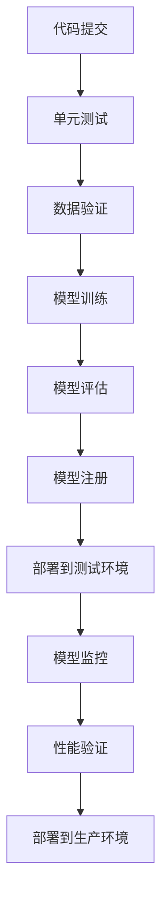
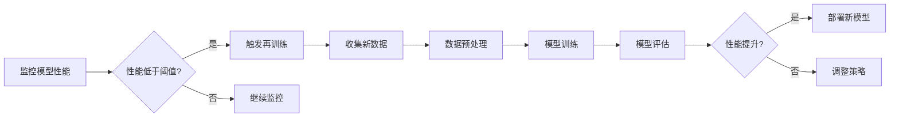

## 前言

作为一名现代开发者，我最近被公司要求将我们团队开发的机器学习模型部署到生产环境。说实话，这让我有点措手不及！🤯 我熟悉传统的软件工程流程，但机器学习系统的部署和维护似乎有着完全不同的挑战。

在深入研究了这个领域后，我发现了一个叫做"MLOps"的概念，它正是连接机器学习开发和传统软件工程的桥梁。今天，我想和大家分享我在构建生产级机器学习系统过程中的经验和思考。

## 什么是MLOps？

MLOps（Machine Learning Operations）是机器学习、DevOps和数据工程的结合体，旨在简化机器学习系统的生命周期管理。它借鉴了DevOps的原则和实践，但针对机器学习系统的特殊需求进行了定制。

::: tip
MLOps不是简单的DevOps应用，而是需要考虑模型特性、数据漂移、实验跟踪等ML特有的挑战。
:::

与传统软件相比，机器学习系统有着独特的复杂性：

1. **模型的不确定性**：软件行为通常是确定的，而模型预测可能存在不确定性
2. **数据依赖性**：模型性能高度依赖于训练数据的质量和分布
3. **持续学习需求**：模型需要定期重新训练以适应新的数据分布
4. **可解释性挑战**：复杂模型的决策过程往往难以解释

## MLOps的核心实践

### 1. 版本控制

在机器学习项目中，我们需要管理多个版本的"工件"：

```yaml
# MLOps版本控制结构示例
ml-project/
├── data/
│   ├── v1.0/          # 数据版本1.0
│   └── v2.0/          # 数据版本2.0
├── models/
│   ├── v1.2/          # 模型版本1.2
│   └── v2.0/          # 模型版本2.0
├── notebooks/
│   ├── exploration.ipynb
│   └── training.ipynb
└── src/
    ├── data_preprocessing.py
    ├── feature_engineering.py
    └── model_training.py
```

### 2. 实验跟踪

在机器学习项目中，我们经常需要尝试不同的算法、超参数和预处理方法。实验跟踪工具（如MLflow、Weights & Biases）可以帮助我们记录和比较这些实验：

```python
# 使用MLflow记录实验
import mlflow
from sklearn.ensemble import RandomForestClassifier

# 启动实验
with mlflow.start_run():
    # 记录参数
    mlflow.log_param("n_estimators", 100)
    mlflow.log_param("max_depth", 5)
    
    # 训练模型
    model = RandomForestClassifier(n_estimators=100, max_depth=5)
    model.fit(X_train, y_train)
    
    # 记录指标
    accuracy = model.score(X_test, y_test)
    mlflow.log_metric("accuracy", accuracy)
    
    # 记录模型
    mlflow.sklearn.log_model(model, "random_forest_model")
```

### 3. CI/CD流水线

构建机器学习系统的CI/CD流水线需要考虑特殊的步骤：



### 4. 模型部署

模型部署有多种策略，选择合适的策略取决于业务需求：

| 部署策略 | 描述 | 适用场景 |
|---------|------|---------|
| 批处理预测 | 定期对大量数据进行预测 | 离线分析、报表生成 |
| 实时预测 | 对单个请求立即返回结果 | 在线推荐、实时决策 |
| 边缘部署 | 将模型部署到靠近数据源的设备 | IoT设备、移动应用 |
| 混合部署 | 结合批处理和实时预测 | 复杂业务场景 |

### 5. 模型监控

模型部署后，持续监控是必不可少的：

- **性能监控**：跟踪模型的准确率、精确率、召回率等指标
- **数据漂移检测**：监控输入数据分布的变化
- **概念漂移检测**：监控目标变量分布的变化
- **资源使用监控**：CPU、内存、GPU使用情况

```python
# 简单的数据漂移检测示例
from scipy import stats

def detect_data_drift(reference_data, current_data, significance=0.05):
    """使用KS检验检测数据分布变化"""
    statistic, p_value = stats.ks_2samp(reference_data, current_data)
    return p_value < significance

# 使用示例
is_drift = detect_data_drift(reference_data, current_data)
if is_drift:
    alert_team("检测到数据漂移！")
```

### 6. 模型再训练

模型性能会随时间下降，因此需要定期重新训练：



## 实用工具推荐

构建MLOps系统时，以下工具可能会很有用：

- **MLflow**：实验跟踪、模型注册和部署
- **Kubeflow**：在Kubernetes上端到端部署ML工作流
- **TFX (TensorFlow Extended)**：构建可扩展的ML生产管道
- **SageMaker**：AWS的ML平台
- **Vertex AI**：Google Cloud的ML平台
- **MLflow Pipelines**：构建可重复的ML工作流

## 案例研究：电商推荐系统

我曾经参与构建一个电商推荐系统，面临以下挑战：

1. **数据量大**：每天数百万用户行为数据
2. **实时性要求高**：需要在100ms内返回推荐结果
3. **个性化需求强**：需要适应用户兴趣变化

我们的解决方案：

1. 使用批处理+实时混合架构
2. 实施数据漂移检测，每周触发模型再训练
3. 采用蓝绿部署策略确保平滑过渡
4. 建立完整的监控仪表板，跟踪关键指标

## 结语

MLOps不仅仅是技术问题，更是思维方式的转变。它要求我们从传统的"构建-部署"模式转向"构建-部署-监控-改进"的持续迭代模式。

🤔 随着AI技术的快速发展，MLOps的重要性只会增加。如果你正在或将要从事机器学习项目，我强烈建议你尽早开始思考MLOps实践。记住，一个没有工程化支持的机器学习模型，就像一辆没有维护的跑车——看起来很酷，但跑不远！

> "机器学习系统的成功不仅取决于模型的准确性，更取决于其稳定性和可维护性。" —— 这是我在MLOps实践中最深刻的体会。

希望这篇文章对你有所帮助！如果你有任何问题或经验分享，欢迎在评论区留言。😊