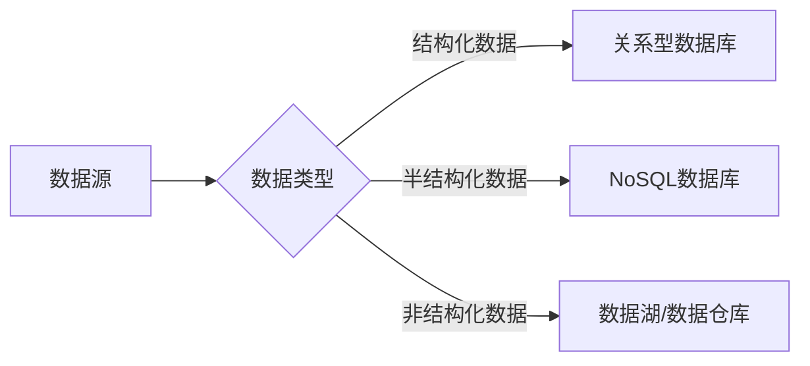

## 前言

作为一名开发者，我们常常沉浸在代码的世界里，构建功能、优化性能、解决bug。但在这个信息爆炸的时代，真正有价值的不仅仅是代码本身，更是代码能够处理和分析的数据。🤔

随着技术的不断发展，数据科学和大数据已经从学术研究领域走进了日常的开发工作中。作为一名应用开发者，掌握数据科学的基本概念和工具，已经不再是数据科学家的专利，而是我们提升应用价值、理解用户行为、优化产品决策的必备技能。

今天，我想和大家分享一下我对数据科学与大数据在现代应用开发中的理解和实践经验。

## 什么是数据科学与大数据？

::: theorem
**数据科学**是一个跨学科领域，结合了统计学、计算机科学和领域专业知识，用于从数据中提取有价值的见解和知识。
:::

而**大数据**则指的是规模庞大、类型多样的数据集，传统数据处理工具难以有效处理。大数据通常具有"4V"特征：
- **Volume（大量）**：数据量巨大，从TB到PB级别
- **Velocity（高速）**：数据生成和处理速度快
- **Variety（多样）**：数据类型多样，包括结构化、半结构化和非结构化数据
- **Value（价值）**：数据中蕴含巨大的潜在价值

## 现代应用中的数据科学工作流程

### 1. 数据收集与存储

在应用开发中，我们通过各种渠道收集数据：
- 用户行为数据（点击、浏览、购买等）
- 系统日志数据
- 第三方API数据
- 传感器数据（IoT设备）

对于这些数据，我们需要选择合适的存储方案：



### 2. 数据清洗与预处理

原始数据往往是"脏"的，需要进行清洗和预处理：
- 处理缺失值
- 去除重复数据
- 数据标准化和归一化
- 特征工程

::: tip
在实际项目中，数据清洗往往占据了数据科学家60%-80%的工作时间。虽然过程繁琐，但却是确保模型准确性的关键步骤！
:::

### 3. 数据分析与探索

在开始建模之前，我们需要对数据进行探索性分析(EDA)：
- 描述性统计分析
- 数据可视化
- 相关性分析
- 特征选择

常用的Python库包括：
- **Pandas**：数据处理和分析
- **NumPy**：科学计算基础库
- **Matplotlib/Seaborn**：数据可视化
- **Scikit-learn**：机器学习算法

### 4. 机器学习模型构建

根据业务需求，我们可以选择不同的机器学习模型：

| 模型类型 | 适用场景 | 常用算法 |
|---------|---------|---------|
| 监督学习 | 分类、回归 | 线性回归、决策树、随机森林、神经网络 |
| 无监督学习 | 聚类、降维 | K-means、PCA、层次聚类 |
| 强化学习 | 序列决策 | Q-learning、策略梯度 |

### 5. 模型评估与优化

构建模型后，我们需要评估其性能并进行优化：
- 交叉验证
- 混淆矩阵
- ROC曲线
- 超参数调优

### 6. 模型部署与监控

最后，将模型部署到生产环境并持续监控其性能：
- 模型版本控制
- A/B测试
- 性能监控
- 模型更新与再训练

## 大数据技术栈

对于大规模数据处理，我们需要掌握以下技术：

### 1. 分布式计算框架

- **Apache Spark**：统一的分析引擎，用于大规模数据处理
- **Apache Flink**：流处理和批处理框架
- **Apache Hadoop**：分布式存储和计算基础架构

### 2. 数据仓库与数据湖

- **Snowflake**：云原生数据仓库
- **Google BigQuery**：Serverless数据仓库
- **Amazon Redshift**：云数据仓库服务
- **Delta Lake**：数据湖上的事务存储层

### 3. 实时数据处理

- **Apache Kafka**：分布式流处理平台
- **Apache Storm**：实时计算系统
- **Apache NiFi**：自动化数据流系统

## 数据科学在应用开发中的实际应用

### 1. 个性化推荐系统

几乎所有现代应用都包含某种形式的推荐系统：

```
用户行为数据 → 特征提取 → 推荐算法 → 个性化内容
```

常见的推荐算法包括：
- 协同过滤
- 基于内容的推荐
- 深度学习推荐模型

### 2. 预测性维护

在工业IoT应用中，通过分析设备数据预测可能的故障：

```python
# 简单的预测性维护示例
def predict_failure(sensor_data):
    # 使用机器学习模型预测设备故障
    model = load_model('failure_prediction_model.pkl')
    features = extract_features(sensor_data)
    prediction = model.predict([features])
    return prediction[0] > 0.7
```

### 3. 异常检测

通过监控系统数据，及时发现异常行为：

- 网络安全异常检测
- 金融欺诈检测
- 生产过程异常监控

### 4. 自然语言处理

现代应用越来越多地集成NLP功能：

- 情感分析
- 文本分类
- 机器翻译
- 聊天机器人

## 数据科学与开发的工具集成

### 1. Jupyter Notebook与VS Code

Jupyter Notebook是数据科学家的首选工具，而VS Code则提供了更好的开发体验：

```python
# 在VS Code中使用Jupyter进行数据分析
import pandas as pd
import matplotlib.pyplot as plt

# 加载数据
df = pd.read_csv('user_behavior.csv')

# 数据分析
df.describe()
df.groupby('category').mean()

# 数据可视化
df.plot(kind='scatter', x='time_spent', y='satisfaction')
plt.show()
```

### 2. MLflow与模型管理

MLflow是管理机器学习工作流程的开源平台：

```python
import mlflow
import mlflow.sklearn

# 记录实验
with mlflow.start_run():
    # 训练模型
    model = train_model(X_train, y_train)
    
    # 记录参数
    mlflow.log_param("n_estimators", 100)
    mlflow.log_param("max_depth", 5)
    
    # 记录指标
    mlflow.log_metric("accuracy", accuracy)
    
    # 保存模型
    mlflow.sklearn.log_model(model, "model")
```

### 3. Docker与容器化

将数据科学应用容器化，便于部署和扩展：

```dockerfile
FROM python:3.9-slim

WORKDIR /app

COPY requirements.txt .
RUN pip install -r requirements.txt

COPY . .

CMD ["python", "app.py"]
```

## 数据科学与开发者的未来

随着技术的不断发展，数据科学与软件开发之间的界限将越来越模糊。作为一名开发者，掌握数据科学技能将使我们能够：

1. **构建更智能的应用**：通过数据分析提供更好的用户体验
2. **做出更明智的决策**：基于数据而非直觉进行产品决策
3. **优化系统性能**：通过数据分析发现系统瓶颈
4. **发现新的业务机会**：通过数据挖掘发现潜在的市场需求

## 结语

数据科学与大数据已经不再是数据科学家的专属领域，而是现代应用开发者的必备技能。通过掌握数据分析、机器学习和大数据处理的基本概念和技术，我们能够构建更智能、更有价值的应用。

正如我常说的："在代码的世界里，数据是新的石油，而数据科学则是提炼这石油的技术。" 🛢️💡

> "数据是新时代的石油，但数据科学是提炼这石油的技术，而开发者则是将这些技术应用到实际产品中的工程师。"

希望这篇文章能够帮助你更好地理解数据科学与大数据在现代应用开发中的重要性。如果你有任何问题或想法，欢迎在评论区分享！👇

---

*Happy coding and data-driven development!* 😄