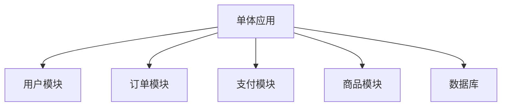
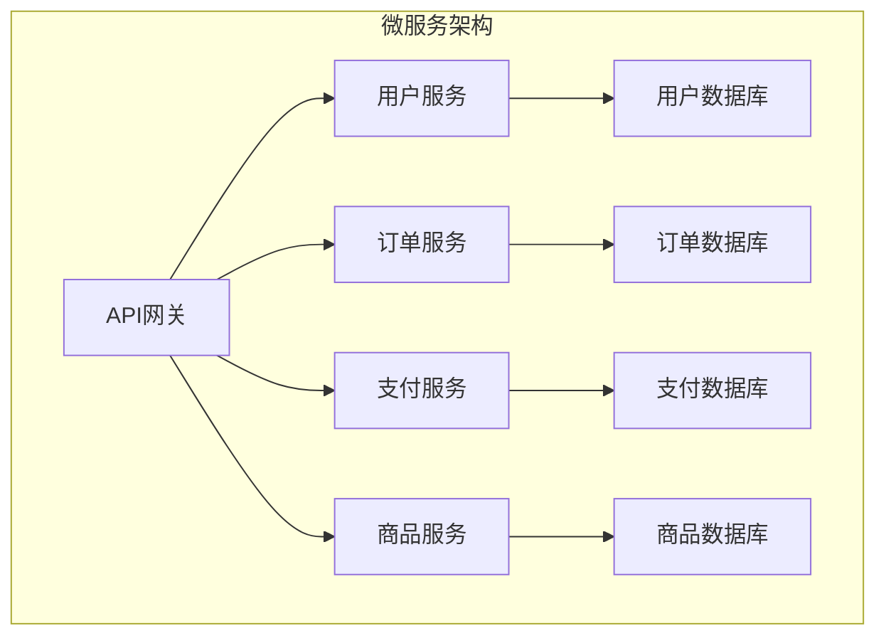
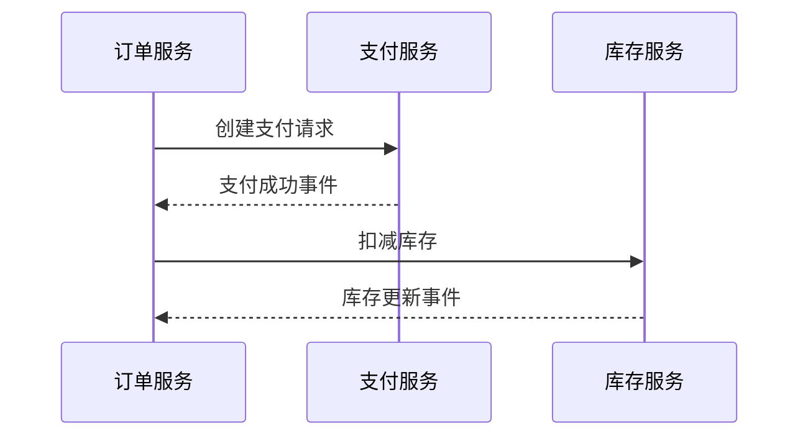

## 前言

作为一名全栈开发者，我经常在项目架构设计中面临一个经典抉择：是继续维护庞大的单体应用，还是勇敢地迈向微服务架构？这个问题没有标准答案，但理解两种架构的优缺点以及如何从单体平滑过渡到微服务，对每个技术团队都至关重要。

::: tip
"架构不是一成不变的，它应该随着业务的发展而演进。"
:::

在这篇文章中，我将分享我在多个项目中实践的后端架构演进经验，希望能为你的技术决策提供一些参考。

## 单体架构的兴衰

### 什么是单体架构？

单体架构是我职业生涯初期接触最多的应用架构模式。简单来说，所有功能模块都打包在一个应用中，共享同一个数据库和资源池。



### 单体架构的优势

单体架构之所以在早期如此流行，主要有以下几个优势：

- **开发简单**：所有代码在一个仓库中，IDE友好，调试方便
- **部署简单**：一次构建，一个部署单元
- **测试简单**：端到端测试相对容易实现
- **事务一致性**：数据库事务处理简单直接

### 单体架构的挑战

随着业务规模扩大，单体架构的问题逐渐显现：

- **代码库膨胀**：项目越大，代码库越难以维护
- **团队协作困难**：多人同时修改同一代码库容易产生冲突
- **技术栈受限**：整个项目必须使用统一的技术栈
- **扩展性差**：无法针对特定模块进行独立扩展

> 我曾经维护过一个电商系统，随着业务增长，代码库达到了50万行，每次发布都需要全量部署，一个小小的bug修复可能导致整个系统不稳定。

## 微服务架构的崛起

### 什么是微服务架构？

微服务架构是将应用拆分为一系列小型、自治的服务，每个服务负责特定的业务功能，独立部署和扩展。



### 微服务架构的优势

微服务架构解决了单体架构的许多痛点：

- **技术多样性**：每个服务可以选择最适合的技术栈
- **独立部署**：服务可以单独部署，减少发布风险
- **水平扩展**：可以根据负载对特定服务进行扩展
- **故障隔离**：一个服务的故障不会影响整个系统

### 微服务架构的挑战

然而，微服务并非银弹，它引入了新的复杂性：

- **分布式系统复杂性**：网络延迟、服务发现、负载均衡
- **数据一致性**：跨服务事务处理的复杂性
- **运维复杂度**：需要更强大的监控、日志和追踪系统
- **团队组织**：需要按照康威定律重组团队

## 从单体到微服务的演进策略

直接将大型单体应用一次性拆分为微服务是不现实的。我推荐采用渐进式演进策略：

### 1. 模块化单体

首先，将单体应用按照业务领域进行模块化划分，明确模块边界，减少模块间耦合。

```java
// 模块化示例
module com.example.user {
    // 用户相关功能
}

module com.example.order {
    // 订单相关功能
}
```

### 2. 隔离数据访问

为每个模块创建独立的数据访问层，为后续拆分做准备。

### 3. 识别边界上下文

使用领域驱动设计(DDD)方法识别业务边界上下文，确定哪些功能可以拆分为独立服务。

### 4. 逐步拆分

选择低风险、高价值的服务优先拆分，如：

- 缓存服务
- 搜索服务
- 通知服务
- 配置中心

### 5. 实现API网关

引入API网关作为统一入口，处理路由、认证、限流等横切关注点。

## 微服务设计最佳实践

### 服务拆分原则

- **单一职责**：每个服务应该有明确的业务边界
- **高内聚低耦合**：服务内部紧密相关，服务间松散耦合
- **自治性**：服务应该能够独立开发、测试和部署

### 数据管理策略

微服务环境下，数据管理是一个挑战。我推荐以下策略：

- **每个服务拥有自己的数据库**：避免跨服务数据库访问
- **API优先设计**：先定义服务间的API，再实现功能
- **最终一致性**：采用事件驱动架构实现最终一致性



### 容错与弹性设计

在分布式系统中，故障是常态而非异常。实现以下模式提高系统弹性：

- **断路器模式**：防止级联故障
- **重试机制**：处理临时性故障
- **舱壁隔离**：限制资源使用，防止雪崩效应

## 实用工具与技术栈

### 服务发现与注册

- **Consul**：提供服务发现、健康检查和键值存储
- **Eureka**：Netflix开源的服务注册与发现
- **Nacos**：阿里巴巴开源的动态服务发现和配置管理平台

### API网关

- **Kong**：云原生API网关
- **Spring Cloud Gateway**：基于Spring的API网关
- **Zuul**：Netflix的API网关

### 分布式追踪

- **Jaeger**：Uber开源的分布式追踪系统
- **Zipkin**：Twitter开源的分布式追踪系统
- **SkyWalking**：Apache开源的APM工具

## 结语

从单体到微服务的演进不是一蹴而就的过程，而是一个持续优化的旅程。没有放之四海而皆准的架构，只有最适合当前业务规模和团队能力的架构。

::: theorem
架构设计的黄金法则：简单性优于复杂性，直到复杂性不可避免。
:::

在我的实践中，我始终遵循"够用就好"的原则，避免过度设计。当系统真的需要拆分时，再引入微服务架构的复杂性。

如果你正在考虑架构转型，我建议从小处着手，先识别出最适合拆分的边界上下文，逐步实施，同时保持对系统复杂性的警惕。

**记住，优秀的架构不是设计出来的，而是演化出来的。** 🚀

> "架构不是关于技术，而是关于业务。技术只是实现业务的手段。" — 某位架构大师