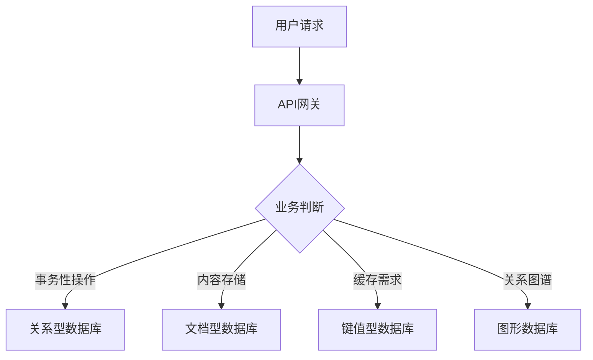

## 前言

在当今的软件开发领域，我们常常会听到各种关于数据库的讨论：SQL vs NoSQL，关系型 vs 非关系型，传统 vs 新一代。随着数据量的爆炸式增长和业务场景的多样化，数据库技术也在不断演进。🤔

> 数据库是应用的基石，选择合适的数据库技术对应用的性能、可扩展性和开发效率有着决定性的影响。

本文将带你了解现代数据库技术的演进历程，以及如何根据不同的业务场景选择合适的数据库解决方案。

## 数据库的演进历程

### 关系型数据库的时代

在很长一段时间里，关系型数据库（RDBMS）是数据存储的绝对主角。以MySQL、PostgreSQL、Oracle等为代表的关系型数据库，凭借其ACID特性和强大的SQL查询能力，成为企业级应用的首选。

**关系型数据库的核心特点**：
- 基于关系模型，数据存储在二维表中
- 支持SQL语言进行数据操作
- 强调ACID特性（原子性、一致性、隔离性、持久性）
- 支持复杂查询和事务处理

```sql
-- 传统关系型数据库示例
CREATE TABLE users (
    id INT PRIMARY KEY,
    username VARCHAR(50) NOT NULL,
    email VARCHAR(100) UNIQUE,
    created_at TIMESTAMP DEFAULT CURRENT_TIMESTAMP
);
```

### NoSQL的崛起

随着互联网应用的快速发展，传统的关系型数据库开始面临挑战：

1. **数据量巨大**：社交网络、物联网等应用产生的数据量远超传统数据库的处理能力
2. **数据结构多样**：半结构化、非结构化数据越来越多
3. **高并发需求**：需要支持高并发的读写操作

NoSQL（Not Only SQL）数据库应运而生，提供了更灵活的数据模型和更高的扩展性。

**主要的NoSQL数据库类型**：

| 类型 | 代表产品 | 特点 | 适用场景 |
|------|---------|------|---------|
| 文档型 | MongoDB, CouchDB | 存储JSON-like文档 | 内容管理、用户配置 |
| 键值型 | Redis, DynamoDB | 简单的键值对存储 | 缓存、会话管理 |
| 列族型 | Cassandra, HBase | 按列存储 | 大数据分析、日志存储 |
| 图形型 | Neo4j, OrientDB | 存储节点和关系 | 社交网络、推荐系统 |

### NewSQL的出现

NoSQL虽然解决了扩展性和灵活性的问题，但在事务支持、一致性等方面有所妥协。为了兼顾关系型数据库的ACID特性和NoSQL的扩展性，NewSQL数据库应运而生。

**NewSQL的特点**：
- 保留了关系型数据库的ACID特性和SQL接口
- 提供了与NoSQL相当的扩展性和性能
- 适用于对一致性要求高且需要水平扩展的场景

## 如何选择合适的数据库

面对众多的数据库选择，开发者应该如何决策呢？以下是一些选择原则：

### 1. 数据模型匹配度

首先考虑你的数据结构是否与数据库模型匹配：

- **结构化数据**：如果数据关系明确且结构固定，关系型数据库是首选
- **半结构化数据**：如JSON文档、XML等，文档型数据库更合适
- **高度关联的数据**：如社交网络、推荐系统，图形数据库是最佳选择
- **简单键值对**：如缓存、会话数据，键值型数据库效率最高

### 2. 一致性与可用性的权衡

根据CAP理论，分布式系统通常需要在一致性和可用性之间做出权衡：

- **强一致性要求**：如金融交易、订单系统，应选择支持强一致性的数据库
- **最终一致性可接受**：如社交动态、评论系统，可以选择最终一致性的数据库

### 3. 扩展性需求

考虑应用的扩展性需求：

- **垂直扩展**：通过增强单机性能来提升处理能力，关系型数据库通常采用这种方式
- **水平扩展**：通过增加服务器节点来提升处理能力，大多数NoSQL和NewSQL支持这种方式

### 4. 开发与运维成本

选择数据库时还需考虑：

- **学习曲线**：团队是否熟悉该数据库技术
- **运维复杂度**：数据库的部署、监控、备份等是否复杂
- **生态系统**：是否有成熟的工具、框架支持

## 现代数据库架构实践

在实际项目中，我们通常不会只使用一种数据库，而是根据业务需求构建多数据库架构：

### 1. 多模型数据库策略



### 2. CQRS模式

命令查询职责分离（CQRS）是一种架构模式，将读操作和写操作分离到不同的模型中：

- **写模型**：使用适合写操作的数据库（如文档型、键值型）
- **读模型**：使用适合读操作的数据库（如列族型、搜索引擎）

### 3. 数据分片策略

对于大规模数据，数据分片是提高性能的关键策略：

- **水平分片**：按数据范围或哈希值将数据分布到不同节点
- **垂直分片**：按数据类型将不同表分布到不同节点

## 未来数据库技术趋势

随着技术的发展，数据库领域也在不断演进：

### 1. 云原生数据库

云原生数据库专为云环境设计，提供弹性扩展、高可用性和简化运维：

- **数据库即服务（DBaaS）**：如Amazon RDS、Google Cloud SQL
- **无服务器数据库**：如Amazon Serverless Aurora、Azure SQL Database

### 2. 多模数据库

多模数据库支持多种数据模型，简化了多数据库架构的复杂性：

- **MongoDB**：支持文档、图形、搜索等多种模型
- **ArangoDB**：原生支持文档、键值、图形模型

### 3. AI增强的数据库

人工智能技术正在改变数据库的设计和使用方式：

- **自动索引优化**：AI算法自动选择最佳索引
- **查询优化**：机器学习辅助的查询优化
- **异常检测**：AI辅助的数据异常检测

## 结语

数据库技术从关系型到NoSQL再到NewSQL，经历了不断的演进和融合。**没有最好的数据库，只有最适合的数据库**。在选择数据库时，我们需要综合考虑数据特性、业务需求、技术团队和运维成本等多方面因素。

随着云计算、人工智能等技术的发展，数据库领域还将迎来更多的创新和变革。作为开发者，保持学习的态度，理解不同数据库的优缺点，才能在复杂多变的业务需求面前做出正确的技术选择。

> 选择数据库如同选择鞋子，合脚才是最好的。不要盲目追求新技术，也不要固守旧传统，而是要根据实际需求做出明智的选择。
