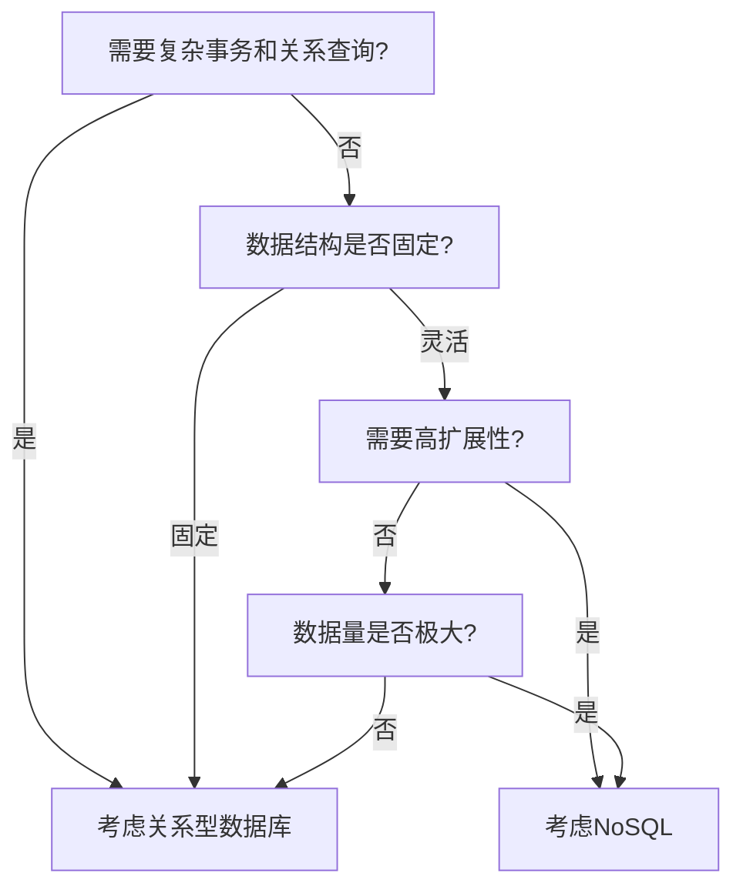

## 前言

在我开始写代码的早期，数据库对我来说就像是一个神秘的黑盒子。🤔 我只知道如何执行 `SELECT * FROM users`，却对背后的工作原理一无所知。随着项目复杂度的增加，我开始意识到选择合适的数据库对于系统性能和可扩展性至关重要。

最近，我参与了一个从单体架构向微服务架构迁移的项目，这让我对数据库的选择和设计有了更深的思考。今天，我想和大家一起探讨数据库技术的演进历程，以及如何在现代应用中做出明智的数据库选择。

## 关系型数据库的黄金时代

还记得大学时学习SQL的日子吗？`CREATE TABLE`, `INSERT INTO`, `JOIN` 这些语句几乎构成了我们与数据交互的全部。关系型数据库（RDBMS）如MySQL、PostgreSQL、Oracle统治了数据存储领域数十年。

### 关系型数据库的核心特点

关系型数据库基于关系模型，具有以下特点：

- **结构化数据**：数据以表格形式存储，每个表有预定义的列和行
- **ACID特性**：保证事务的原子性、一致性、隔离性和持久性
- **SQL语言**：使用结构化查询语言进行数据操作
- **外键约束**：确保表之间的引用完整性

```sql
-- 一个典型的关系型数据库表设计
CREATE TABLE users (
    id INT PRIMARY KEY AUTO_INCREMENT,
    username VARCHAR(50) NOT NULL,
    email VARCHAR(100) NOT NULL UNIQUE,
    created_at TIMESTAMP DEFAULT CURRENT_TIMESTAMP
);

CREATE TABLE posts (
    id INT PRIMARY KEY AUTO_INCREMENT,
    user_id INT,
    title VARCHAR(200) NOT NULL,
    content TEXT,
    created_at TIMESTAMP DEFAULT CURRENT_TIMESTAMP,
    FOREIGN KEY (user_id) REFERENCES users(id)
);
```

### 何时选择关系型数据库？

在以下场景中，关系型数据库仍然是最佳选择：

1. **需要复杂事务**：如金融系统、订单处理等
2. **数据结构稳定**：模式变化不频繁的应用
3. **需要复杂查询**：多表连接、聚合查询等
4. **数据一致性要求高**：如用户信息、配置数据等

::: tip
关系型数据库就像是一位严谨的图书管理员，每一本书都有固定的位置和编号，查找时需要按照严格的规则进行。
:::

## NoSQL的崛起

随着互联网应用的爆炸式增长，传统的关系型数据库开始面临挑战。高并发、海量数据、灵活的数据结构需求催生了NoSQL数据库的兴起。

### NoSQL的类型与特点

NoSQL（Not Only SQL）数据库并不是要取代SQL数据库，而是为了解决特定问题而设计的。主要分为以下几类：

#### 1. 文档型数据库

- **代表**：MongoDB, CouchDB
- **特点**：存储类似JSON的文档，灵活的数据结构
- **适用场景**：内容管理系统、用户配置文件等

```javascript
// MongoDB文档示例
{
  _id: ObjectId("507f191e810c19729de860ea"),
  name: "张三",
  age: 30,
  hobbies: ["编程", "阅读", "旅行"],
  address: {
    city: "北京",
    district: "海淀区"
  }
}
```

#### 2. 键值型数据库

- **代表**：Redis, DynamoDB
- **特点**：简单的键值对存储，极高的读写性能
- **适用场景**：缓存、会话存储、排行榜等

```bash
# Redis键值示例
SET user:1001:name "张三"
SET user:1001:age "30"
GET user:1001:name  # 返回 "张三"
```

#### 3. 列族型数据库

- **代表**：Cassandra, HBase
- **特点**：按列存储，适合大规模数据集
- **适用场景**：日志分析、物联网数据等

#### 4. 图形数据库

- **代表**：Neo4j, OrientDB
- **特点**：存储节点和边的关系，擅长复杂关系查询
- **适用场景**：社交网络、推荐系统、欺诈检测等

### NoSQL的优势

NoSQL数据库在以下方面表现出色：

1. **水平扩展**：可以通过增加更多服务器来提高性能和容量
2. **灵活的数据模型**：无需预定义模式，适应快速变化的需求
3. **高性能**：针对特定查询优化，通常读写性能很高
4. **高可用性**：内置复制和分片机制，提供更好的容错能力

::: theorem
CAP理论指出，分布式系统不可能同时满足一致性(Consistency)、可用性(Availability)和分区容错性(Partition tolerance)三个特性。NoSQL数据库通常在这三者之间做出不同的权衡。
:::

## 新型数据库技术

数据库技术并未止步于关系型和NoSQL的二元对立。近年来，出现了许多融合两者优点的新型数据库技术。

### 1. NewSQL数据库

NewSQL试图结合关系型数据库的ACID保证和NoSQL的水平扩展能力：

- **代表**：Google Spanner, CockroachDB, TiDB
- **特点**：支持SQL接口，同时具备分布式扩展能力
- **适用场景**：需要强一致性且需要水平扩展的应用

### 2. 多模数据库

多模数据库支持多种数据模型，减少数据迁移的复杂性：

- **代表**：ArangoDB, MongoDB
- **特点**：在一个数据库中支持文档、图形、键值等多种存储方式
- **适用场景**：需要多种数据模型且希望简化架构的系统

### 3. 时序数据库

专门处理时间序列数据的数据库：

- **代表**：InfluxDB, Prometheus
- **特点**：高效存储和查询时间戳数据
- **适用场景**：监控系统、IoT数据收集、金融分析等

## 如何选择合适的数据库

面对如此多的数据库选择，如何做出明智的决策呢？以下是我总结的选择框架：

### 1. 分析数据特征

首先，了解你的数据：

- **数据结构**：结构化还是半结构化？
- **数据量**：GB、TB还是PB级别？
- **增长速度**：数据增长是否可预测？
- **访问模式**：读写比例、查询复杂度如何？

### 2. 评估业务需求

其次，明确业务需求：

- **一致性要求**：强一致性还是最终一致性？
- **可用性要求**：能容忍多长时间的停机？
- **扩展性需求**：需要垂直扩展还是水平扩展？
- **开发效率**：团队对哪种数据库更熟悉？

### 3. 考虑运维成本

最后，不要忽视运维因素：

- **学习曲线**：团队需要多长时间掌握？
- **工具生态**：是否有成熟的监控、备份工具？
- **社区支持**：遇到问题时能否获得帮助？
- **许可成本**：开源还是商业版本？

### 数据库选择决策树



## 未来数据库发展趋势

数据库技术仍在快速发展，以下是一些值得关注的方向：

### 1. 云原生数据库

随着云计算的普及，专为云环境设计的数据库越来越受欢迎：

- **特点**：自动扩展、按需付费、简化运维
- **代表**：Amazon Aurora, Google Cloud Spanner, Azure SQL Database

### 2. AI增强数据库

人工智能技术正在改变数据库的设计和使用方式：

- **自动调优**：AI帮助优化查询和索引
- **预测性分析**：预测性能瓶颈和容量需求
- **自然语言查询**：使用自然语言查询数据库

### 3. 量子计算与数据库

虽然还处于早期阶段，但量子计算可能彻底改变数据处理方式：

- **量子算法**：如Grover算法可能加速数据库搜索
- **量子机器学习**：结合量子计算和机器学习处理大数据

## 结语

回顾数据库技术的演进历程，从关系型数据库的统治地位，到NoSQL的百花齐放，再到如今多模式、云原生的数据库生态，我们见证了数据管理技术的不断革新。

作为开发者，我们不应该固守"银弹思维"——没有一种数据库能解决所有问题。**理解不同数据库的特性和适用场景，根据具体需求做出明智选择**，才是现代数据架构设计的核心。

在我最近的项目中，我们采用了多数据库策略：使用PostgreSQL存储核心业务数据，Redis处理缓存，MongoDB存储用户配置，InfluxDB监控系统指标。虽然增加了系统复杂性，但每种数据库都在其擅长的领域发挥最大价值。

> 数据库就像工具箱中的不同工具，没有绝对的好坏，只有是否适合当前任务。掌握多种工具，才能应对各种挑战。

希望这篇文章能帮助你更好地理解数据库技术的演进，并在项目中做出更明智的选择。如果你有任何问题或不同的见解，欢迎在评论区交流讨论！

---

*本文首发于 [Jorgen的Code World](https://github.com/jorgen-zhao/code-world)，转载请注明出处。*