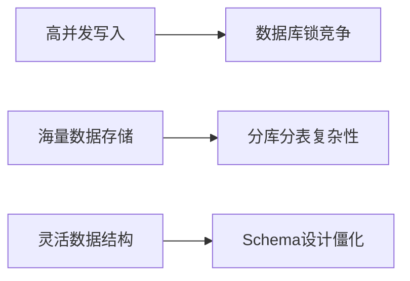
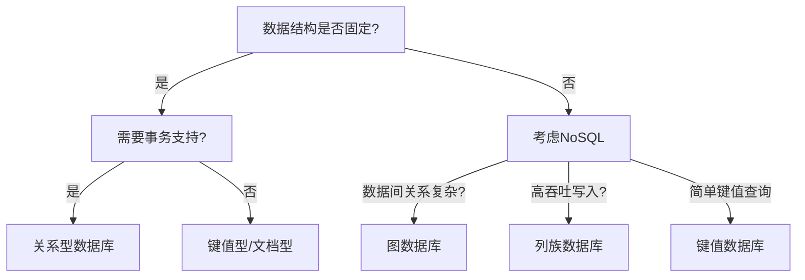

## 前言

在构建现代应用时，数据库选择往往是决定系统架构的核心决策之一。🏗 从早期的MySQL/PostgreSQL独霸天下，到如今MongoDB、Redis、Cassandra等百花齐放，数据库技术经历了翻天覆地的变化。作为一个在多个项目中踩过坑的工程师，我想分享这段演进历程和实际选择经验。

::: tip
"数据是新时代的石油，而数据库就是炼油厂" —— 这句话在分布式系统时代显得尤为贴切
:::

## 关系型数据库的黄金时代

还记得刚入行时，MySQL几乎是所有项目的标配。📚 它的ACID特性保证数据一致性，SQL查询直观易懂，加上成熟的生态工具链，让开发过程如丝般顺滑。

### 关系型数据库的核心优势

- **强一致性保证**：事务支持让金融级应用成为可能
- **成熟稳定**：几十年的发展历程，经过无数生产环境验证
- **标准化查询**：SQL语言跨数据库通用，学习成本低

但随着业务规模扩大，关系型数据库的局限性也逐渐暴露：



## NoSQL革命：打破关系枷锁

当社交网络、物联网等场景出现时，传统关系型数据库显得力不从心。NoSQL应运而生，用更灵活的数据模型解决新问题。

### 四大NoSQL阵营

| 类型       | 代表产品       | 适用场景               | 特点               |
|------------|----------------|------------------------|--------------------|
| 文档型     | MongoDB        | 内容管理、用户配置    | 灵活Schema         |
| 键值型     | Redis          | 缓存、计数器          | 极高性能           |
| 列族型     | Cassandra      | 日志分析、时间序列    | 高可扩展性         |
| 图形数据库 | Neo4j          | 社交网络、推荐系统    | 关系复杂查询       |

🤔 我还记得在电商项目中，用Redis做秒杀系统缓存，QPS轻松突破10万+，而MySQL可能连1万都达不到。这种性能差距直接决定了技术选型的方向。

## 混合架构：现代数据库实践

现在很少有项目会只用单一数据库了。**混合架构**成为主流，根据业务场景选择最合适的数据库：

::: theorem
数据库选型黄金法则
1. 遵循"单一职责"原则：每个数据库解决特定问题
2. 数据流向设计：冷热数据分离，读写分离
3. 性能一致性平衡：避免过度设计，满足业务需求即可
:::

### 实际案例：现代博客系统架构

```
用户请求 → CDN → API网关 → [Redis缓存] → [MySQL主库] → [MongoDB内容存储]
                                    ↑
                              [Elasticsearch全文搜索]
```

在这个架构中：
- Redis处理会话和热点数据
- MySQL保证用户数据一致性
- MongoDB存储灵活的文章内容
- Elasticsearch提供全文检索

## 数据库选型决策树

选择数据库时，可以按以下流程决策：



## 结语

数据库技术的演进本质上是业务需求驱动的。📡 从关系型到NoSQL，不是简单的替代，而是工具箱的扩充。**没有最好的数据库，只有最适合场景的数据库**。

> 在我的实践中，80%的项目最终都会采用混合架构，关键在于理解每种数据库的"舒适区"，让它们各司其职。

未来随着NewSQL、多模数据库的发展，这个领域还会继续演进。但无论技术如何变化，理解数据本质和业务需求永远是最重要的。🚀

---

*本文仅代表个人观点，欢迎在评论区分享你的数据库选型经验！* 😊