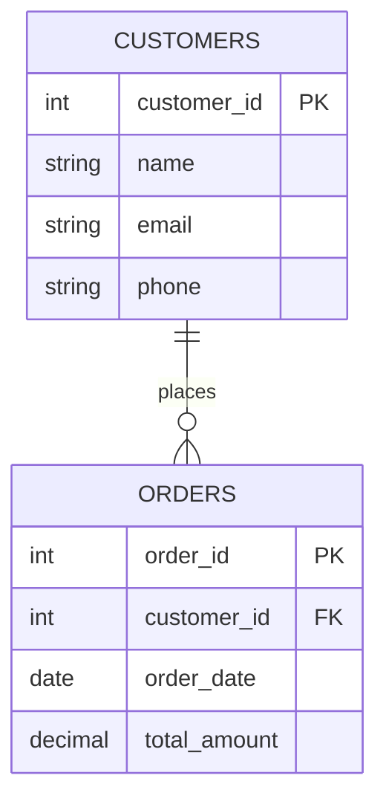

```yaml
---
title: 关系型数据库基础与SQL入门
date: 2023-11-15 10:30:00
permalink: /pages/relational-database-basics/
categories: 
  - database
tags:
  - 关系型数据库
  - SQL
  - 数据库设计
author: 
  name: Jorgen
  link: https://github.com/jorgen-zhao
---

## 前言

在数据库的广阔世界中，关系型数据库（RDBMS）至今仍是企业级应用的中流砥柱。当我们谈论PostgreSQL、MySQL时，是否真正理解它们背后的核心原理？🤔 本文将带你从零开始，揭开关系型数据库的神秘面纱，掌握SQL这一数据操作的"通用语言"。

::: tip
关系型数据库就像一个高度组织化的数字图书馆，每本书（数据）都有明确的分类（表）和编号（主键），通过借阅卡（外键）建立书籍之间的关联。
:::

## 关系型数据库的核心概念

### 数据模型与表结构

关系型数据库基于**关系模型**，将数据组织成二维表格的形式。每个表由**行（记录）**和**列（字段）**组成：



### 关键术语解析

| 术语 | 说明 | 示例 |
|------|------|------|
| **主键（PK）** | 唯一标识表中每行记录 | `customer_id` |
| **外键（FK）** | 建立表之间关系的字段 | `orders.customer_id` → `customers.customer_id` |
| **范式** | 数据库设计的规范化标准 | 第一范式（1NF）：无重复组 |
| **索引** | 加速查询的数据结构 | 为`email`字段创建B-tree索引 |

## SQL基础操作

### 数据查询语言（DQL）

```sql
-- 查询客户订单总金额超过1000的记录
SELECT 
    c.name AS customer_name,
    COUNT(o.order_id) AS order_count,
    SUM(o.total_amount) AS total_spent
FROM 
    customers c
JOIN 
    orders o ON c.customer_id = o.customer_id
GROUP BY 
    c.customer_id, c.name
HAVING 
    SUM(o.total_amount) > 1000
ORDER BY 
    total_spent DESC;
```

### 数据操作语言（DML）

```sql
-- 插入新客户
INSERT INTO customers (name, email, phone)
VALUES ('张三', 'zhangsan@example.com', '13800138000');

-- 更新订单状态
UPDATE orders 
SET order_status = 'shipped'
WHERE order_id = 1024 AND order_date > '2023-01-01';

-- 删除过期订单
DELETE FROM orders 
WHERE order_date < '2023-01-01' AND order_status = 'cancelled';
```

## 数据库设计最佳实践

### 1. 范式化设计

遵循数据库范式可以减少数据冗余：

- **第一范式（1NF）**：确保每列都是原子值
- **第二范式（2NF）**：在1NF基础上，非主键字段完全依赖主键
- **第三范式（3NF）**：在2NF基础上，消除传递依赖

### 2. 索引策略

```sql
-- 为高频查询字段创建索引
CREATE INDEX idx_customers_email ON customers(email);

-- 复合索引优化多条件查询
CREATE INDEX idx_orders_customer_date ON orders(customer_id, order_date);
```

### 3. 事务处理

```sql
BEGIN TRANSACTION;

-- 批量更新操作
UPDATE products 
SET stock_quantity = stock_quantity - 10 
WHERE product_id = 505;

UPDATE orders 
SET order_status = 'processing' 
WHERE order_id = 2001;

COMMIT; -- 或 ROLLBACK 回滚
```

## 关系型数据库 vs NoSQL

| 特性 | 关系型数据库 | NoSQL数据库 |
|------|-------------|-------------|
| 数据模型 | 表格结构 | 文档/键值/列族/图 |
| 查询语言 | SQL | 特定API |
| 扩展性 | 垂直扩展 | 水平扩展 |
| 适用场景 | 事务处理、复杂查询 | 大数据、高并发 |

> 💡 **经验之谈**：选择数据库时，不要盲目追求新技术。90%的业务场景中，经过良好设计的关系型数据库仍然是最佳选择。只有在处理海量非结构化数据或需要极高扩展性时，才考虑NoSQL方案。

## 结语

关系型数据库是数据管理领域的基石，SQL则是每个开发者必备的技能。掌握这些基础概念后，当你再次面对PostgreSQL或MySQL时，将不再是简单地执行SQL语句，而是真正理解数据在表间流动的优雅逻辑。~~记住：没有最好的数据库，只有最适合的数据库~~ 🚀

::: right
"数据是新时代的石油，而关系型数据库就是精炼厂" —— 数据库架构师箴言
:::
```