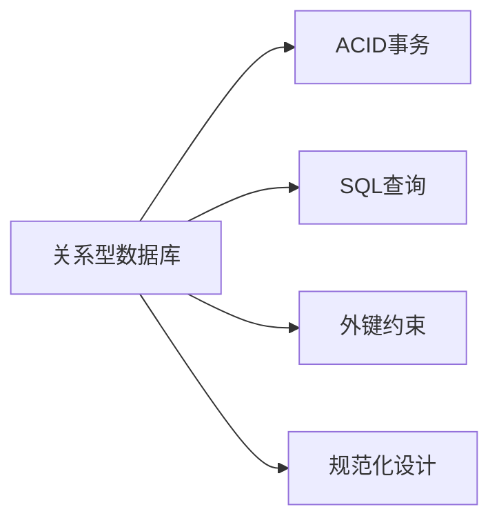
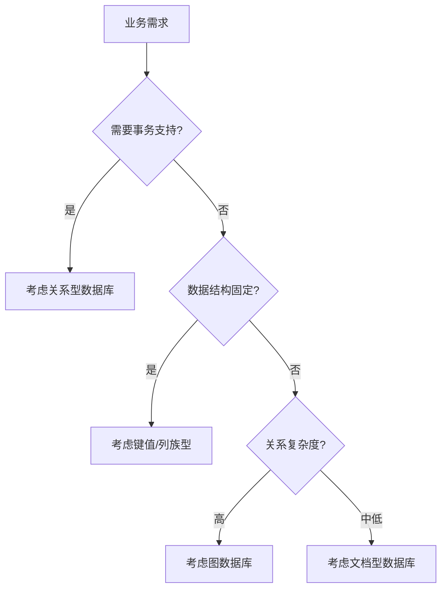

```yaml
---
title: 数据库分类与选型指南
date: 2023-10-15 14:30:00
permalink: /pages/aB3x7y/
categories: 
  - database
tags:
  - 数据库
  - 数据库分类
  - 数据库选型
author: 
  name: Jorgen
  link: https://github.com/jorgen-zhao
---

## 前言

在技术架构的演进中，数据库作为数据存储的核心组件，其选型往往决定着整个系统的性能与扩展性。🤔 现有博客已覆盖了时序数据库（InfluxDB等）、关系型数据库（PostgreSQL）和文档型数据库（MongoDB）的实践，但缺少一个系统性梳理数据库分类体系的内容。本文将填补这一空白，帮助开发者建立完整的数据库知识框架。

::: tip
"数据库没有银弹，只有最适合业务场景的选型" —— 数据架构师箴言
:::

## 数据库分类体系

### 按数据模型划分

| 类型 | 核心特点 | 代表产品 | 适用场景 |
|------|----------|----------|----------|
| **关系型** | 结构化数据、SQL查询、ACID事务 | PostgreSQL, MySQL | 金融交易、订单系统 |
| **文档型** | 灵活JSON存储、动态模式 | MongoDB, Couchbase | 内容管理、用户画像 |
| **键值型** | 高性能读写、简单结构 | Redis, DynamoDB | 缓存、会话存储 |
| **列族型** | 大规模数据、高吞吐量 | Cassandra, HBase | 日志分析、大数据 |
| **图数据库** | 复杂关系查询 | Neo4j, Nebula | 社交网络、推荐系统 |
| **时序型** | 时间序列优化 | InfluxDB, TimescaleDB | IoT监控、指标收集 |

### 按部署方式划分

- **单机数据库**：SQLite、LevelDB（适合轻量级应用）
- **分布式数据库**：TiDB、CockroachDB（高可用、水平扩展）
- **云原生数据库**：AWS Aurora、Google Spanner（免运维、弹性伸缩）

## 主流数据库类型详解

### 关系型数据库（RDBMS）



**核心优势**：
- 数据一致性保证
- 复杂查询能力
- 成熟生态工具

**适用场景**：
- 需要严格事务的业务系统
- 结构化数据为主的应用
- 需要复杂联表查询的场景

### NoSQL数据库家族

#### 文档型数据库
- **特点**：灵活schema，JSON/BSON存储
- **代表**：MongoDB（已有文章）
- **适用**：内容管理、用户配置存储

#### 键值型数据库
- **特点**：内存级性能，简单K-V结构
- **代表**：Redis（已有文章）
- **适用**：缓存、排行榜、计数器

#### 列族型数据库
- **特点**：高吞吐写入，宽列存储
- **代表**：Apache Cassandra
- **适用**：日志分析、物联网数据

## 数据库选型决策树



### 选型关键考量因素

1. **数据一致性要求**
   - 强一致性 → 关系型/NewSQL
   - 最终一致性 → 大部分NoSQL

2. **读写性能特征**
   - 高并发写 → 列族型/时序型
   - 复杂查询 → 关系型/图数据库

3. **扩展性需求**
   - 垂直扩展 → 单机数据库
   - 水平扩展 → 分布式数据库

4. **开发团队技能**
   - SQL熟练 → 关系型
   - NoSQL经验 → 文档型/键值型

## 新兴数据库趋势

### HTAP数据库
- 代表：TiDB, ClickHouse
- 特点：融合OLTP与OLAP，统一分析处理
- 应用：实时报表、业务监控

### 多模数据库
- 代表：ArangoDB, OrientDB
- 特点：支持多种数据模型
- 应用：复杂业务场景，减少数据孤岛

## 结语

数据库技术仍在快速发展，从SQL到NoSQL再到NewSQL，每种技术都有其适用场景。~~没有"最好"的数据库，只有"最合适"的数据库~~。理解数据库分类体系的核心价值，在于建立系统化的选型思维，而非盲目追随技术潮流。

> "选择数据库的本质，是为业务需求寻找最优雅的技术解法" —— 数据架构设计原则

希望本文能帮助你在技术选型时做出更明智的决策。后续我们将继续深入探讨各类数据库的最佳实践，敬请期待！🚀
```