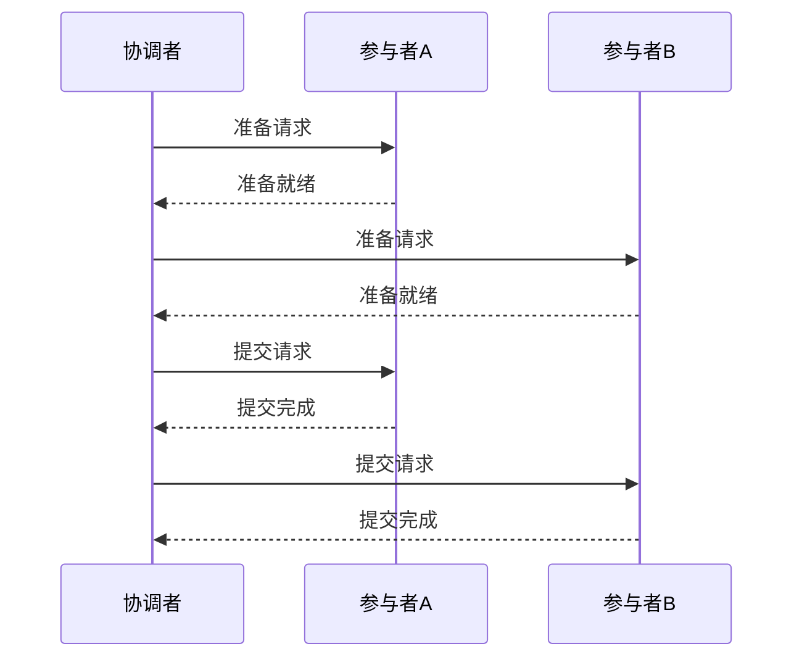
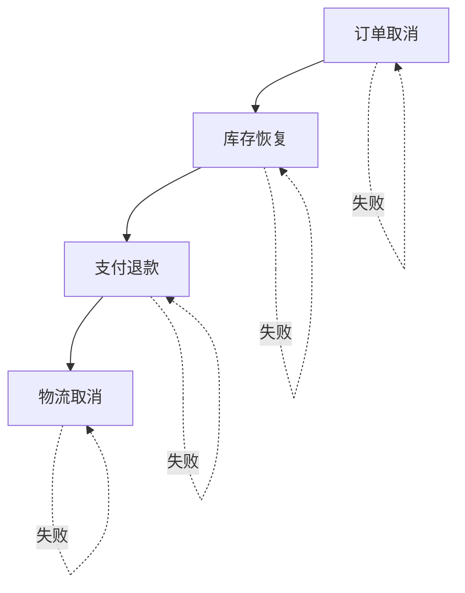

## 前言

在分布式系统盛行的今天，我们每天都在与各种微服务打交道。🤔 每当我设计一个需要跨多个服务完成的功能时，总会遇到一个经典问题："如何保证这些服务之间的数据一致性？"

最近，我在项目中遇到了一个典型场景：用户下单后，需要同时扣减库存、创建订单记录、增加积分，这三个操作分别在不同的微服务中完成。如果任何一个环节失败，都会导致数据不一致。~~这简直就是分布式系统中的"薛定谔的订单"——存在又不存在~~。

经过一番研究与实践，我决定分享关于分布式事务的知识，希望能帮助大家解决类似的问题。

## 分布式事务的挑战

在深入解决方案之前，我们需要先理解为什么分布式事务如此复杂。

### 单体应用 vs 分布式系统

在单体应用中，事务管理相对简单。我们可以使用数据库提供的事务机制（如ACID特性）来保证操作的原子性。例如：

```sql
BEGIN TRANSACTION;
UPDATE accounts SET balance = balance - 100 WHERE user_id = 1;
UPDATE orders SET status = 'paid' WHERE order_id = 123;
COMMIT;
```

这段SQL要么全部执行成功，要么全部失败回滚，保证了数据的一致性。

然而，在分布式系统中，事情变得复杂多了。🤯 想象一下，上述两个操作分别在不同的服务、不同的数据库中执行，如何保证它们要么全部成功，要么全部失败？

### 分布式事务的核心挑战

分布式系统面临的主要挑战包括：

1. **网络分区**：节点之间的通信可能失败
2. **时钟不同步**：不同节点的系统时钟可能不一致
3. **部分失败**：某个操作可能成功，而其他操作失败
4. **性能与可用性**：强一致性往往意味着牺牲性能或可用性

## 分布式事务解决方案

针对上述挑战，业界提出了多种分布式事务解决方案。下面我将介绍几种主流的解决方案。

### 两阶段提交（2PC）

两阶段提交（Two-Phase Commit，2PC）是最经典的分布式事务协议。

#### 2PC的工作原理

2PC分为两个阶段：

1. **准备阶段（投票阶段）**：
   - 协调者向所有参与者发送准备请求
   - 参与者执行事务，但不提交，并返回"可以提交"或"不能提交"的响应

2. **提交阶段**：
   - 如果所有参与者都返回"可以提交"，协调者发送提交请求
   - 如果有任何一个参与者返回"不能提交"，协调者发送回滚请求



#### 2PC的优缺点

**优点**：
- 实现简单，原理直观
- 能够保证强一致性

**缺点**：
- 同步阻塞，性能较差
- 单点故障问题（协调者故障会导致整个系统阻塞）
- 参与者故障后，协调者无法确定是否应该提交

### 三阶段提交（3PC）

为了解决2PC的阻塞问题，提出了三阶段提交（Three-Phase Commit，3PC）。

#### 3PC的工作原理

3PC在2PC的基础上增加了一个"预提交"阶段：

1. **CanCommit阶段**：
   - 协调者向所有参与者发送CanCommit请求
   - 参与者评估自己是否能提交，返回响应

2. **PreCommit阶段**：
   - 如果所有参与者都返回"可以提交"，协调者发送PreCommit请求
   - 参与者执行事务但不提交，并记录日志

3. **DoCommit阶段**：
   - 协调者根据参与者响应决定提交或回滚

#### 3PC的优缺点

**优点**：
- 相比2PC减少了阻塞的可能性
- 增加了容错能力

**缺点**：
- 实现更复杂
- 仍然存在性能问题
- 在极端情况下仍可能阻塞

### TCC事务

TCC（Try-Confirm-Cancel）是一种基于业务逻辑的分布式事务解决方案。

#### TCC的工作原理

TCC将一个业务操作拆分为三个阶段：

1. **Try阶段**：尝试执行业务操作，预留资源
2. **Confirm阶段**：确认执行业务操作，使用预留的资源
3. **Cancel阶段**：取消业务操作，释放预留的资源

以电商下单为例：

```java
// Try阶段：检查库存并预留
public void tryReserveInventory(String orderId, String productId, int quantity) {
    // 检查库存是否充足
    if (!inventoryService.checkInventory(productId, quantity)) {
        throw new InventoryShortageException();
    }
    // 预留库存
    inventoryService.reserveInventory(productId, quantity);
    // 记录订单状态为"待支付"
    orderService.createOrder(orderId, "待支付");
}

// Confirm阶段：确认下单
public void confirmOrder(String orderId) {
    // 更新订单状态为"已支付"
    orderService.updateOrderStatus(orderId, "已支付");
    // 确认库存扣减
    inventoryService.confirmReserve(orderId);
}

// Cancel阶段：取消下单
public void cancelOrder(String orderId) {
    // 更新订单状态为"已取消"
    orderService.updateOrderStatus(orderId, "已取消");
    // 释放预留库存
    inventoryService.releaseReserve(orderId);
}
```

#### TCC的优缺点

**优点**：
- 性能较好，无锁机制
- 业务侵入性低，易于实现
- 支持长事务

**缺点**：
- 需要业务方实现三个阶段的逻辑
- Confirm和Cancel操作需要保证幂等性
- 异常情况处理复杂

### Saga模式

Saga模式是一种基于事件驱动的分布式事务解决方案，特别适合长事务场景。

#### Saga的工作原理

Saga将一个长事务拆分为多个本地事务，每个本地事务完成后会触发一个事件，触发下一个本地事务。如果某个本地事务失败，则执行补偿事务。



#### Saga的实现方式

1. **编排式（Choreography）**：
   - 通过事件和消息队列来实现事务协调
   - 各服务通过监听事件来执行相应的操作
   - 优点：松耦合，易于扩展
   - 缺点：难以追踪整个事务状态

2. **协同式（Orchestration）**：
   - 由一个协调者服务来管理整个事务流程
   - 协调者依次调用各服务的API
   - 优点：易于追踪和调试
   - 缺点：协调者成为单点故障

#### Saga的优缺点

**优点**：
- 无锁机制，性能好
- 支持长事务
- 最终一致性，可用性高

**缺点**：
- 不保证强一致性
- 补偿事务实现复杂
- 事务回滚链可能很长

## 分布式事务实践指南

了解了各种分布式事务解决方案后，如何在项目中选择合适的方案呢？以下是我的实践建议。

### 场景分析

不同的业务场景适合不同的分布式事务方案：

1. **强一致性要求高的场景**（如金融交易）：
   - 优先考虑2PC/3PC
   - 可以接受性能损失和可用性降低

2. **性能要求高，可接受最终一致性的场景**（如电商订单）：
   - Saga模式是不错的选择
   - TCC适用于中等复杂度的场景

3. **长事务场景**（如跨多个服务的复杂业务流程）：
   - Saga模式更适合
   - 避免使用2PC/3PC，可能导致长时间阻塞

### 实现技巧

无论选择哪种方案，以下技巧都能帮助你更好地实现分布式事务：

1. **幂等性设计**：
   - 所有操作都需要设计成可重试的
   - 使用唯一标识符防止重复执行

2. **超时控制**：
   - 设置合理的超时时间
   - 避免长时间阻塞

3. **重试机制**：
   - 实现自动重试逻辑
   - 使用指数退避算法避免雪崩

4. **状态跟踪**：
   - 记录事务状态
   - 提供事务查询接口

### 工具与框架选择

市面上有许多优秀的分布式事务框架，可以简化实现：

1. **Seata**：
   - 阿里开源的分布式事务框架
   - 支持AT、TCC、SAGA、XA等多种模式
   - 适合Java生态

2. **RocketMQ事务消息**：
   - 基于消息队列的分布式事务实现
   - 适合基于消息的场景

3. **Nebula Transaction**：
   - 微软开源的分布式事务协调器
   - 支持多种协议

## 结语

分布式事务是分布式系统中的核心技术，也是构建可靠系统的关键。没有银弹，不同的解决方案适用于不同的场景。在实际项目中，我们需要根据业务需求、性能要求和团队技术能力来选择合适的方案。

**记住**：分布式事务不是万能的，过度使用可能导致系统复杂度增加。在可能的情况下，尽量通过系统设计避免分布式事务，比如通过服务拆分、数据分片等方式减少跨服务操作的需求。

希望这篇文章能帮助你在分布式系统的道路上少走一些弯路。如果你有分布式事务的实际经验或疑问，欢迎在评论区分享和讨论！🚀

> "分布式系统的唯一困难是，分布式系统中的每一台计算机都认为分布式系统中的其他计算机是不可靠的。" — Leslie Lamport