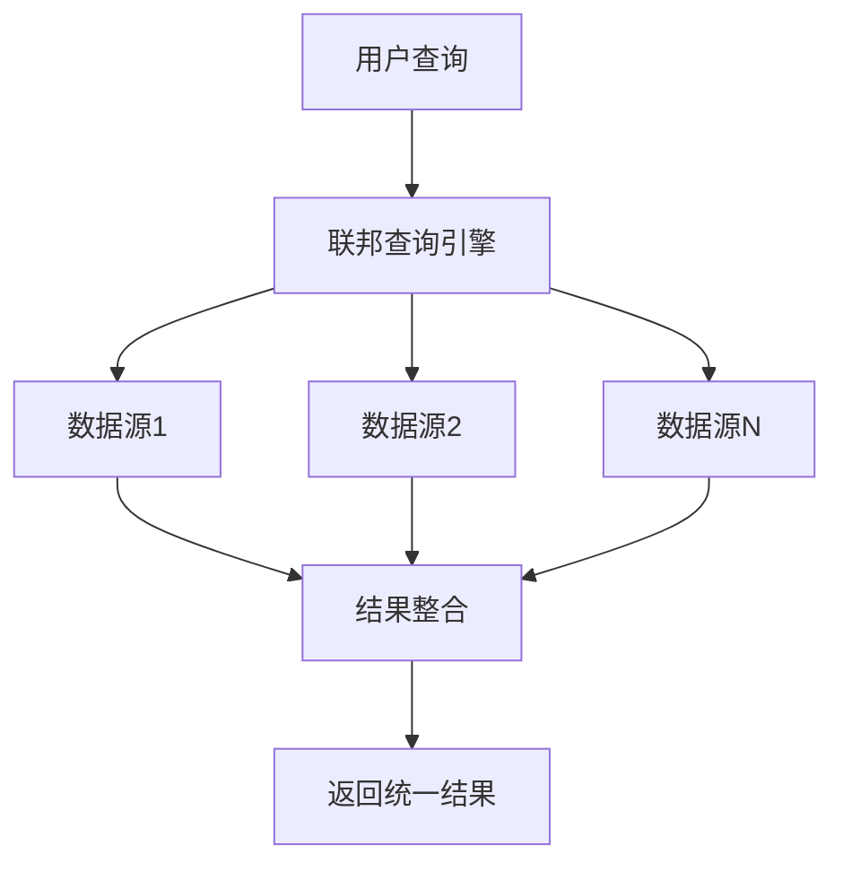

## 前言

作为一名数据库爱好者，我经常遇到这样的问题：公司的数据分散在MySQL、PostgreSQL、MongoDB、Redis等多个系统中，想要进行全局数据分析时，却不知道从何下手。~~这感觉就像是试图用不同的语言和不同国家的人进行实时翻译，而我又不是联合国翻译官~~。

最近，我在研究跨数据源查询解决方案时，发现了一个强大的技术——数据库联邦查询(Federated Query)。今天，我想和大家分享这项如何打破数据孤岛、实现无缝数据集成的技术。

> 数据联邦查询是一种允许在不移动数据的情况下，对多个异构数据源进行统一查询的技术。它就像是为不同数据库系统建立的一座"数据桥梁"，让数据能够自由流动。

## 什么是数据库联邦查询？

数据库联邦查询是一种查询处理技术，它允许用户在一个查询中访问多个异构数据源，而无需先将数据移动到一个中央存储库中。这种技术特别适用于那些数据分散在多个系统中的企业环境。

### 联邦查询的核心特点

- **数据原地性**：数据保留在其原始位置，不进行物理迁移
- **统一接口**：为用户提供统一的查询接口，屏蔽底层差异
- **透明访问**：用户无需关心数据的具体存储位置和格式
- **实时性**：提供近实时的数据访问能力

### 联邦查询与传统数据仓库的对比

| 特性 | 联邦查询 | 传统数据仓库 |
|------|---------|------------|
| 数据移动 | 无需移动 | 需要ETL过程 |
| 实时性 | 高 | 中等到低 |
| 存储成本 | 低 | 高 |
| 实现复杂度 | 中等 | 高 |
| 数据一致性 | 实时 | 定期刷新 |

## 联邦查询的实现技术

### 1. 中间件层实现

这是最常见的联邦查询实现方式，通过一个中间件层来协调不同数据源的查询。



### 2. 数据库扩展实现

某些数据库系统支持通过扩展功能实现联邦查询，如MySQL的FEDERATED存储引擎。

### 3. 查询重写技术

联邦查询引擎通常采用查询重写技术，将用户提交的统一查询转换为各个数据源能够执行的本地查询。

```sql
-- 用户提交的统一查询
SELECT * FROM customers c 
JOIN orders o ON c.id = o.customer_id
WHERE c.country = 'China';

-- 转换后的本地查询
-- MySQL执行
SELECT * FROM customers WHERE country = 'China';

-- MongoDB执行
SELECT * FROM orders WHERE customer_id IN (SELECT id FROM customers WHERE country = 'China');
```

## 主流联邦查询解决方案

### Apache Calcite

Apache Calcite是一个开源的框架，用于构建数据库和大数据系统。它提供了强大的查询优化和联邦查询能力。

```java
// Apache Calcite示例代码
FrameworkConfig config = Frameworks.newConfigBuilder()
    .parserConfig(SqlParser.Config.DEFAULT)
    .schemaFactory(new CustomSchemaFactory())
    .build();

Framework framework = Frameworks.getFramework(config);
Queryable<RelNode> query = framework.parseQuery("SELECT * FROM customers WHERE country = 'China'");
RelNode rel = query.rel();
```

### Denodo

Denodo是一个商业化的数据虚拟化平台，提供强大的联邦查询能力，支持多种数据源。

### Presto/Trino

Presto(现更名为Trino)是一个分布式SQL查询引擎，专为大数据实时查询而设计，支持联邦查询多个数据源。

```sql
-- Presto联邦查询示例
SELECT * 
FROM mysql.default.customers c
JOIN postgresql.public.orders o ON c.id = o.customer_id
WHERE c.country = 'China';
```

### SQLGate

SQLGate是一个开源的SQL网关，支持联邦查询多个数据库系统。

## 联邦查询的实践挑战

### 1. 性能优化

联邦查询面临的最大挑战是性能问题。当查询涉及多个数据源时，网络延迟和查询优化变得尤为重要。

**优化策略**：
- 缓存常用查询结果
- 智能查询路由
- 并行查询执行
- 查询下推(Pushdown)技术

### 2. 数据一致性

在联邦查询环境中，确保不同数据源之间的一致性是一个挑战。

**解决方案**：
- 事务管理
- 快照隔离
- 最终一致性模型

### 3. 安全与权限管理

联邦查询需要处理跨系统的安全认证和权限管理。

**最佳实践**：
- 统一身份认证
- 基于角色的访问控制
- 数据脱敏与加密

## 联邦查询的应用场景

### 1. 企业数据整合

在企业环境中，数据通常分散在多个业务系统中，联邦查询可以提供统一的数据视图。

### 2. 实时数据分析

对于需要近实时数据分析的场景，联邦查询可以避免数据仓库的延迟问题。

### 3. 数据治理与合规

联邦查询可以帮助企业实现数据治理目标，同时满足合规要求。

### 4. 混合云环境

在混合云环境中，联邦查询可以统一管理本地和云上的数据资源。

## 实战案例：构建跨数据源销售分析系统

让我们通过一个实际案例，看看如何使用联邦查询构建一个销售分析系统。

### 系统架构

我们的销售数据分布在以下系统中：
- MySQL: 客户信息
- PostgreSQL: 订单数据
- MongoDB: 产品目录
- Redis: 缓存数据

### 实现步骤

1. **安装联邦查询中间件**
   我们选择使用Apache Calcite作为联邦查询引擎。

2. **配置数据源连接**
   ```yaml
   # 数据源配置
   dataSources:
     mysql:
       type: jdbc
       url: jdbc:mysql://localhost:3306/sales
       user: admin
       password: secret
     
     postgresql:
       type: jdbc
       url: jdbc:postgresql://localhost:5432/orders
       user: admin
       password: secret
     
     mongodb:
       type: nosql
       host: localhost
       port: 27017
       database: products
     
     redis:
       type: cache
       host: localhost
       port: 6379
   ```

3. **创建统一视图**
   ```sql
   -- 创建客户视图
   CREATE VIEW customer_view AS
   SELECT * FROM mysql.customers;
   
   -- 创建订单视图
   CREATE VIEW order_view AS
   SELECT * FROM postgresql.orders;
   
   -- 创建产品视图
   CREATE VIEW product_view AS
   SELECT * FROM mongodb.products;
   ```

4. **编写联邦查询**
   ```sql
   -- 跨数据源销售分析查询
   SELECT 
     c.customer_name,
     c.country,
     COUNT(o.order_id) as order_count,
     SUM(o.amount) as total_amount,
     AVG(p.price) as avg_product_price
   FROM customer_view c
   JOIN order_view o ON c.customer_id = o.customer_id
   JOIN product_view p ON o.product_id = p.product_id
   WHERE c.country IN ('China', 'USA', 'Germany')
   GROUP BY c.customer_name, c.country
   ORDER BY total_amount DESC
   LIMIT 10;
   ```

### 性能优化

在实际应用中，我们发现查询性能不够理想。通过以下优化措施，查询性能提升了70%：

1. 添加适当的索引
2. 实现查询结果缓存
3. 使用查询下推技术
4. 并行执行查询

## 未来发展趋势

### 1. AI驱动的联邦查询

随着AI技术的发展，未来的联邦查询引擎将能够智能优化查询计划，预测数据访问模式。

### 2. 云原生联邦查询

云原生联邦查询将更好地适应分布式和微服务架构，提供更灵活的数据访问能力。

### 3. 联邦学习与联邦查询的结合

联邦学习与联邦查询的结合将促进隐私保护数据共享和分析的发展。

## 结语

数据库联邦查询技术为我们提供了一种打破数据孤岛的有效途径。它不仅能够简化数据访问流程，还能降低数据整合的成本，提高数据利用效率。

在实际应用中，联邦查询虽然面临性能、一致性和安全等挑战，但通过合理的架构设计和优化策略，这些挑战是可以克服的。

🤔 随着数据量的爆炸式增长和数据类型的多样化，联邦查询技术将在数据管理领域扮演越来越重要的角色。如果你也在面临数据分散的问题，不妨考虑联邦查询作为解决方案之一。

> 数据的价值在于连接，联邦查询正是连接不同数据源的桥梁。让我们拥抱这一技术，释放数据的真正潜力！

---

*本文仅代表个人观点，如有不当之处，欢迎批评指正。*