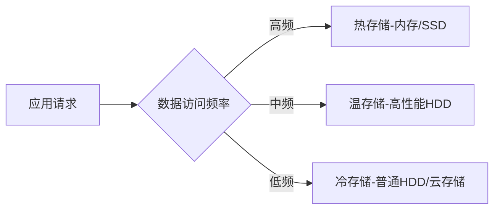

## 前言

作为一名数据库领域的开发者，我经常面临一个有趣的问题：如何选择最适合应用场景的数据库类型？🤔 是传统的关系型数据库，还是灵活的NoSQL，或者是专门处理时序数据的系统？~~曾经我以为这就像在汉堡和披萨之间做选择~~，直到我意识到现代应用往往需要同时处理多种数据类型。

随着业务复杂度的提升，单一数据模型已难以满足多样化需求。今天，我想和大家探讨数据库多模支持与混合存储策略，如何构建一个既能适应现代应用需求，又能保持高性能和成本效益的数据架构。

## 为什么需要多模数据库？

### 现代应用的复杂性

在当今数字化时代，我们的应用需要处理的数据类型越来越丰富：

- **结构化数据**：用户信息、订单记录等传统表格数据
- **半结构化数据**：JSON、XML格式的日志、配置信息
- **非结构化数据**：图片、视频、文档等多媒体内容
- **图数据**：社交网络、推荐系统中的关系数据
- **时序数据**：IoT设备传感器读数、监控系统数据

::: tip
多模数据库允许我们在同一系统中使用多种数据模型，无需为每种数据类型部署独立的数据库实例。
:::

### 单一数据库的局限性

传统的单一数据库模型在面对多样化数据需求时往往力不从心：

1. **关系型数据库**：擅长处理结构化数据，但对半结构化和非结构化数据支持有限
2. **文档数据库**：灵活处理JSON等文档，但复杂关联查询能力较弱
3. **图数据库**：擅长关系分析，但不适合大规模事务处理
4. **键值存储**：高性能读写，但查询能力有限
5. **列式存储**：适合分析型查询，但事务处理能力较弱

## 多模数据库解决方案

### 主流多模数据库产品

市场上已经出现了多种支持多模的数据库产品：

| 数据库 | 支持的数据模型 | 适用场景 |
|--------|--------------|---------|
| MongoDB | 文档、图、搜索 | 内容管理、用户画像、社交网络 |
| ArangoDB | 文档、键值、图 | 多样化数据统一存储 |
| OrientDB | 文档、键值、图、关系 | 复杂业务数据建模 |
| Cassandra | 键值、列、图 | 大规模分布式数据 |
| Redis | 键值、流、图 | 高性能缓存、实时分析 |

::: theorem
多模数据库的核心优势在于**数据模型灵活性**和**运维简化**，能够在不牺牲性能的前提下，满足多样化数据需求。
:::

### 多模数据库的实现方式

多模数据库通常通过以下几种方式实现多模型支持：

1. **统一内核多模型**：在单一存储引擎上支持多种数据模型
   - 优点：性能最佳，数据一致性高
   - 缺点：实现复杂，扩展性可能受限

2. **插件式多模型**：基于核心数据库，通过插件支持其他数据模型
   - 优点：灵活性强，可按需扩展
   - 缺点：性能可能受影响，一致性保障复杂

3. **联邦式多模型**：多个专门数据库通过统一接口协同工作
   - 优点：每种模型都可选择最佳实现
   - 缺点：跨模型查询复杂，运维成本高

## 混合存储策略

### 冷热数据分离

现代应用往往产生大量数据，但并非所有数据都需要相同的存储性能和成本。冷热数据分离是一种有效的成本优化策略：

::: tip
冷热数据分离可以降低存储成本高达60-80%，同时保持热数据的访问性能。
:::

### 分层存储架构

理想的分层存储架构包括：

1. **内存层**：Redis等内存数据库，用于缓存和实时处理
2. **SSD层**：高性能SSD存储，用于热数据和频繁访问数据
3. **HDD层**：大容量HDD存储，用于温数据和归档数据
4. **云存储层**：对象存储服务，用于冷数据和长期归档

### 数据生命周期管理

数据生命周期管理是混合存储策略的重要组成部分：

1. **数据生成**：新数据首先写入高性能存储
2. **数据活跃期**：根据访问频率调整存储层级
3. **数据温存期**：迁移到成本较低的存储
4. **数据归档期**：迁移到云存储或磁带
5. **数据销毁**：根据合规要求安全删除

## 实施多模与混合存储的最佳实践

### 数据模型选择策略

选择合适的数据模型需要考虑以下因素：

1. **数据特性**：结构化程度、访问模式、关系复杂度
2. **业务需求**：查询类型、一致性要求、扩展性需求
3. **成本约束**：硬件成本、运维成本、扩展成本
4. **团队技能**：团队对不同数据库技术的熟悉程度

::: right
"没有最好的数据库，只有最适合的数据库架构。"
:::

### 混合存储实施步骤

1. **数据分类**：根据访问频率、重要性、合规要求分类数据
2. **存储规划**：为不同类别数据选择合适的存储介质
3. **迁移策略**：制定数据迁移计划，确保业务连续性
4. **监控优化**：持续监控访问模式，动态调整存储策略
5. **成本评估**：定期评估存储成本，优化资源配置

### 架构设计考虑

在实施多模与混合存储架构时，需要考虑以下设计要点：

1. **数据一致性**：确保跨模型和跨存储层的数据一致性
2. **查询优化**：优化跨模型查询，避免性能瓶颈
3. **故障恢复**：设计完善的故障恢复机制
4. **扩展性**：确保架构能够随业务增长而扩展
5. **安全性**：保障数据在不同存储层级的安全性

## 案例分析：电商平台的混合存储架构

让我们以一个电商平台为例，看看如何应用多模与混合存储策略：

### 数据类型与存储需求

| 数据类型 | 特点 | 存储需求 | 推荐存储 |
|---------|------|---------|---------|
| 用户信息 | 结构化，频繁读写 | 低延迟，高一致性 | 关系型数据库+缓存 |
| 商品信息 | 半结构化，读多写少 | 中等延迟，全文检索 | 文档数据库+搜索引擎 |
| 订单数据 | 结构化，事务性强 | 高一致性，ACID | 关系型数据库 |
| 用户行为 | 时序数据，海量写入 | 高吞吐，成本敏感 | 列式存储+时序数据库 |
| 商品图片 | 非结构化，大文件 | 大容量，成本优先 | 对象存储 |
| 推荐系统 | 图数据，复杂关系 | 图遍历性能 | 图数据库 |

### 架构实现

该电商平台的混合存储架构包括：

1. **交易层**：MySQL集群处理订单和用户信息，Redis缓存热点数据
2. **商品层**：MongoDB存储商品详情，Elasticsearch提供搜索功能
3. **分析层**：ClickHouse处理用户行为分析，InfluxDB存储时序数据
4. **内容层**：MinIO存储商品图片和视频，CDN加速访问
5. **推荐层**：Neo4j构建用户-商品关系图，支持个性化推荐

## 结语

多模支持与混合存储策略是现代数据架构的必然选择。它不仅能够满足多样化数据需求，还能在性能和成本之间取得平衡。

实施这一策略需要深入理解业务需求，精心设计架构，并持续优化调整。~~这就像在调一杯完美的鸡尾酒，需要不断尝试不同配方~~，但最终的结果绝对值得。

随着数据量的爆炸式增长和业务需求的日益复杂，多模与混合存储将成为构建现代化数据架构的核心技术。希望今天的分享能为大家在数据库选型和架构设计时提供一些思路和启发。

> 数据架构没有银弹，只有最适合业务需求的解决方案。在多模与混合存储的道路上，持续学习和实践才是王道。

---

**参考资料**：
1. 《多模数据库：架构与应用实践》
2. 《混合存储策略：成本与性能的平衡艺术》
3. 《现代数据架构设计指南》