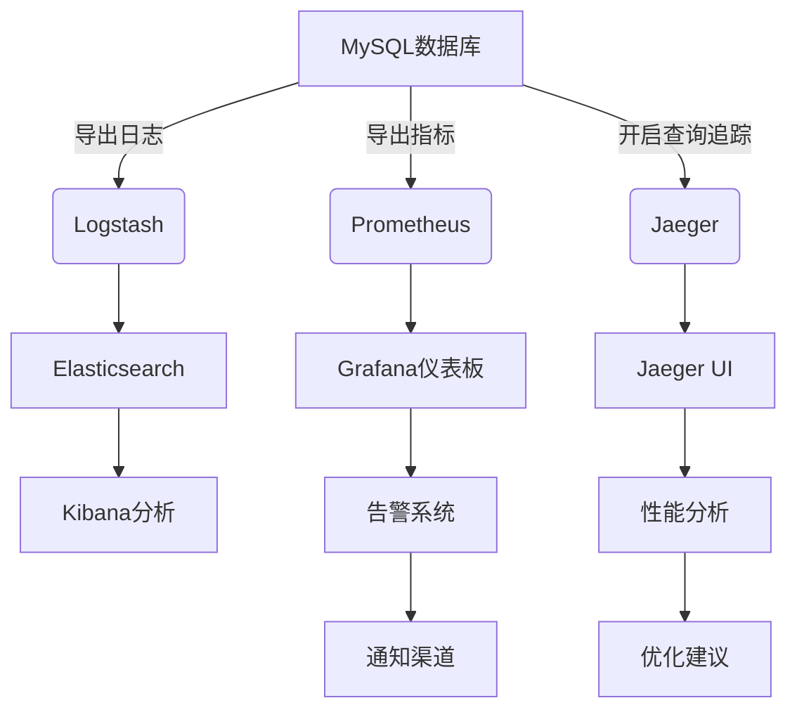

## 前言

在当今复杂的分布式系统中，数据库作为核心组件，其健康状况直接影响整个应用的性能与稳定性。~~传统监控方式往往只能提供表面的指标，无法深入洞察数据库内部行为~~。随着系统规模的扩大和复杂性的增加，我们需要一种更全面的方法来理解数据库系统——这就是**可观测性 (Observability)**。

> 可观测性不仅仅是监控的升级，它是一种让我们通过系统外部输出推断系统内部状态的能力。

本文将探讨如何构建全方位的数据库可观测性体系，从基础指标到高级分析，帮助DBA和开发团队更好地理解和优化数据库性能。

## 可观测性的三大支柱

现代可观测性建立在三大支柱之上：Metrics（指标）、Logs（日志）和Traces（追踪）。对于数据库系统而言，这三者缺一不可。

### Metrics：量化数据库健康状况

Metrics提供了数据库系统的量化视图，帮助我们了解系统的运行状态。关键数据库指标包括：

- **连接指标**：活跃连接数、连接等待时间、连接池使用率
- **性能指标**：查询响应时间、吞吐量（QPS）、慢查询比例
- **资源指标**：CPU使用率、内存使用情况、磁盘I/O、网络流量
- **容量指标**：存储空间使用率、表空间增长趋势

```markdown
| 指标类别 | 关键指标 | 告警阈值 | 监控频率 |
|---------|---------|---------|---------|
| 连接健康 | 活跃连接数 > 80% | > 85% | 实时 |
| 查询性能 | 平均响应时间 > 500ms | > 1s | 1分钟 |
| 资源使用 | CPU使用率 > 70% | > 85% | 5分钟 |
| 存储容量 | 磁盘使用率 > 80% | > 90% | 1小时 |
```

### Logs：洞察数据库内部行为

日志提供了详细的上下文信息，帮助我们理解"发生了什么"。数据库日志类型包括：

- **错误日志**：记录数据库错误和警告信息
- **查询日志**：记录执行的SQL语句和执行计划
- **慢查询日志**：记录执行时间超过阈值的查询
- **事务日志**：记录事务的开始、提交和回滚

💡 **最佳实践**：使用结构化日志（如JSON格式）便于自动化分析和告警。

### Traces：追踪请求的全生命周期

Traces展示了单个请求在系统中的完整路径，对于理解分布式数据库系统尤为重要。数据库追踪应包含：

- 查询执行路径
- 跨服务的数据访问链路
- 分布式事务的协调过程

🏗 **架构建议**：实现分布式追踪系统（如Jaeger、Zipkin）来追踪跨数据库的请求流。

## 数据库可观测性工具与平台

构建全面的数据库可观测性体系需要合适的工具支持。以下是几种常见的解决方案：

### 开源工具组合

1. **Prometheus + Grafana**：强大的指标收集与可视化平台
   - Prometheus：收集和存储时间序列数据
   - Grafana：创建丰富的仪表板和告警规则

2. **ELK/EFK Stack**：日志集中管理与分析
   - Elasticsearch：日志存储与搜索
   - Logstash/Fluentd：日志收集与处理
   - Kibana：日志可视化与分析

3. **OpenTelemetry**：标准化的可观测性框架
   - 提供统一的Metrics、Logs和Traces收集标准
   - 支持多种数据库和编程语言

### 商业解决方案

1. **Datadog**：全栈可观测性平台，提供强大的数据库监控
2. **New Relic**：应用性能监控，包含数据库专项分析
3. **Amazon CloudWatch**：AWS原生监控服务，支持RDS等云数据库

🤔 **选择建议**：对于大多数团队，开源组合提供了足够的灵活性和控制力，而商业解决方案则提供了更丰富的开箱即用功能和专业技术支持。

## 关键性能指标与告警策略

有效的可观测性不仅需要收集数据，还需要定义有意义的告警策略。

### 关键性能指标 (KPIs)

1. **查询性能KPIs**
   - 平均查询响应时间
   - P95/P99查询延迟
   - 慢查询比例
   - 全表扫描比例

2. **系统健康KPIs**
   - 连接池利用率
   - 缓存命中率
   - 死锁频率
   - 锁等待时间

3. **业务影响KPIs**
   - 数据库相关错误率
   - 数据库响应时间对业务的影响
   - 数据可用性（SLA达成率）

### 告警策略设计

有效的告警策略应遵循以下原则：

1. **分层次告警**
   - P0（严重）：系统不可用，立即响应
   - P1（高）：性能严重下降，30分钟内响应
   - P2（中）：性能下降，2小时内响应
   - P3（低）：一般性问题，计划内处理

2. **告警降噪**
   - 避免告警风暴
   - 实施告警聚合
   - 设置告警升级路径

3. **告警内容优化**
   - 提供足够上下文
   - 包含可能的解决方案
   - 链接到相关文档

## 实战案例：构建端到端的数据库可观测性解决方案

让我们通过一个实际案例，展示如何为MySQL数据库构建完整的可观测性体系。

### 架构设计



### 实施步骤

1. **配置MySQL指标收集**
   ```yaml
   # mysqld_exporter配置
   collectors_enabled:
     - global_status
     - global_variables
     - engine_innodb_status
     - processlist
     - schema_auto_increment
     - replication_status
   ```

2. **设置慢查询日志分析**
   ```sql
   -- 启用慢查询日志
   SET GLOBAL slow_query_log = 'ON';
   SET GLOBAL long_query_time = 1; -- 1秒阈值
   SET GLOBAL log_queries_not_using_indexes = 'ON';
   
   -- 分析慢查询
   SELECT * FROM mysql.slow_log 
   WHERE start_time > NOW() - INTERVAL 1 HOUR
   ORDER BY query_time DESC
   LIMIT 10;
   ```

3. **创建Grafana仪表板**
   - 数据库连接池状态
   - 查询性能趋势
   - 系统资源使用情况
   - 锁等待分析

4. **配置分布式追踪**
   ```java
   // Java应用中使用OpenTelemetry追踪数据库查询
   Span span = tracer.spanBuilder("database-query")
                .setStartTimestamp(Instant.now())
                .setAttribute("db.statement", sql)
                .startSpan();
   
   try (Connection conn = dataSource.getConnection();
        PreparedStatement stmt = conn.prepareStatement(sql)) {
       // 执行查询
   } finally {
       span.end();
   }
   ```

### 效果评估

实施可观测性方案后，我们观察到：

- 平均故障检测时间(MTTR)减少了60%
- 数据库性能问题提前预警率提高了75%
- 团队对数据库行为的理解显著提升
- 优化决策更加数据驱动

## 未来趋势：AI驱动的数据库可观测性

随着AI技术的发展，数据库可观测性正在向智能化方向发展：

1. **异常检测**
   - 基于机器学习的异常模式识别
   - 自动发现异常查询模式
   - 预测性故障预警

2. **根因分析**
   - 自动分析性能问题的根本原因
   - 提供针对性的优化建议
   - 智能关联多个指标找出问题源头

3. **容量规划**
   - 基于历史数据的容量预测
   - 自动化的扩容建议
   - 成本优化方案

4. **自愈能力**
   - 自动执行性能优化操作
   - 自动调整配置参数
   - 故障自动恢复

> 未来数据库可观测性将不仅是"发现问题"的工具，而是"预防问题"和"自动解决问题"的智能系统。

## 结语

在数字化转型的浪潮中，数据库作为核心数据资产，其可观测性已成为技术团队不可或缺的能力。通过构建Metrics、Logs和Traces三大支柱，结合适当的工具和策略，我们可以实现对数据库系统全方位的洞察。

📡 **行动建议**：
1. 从关键指标开始，逐步扩展可观测性范围
2. 建立标准化的日志格式和命名规范
3. 将可观测性融入DevOps流程，实现持续优化
4. 投资团队培训，提升对数据库行为的理解

数据库可观测性不是一蹴而就的项目，而是一个持续演进的过程。随着系统复杂性的增加，对可观测性的需求也将不断提升。通过不断学习和实践，我们可以构建更加健壮、高效的数据库系统，为业务发展提供坚实的数据支撑。