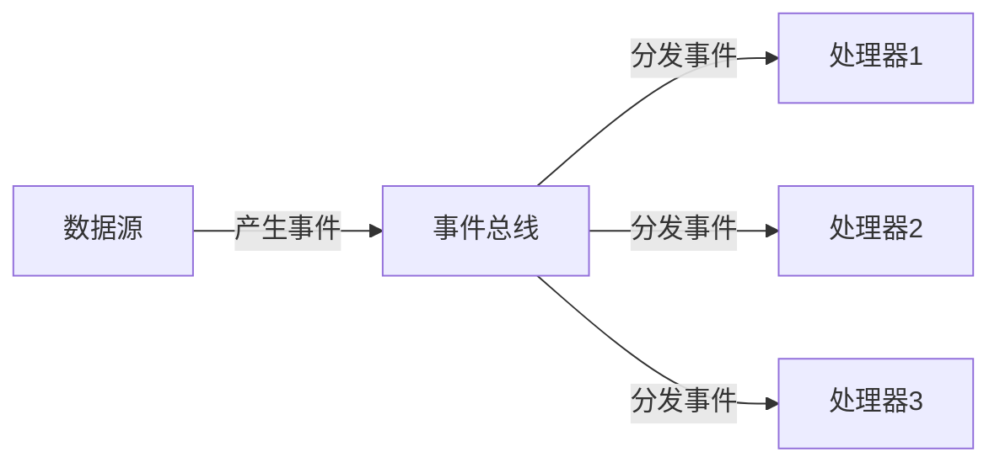
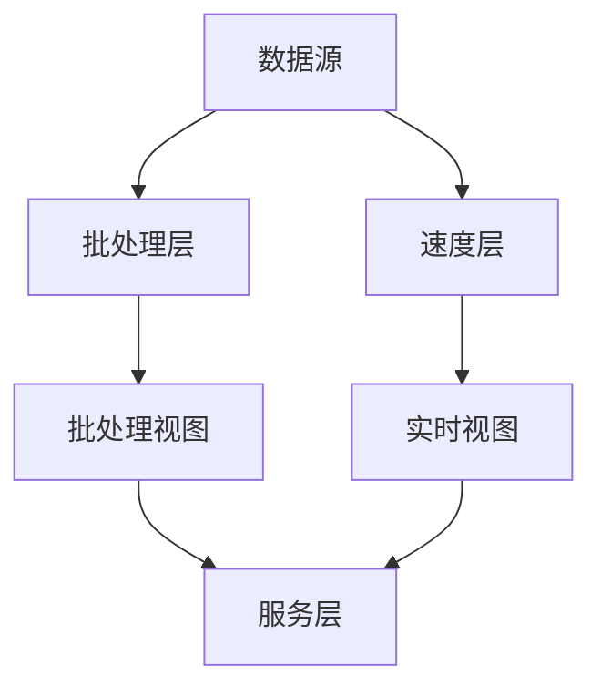
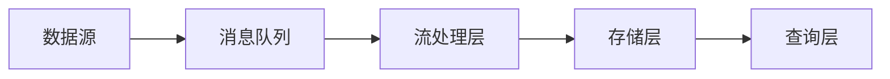
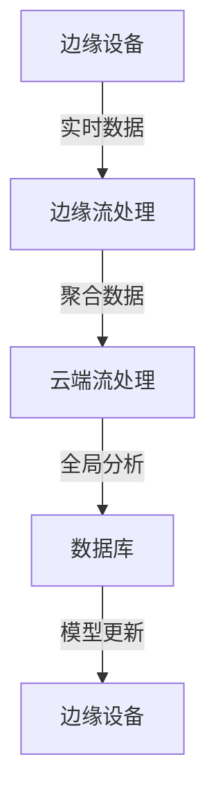

## 前言

在当今数据驱动的世界中，传统的批处理模式已经无法满足业务对实时性的需求。从金融风控、物联网监控到用户体验优化，越来越多的场景要求我们能够即时处理和分析数据流。然而，现有的数据库文章列表中，虽然涵盖了性能优化、分布式架构、高可用方案等多个方面，却缺少了对**流处理与实时分析**这一关键领域的深入探讨。

今天，我想和大家一起探讨如何将流处理技术与数据库相结合，构建能够支持实时决策的现代数据应用。

## 流处理与实时分析的基本概念

### 什么是流处理？

流处理是一种计算范式，它专注于对持续产生的数据流进行实时或近实时的处理。与传统的批处理不同，流处理不需要等待数据收集完成，而是可以立即对到达的数据进行处理。

::: tip
流处理的核心思想是"数据在移动时被处理"，而不是"数据被收集后再处理"。
:::

### 实时分析的价值

实时分析能够让我们：

- 即时发现业务异常和趋势
- 提供即时反馈的用户体验
- 支持实时决策和自动化操作
- 捕获短暂但有价值的数据窗口

## 流处理架构模式

### 事件驱动架构

事件驱动架构是流处理的基础，它通过产生、发布、订阅和处理事件来实现系统间的松耦合通信。



### Lambda架构

Lambda架构结合了批处理和流处理的优势，提供了一种既能处理历史数据又能处理实时数据的统一架构。



### Kappa架构

Kappa架构是Lambda架构的简化版本，它假设所有数据都可以重新处理，因此只保留了流处理层。



## 实时数据库技术选型

### 传统数据库的实时能力

传统关系型数据库如PostgreSQL、MySQL等通过以下方式支持实时处理：

- 物化视图和触发器
- 事件监听和通知
- 流式SQL扩展

```sql
-- PostgreSQL的LISTEN/NOTIFY示例
LISTEN notifications;
NOTIFY 'new_order', 'order_id=12345';
```

### 专用流处理数据库

专用流处理数据库为实时分析而设计，具有以下特点：

- 高吞吐量和低延迟
- 持续查询能力
- 窗口函数和时间序列处理

**代表产品：**
- TimescaleDB (基于PostgreSQL的时序数据库扩展)
- Apache Cassandra (支持高吞吐写入)
- InfluxDB (专为时序数据设计)

### NewSQL数据库

NewSQL数据库结合了传统关系型数据库的ACID特性和NoSQL的扩展性：

- CockroachDB
- TiDB
- Google Spanner

## 流处理与数据库的集成方案

### 变更数据捕获(CDC)

CDC是一种捕获数据库变更的技术，可以将变更事件实时发送到流处理系统。

```java
// Debezium CDC示例
@ChangeStream("inventory.customers")
public class CustomerChangeProcessor {
    
    @ChangeStreamHandler
    public void handleChange(CustomerChangeEvent event) {
        // 处理变更事件
    }
}
```

### 流式ETL

流式ETL将传统ETL过程改为实时处理模式：

```python
# 使用Apache Flink的流式ETL示例
from pyflink.datastream import StreamExecutionEnvironment
from pyflink.table import StreamTableEnvironment

env = StreamExecutionEnvironment.get_execution_environment()
t_env = StreamTableEnvironment.create(env)

# 创建源表
t_env.execute_sql("""
    CREATE TABLE source (
        id INT,
        name STRING,
        timestamp TIMESTAMP(3)
    ) WITH (
        'connector' = 'kafka',
        'topic' = 'input-topic',
        'properties.bootstrap.servers' = 'localhost:9092',
        'format' = 'json'
    )
""")

# 创建目标表
t_env.execute_sql("""
    CREATE TABLE sink (
        id INT,
        processed_name STRING,
        processing_time TIMESTAMP(3)
    ) WITH (
        'connector' = 'jdbc',
        'url' = 'jdbc:postgresql://localhost:5432/mydb',
        'table-name' = 'processed_data',
        'username' = 'user',
        'password' = 'password'
    )
""")

# 执行流式转换
t_env.sql_query("""
    INSERT INTO sink
    SELECT id, UPPER(name), CURRENT_TIMESTAMP
    FROM source
""").execute()
```

### 流式物化视图

流式物化视图可以实时更新计算结果：

```sql
-- TimescaleDB的流式物化视图示例
CREATE MATERIALIZED VIEW IF NOT EXISTS hourly_sales
WITH (timescaledb.continuous) AS
SELECT 
    time_bucket('1 hour', order_time) AS hour,
    SUM(amount) AS total_sales
FROM orders
GROUP BY hour;
```

## 实时分析的性能优化

### 数据分区与分片

合理的数据分区可以显著提高查询性能：

```sql
-- 按时间范围分区
CREATE TABLE sensor_data (
    device_id INT,
    timestamp TIMESTAMP,
    value FLOAT
) PARTITION BY RANGE (timestamp);

-- 创建分区
CREATE TABLE sensor_data_2023_01 PARTITION OF sensor_data
    FOR VALUES FROM ('2023-01-01') TO ('2023-02-01');
```

### 索引优化

针对实时查询的索引策略：

```sql
-- 时间序列数据的时间索引
CREATE INDEX idx_sensor_data_time ON sensor_data (timestamp);

-- 复合索引
CREATE INDEX idx_sensor_data_device_time ON sensor_data (device_id, timestamp);
```

### 内存计算

利用内存加速实时计算：

```python
# 使用Apache Spark Streaming的内存缓存示例
stream_df = spark.readStream.format("kafka") \
    .option("kafka.bootstrap.servers", "localhost:9092") \
    .option("subscribe", "input") \
    .load()

# 缓存中间结果
cached_df = stream_df.select("value").cache()
```

## 实际应用案例

### 电商平台实时推荐

**场景：** 根据用户实时行为动态调整推荐内容

**架构：**
1. 用户行为事件流 → Kafka
2. 实时特征提取 → Flink
3. 模型预测 → Spark MLlib
4. 结果存储 → Redis
5. 前端展示 → 实时API

```java
// 实时推荐系统示例代码
public class RealtimeRecommender {
    
    private FeatureExtractor featureExtractor;
    private PredictionModel model;
    private RedisCache cache;
    
    public void processUserEvent(UserEvent event) {
        // 提取实时特征
        FeatureVector features = featureExtractor.extract(event);
        
        // 预测推荐结果
        List<Item> recommendations = model.predict(features);
        
        // 缓存结果
        cache.set("recommendations:" + event.getUserId(), 
                  recommendations, 
                  Duration.ofMinutes(10));
    }
}
```

### 物联网设备监控

**场景：** 实时监控工业设备运行状态，及时发现异常

**架构：**
1. 设备数据流 → MQTT → Kafka
2. 实时异常检测 → Flink CEP
3. 告警生成 → 数据库 + 消息队列
4. 可视化展示 → Grafana

```python
# 使用Flink CEP进行异常检测
from pyflink.datastream import StreamExecutionEnvironment
from pyflink.cep import PatternSelectFunction, PatternTimeoutFunction
from pyflink.cep.pattern import Pattern, begin, where, next, times, or_

env = StreamExecutionEnvironment.get_execution_environment()

# 定义异常检测模式
temperature_pattern = Pattern.begin("start") \
    .where(lambda event: event["sensor_type"] == "temperature") \
    .next("high_temp") \
    .where(lambda event: event["value"] > 90) \
    .times(2, within=minutes(5)) \
    .within(minutes(10))

# 应用模式检测
pattern_stream = CEP.pattern(sensor_stream, temperature_pattern)

# 处理匹配结果
result_stream = pattern_stream.select(
    select_function=AnomalySelectFunction(),
    timeout_function=AnomalyTimeoutFunction()
)
```

## 未来发展趋势

### 流批一体化

流批一体化技术正在兴起，如Apache Kafka KSQL、Apache Flink等平台正在模糊流处理和批处理的界限。

```sql
-- KSQL示例：统一的流批查询
CREATE STREAM user_events WITH (
    KAFKA_TOPIC='user-events',
    VALUE_FORMAT='JSON',
    TIMESTAMP='timestamp'
) AS SELECT
    user_id,
    event_type,
    COUNT(*) AS event_count
FROM user_events
WINDOW TUMBLING (SIZE 1 HOUR)
GROUP BY user_id, event_type;
```

### 边缘计算与流处理

随着物联网设备的普及，边缘计算与流处理的结合变得越来越重要：



### AI与流处理的深度融合

机器学习模型正在越来越多地直接集成到流处理管道中：

```python
# 使用TensorFlow Extended(TFX)进行在线模型训练
from tfx.components import CsvExampleGen, StatisticsGen, SchemaGen, Trainer
from tfx.orchestration import pipeline, pipeline_root, dsl
from tfx.orchestration.beam.beam_dag_runner import BeamDagRunner

# 定义在线学习管道
def online_learning_pipeline():
    example_gen = CsvExampleGen(input_base=INPUT_BASE)
    statistics_gen = StatisticsGen(examples=example_gen.outputs['examples'])
    schema_gen = SchemaGen(statistics=statistics_gen.outputs['statistics'])
    trainer = Trainer(
        module_file=_trainer_module_file,
        examples=example_gen.outputs['examples'],
        schema=schema_gen.outputs['schema'],
        train_args=trainer_pb2.TrainArgs(num_steps=1000),
        eval_args=trainer_pb2.EvalArgs(num_steps=500)
    )
    return pipeline.Pipeline(
        pipeline_name='online_learning_pipeline',
        pipeline_root=PIPELINE_ROOT,
        components=[
            example_gen,
            statistics_gen,
            schema_gen,
            trainer
        ],
        enable_cache=True
   )
```

## 结语

流处理与实时分析已经成为现代数据架构不可或缺的一部分。从传统的批处理到实时的流处理，这一转变不仅改变了我们处理数据的方式，更深刻地影响了业务决策的流程。

通过合理选择流处理技术、优化数据库集成方案、应用性能优化策略，我们可以构建出既高效又可靠的实时数据应用。随着边缘计算、AI与流处理的深度融合，未来的数据架构将更加智能和响应迅速。

对于数据库架构师和开发者来说，掌握流处理与实时分析技术已经成为必备技能。希望这篇文章能够为你提供有价值的参考，助你在构建现代数据应用的道路上走得更远。

> 正如数据库大师 Michael Stonebraker 所言："未来属于能够实时处理数据的系统，而不是那些只能在夜间批处理数据的系统。"