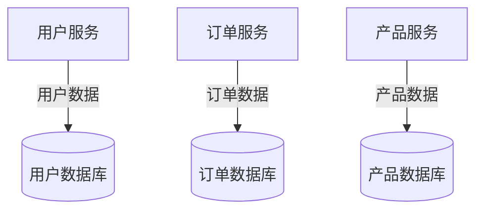
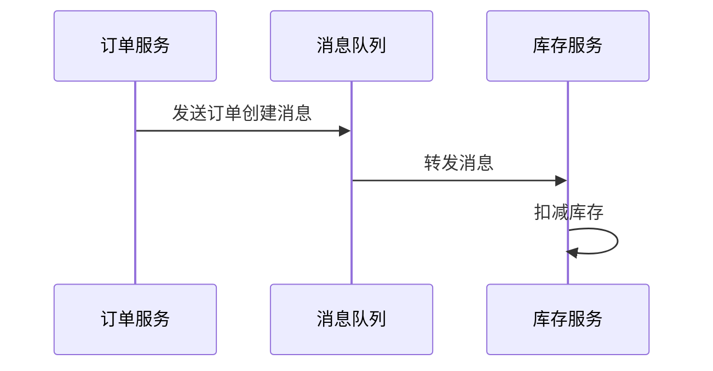
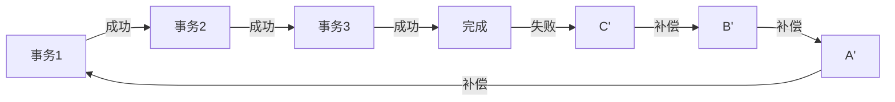
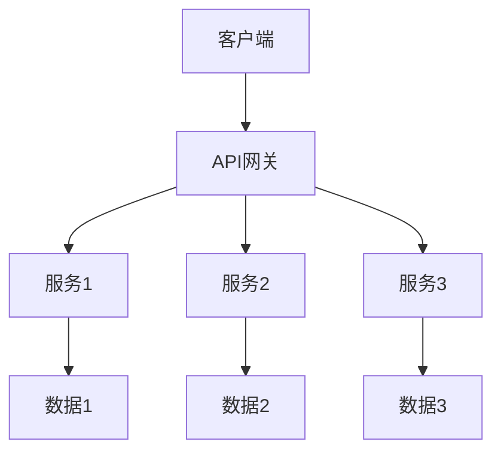
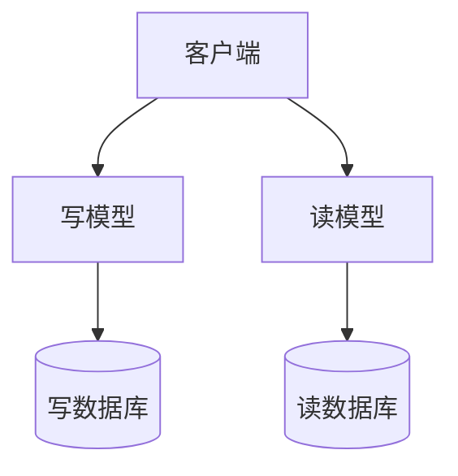

## 前言

最近我在团队中负责一个微服务架构的转型项目，其中一个最大的挑战就是数据库设计。~~说实话，一开始我以为这不过是把单体数据库拆分成几个小数据库而已，结果踩了不少坑~~ 🤣。随着项目的深入，我发现微服务架构下的数据库设计远比想象中复杂，涉及到数据一致性、分布式事务、服务间数据共享等多个方面。

在本文中，我想和大家分享一下我在微服务架构下数据库设计的经验和思考，希望能对正在面临类似挑战的朋友们有所帮助。

## 微服务架构下的数据库设计挑战

### 数据一致性挑战

在单体应用中，我们可以轻松使用数据库事务来保证数据一致性。但在微服务架构中，每个服务通常拥有自己的数据库，跨服务的数据一致性变得非常复杂。

::: tip
微服务架构下的CAP理论告诉我们，在分布式系统中，一致性(Consistency)、可用性(Availability)和分区容错性(Partition tolerance)三者不可兼得。我们需要根据业务场景做出权衡。
::_

**分布式事务**成为了微服务架构中的常见挑战。例如，在一个电商系统中，订单服务和库存服务需要同时更新数据，如何保证这两个操作要么都成功，要么都失败？

### 数据共享与耦合问题

在微服务架构中，我们通常希望服务之间保持低耦合。然而，数据共享却可能导致服务间的紧密耦合。例如，一个服务直接访问另一个服务的数据库，这违背了微服务的自治原则。

### 数据查询复杂性

在单体应用中，我们可以轻松进行复杂的跨表查询。但在微服务架构中，每个服务只能访问自己的数据，跨服务的查询变得非常困难。

## 解决方案

### 数据库拆分策略

#### 按业务领域拆分

这是最常见的拆分策略，每个微服务对应一个业务领域，拥有独立的数据库。

#### 按数据类型拆分

对于某些特定类型的数据，可以考虑按数据类型拆分。例如，将结构化数据、半结构化数据和文档数据分别存储在不同的数据库中。

### 数据一致性解决方案

#### 最终一致性模型

采用最终一致性模型，允许系统在短时间内存在不一致状态，但最终会达到一致。这种方法通常结合消息队列来实现。

#### Saga模式

Saga模式是一种分布式事务模式，将一个分布式事务拆分为多个本地事务，每个本地事务都有一个补偿事务。

### 数据共享解决方案

#### API组合模式

通过API组合来实现跨服务的数据访问。客户端从多个服务获取数据，然后在客户端或API网关中组合这些数据。

#### CQRS模式

命令查询责任分离(Command Query Responsibility Segregation)模式将读写操作分离，为查询操作提供专门的模型和存储。

### 数据查询解决方案

#### 聚合服务模式

创建专门的聚合服务，负责从多个微服务获取数据并组合成客户端需要的数据视图。

#### 数据复制与缓存

将频繁访问的数据复制到专门的缓存服务或数据库中，以提高查询性能。

## 实践案例

### 电商平台案例

在一个电商平台中，我们有用户、商品、订单、支付等多个微服务。每个服务都有自己的数据库。

**订单创建流程**：
1. 订单服务创建订单
2. 订单服务发送消息到库存服务
3. 库存服务扣减库存
4. 订单服务更新订单状态

在这个过程中，我们采用了Saga模式来保证数据一致性。如果库存扣减失败，订单服务会触发补偿事务，取消订单。

### 实时数据分析案例

在一个实时数据分析平台中，我们有数据收集、数据处理、数据存储等多个微服务。

**数据查询流程**：
1. 客户端发送查询请求到API网关
2. API网关将请求转发到查询服务
3. 查询服务从多个数据源获取数据
4. 查询服务组合数据并返回结果

在这个案例中，我们采用了CQRS模式，为查询操作提供了专门的读模型和数据库。

## 最佳实践

1. **单一职责原则**：每个微服务应该只负责一个业务领域，拥有自己的数据库。
2. **避免跨服务数据库访问**：服务不应该直接访问其他服务的数据库。
3. **优先考虑最终一致性**：在大多数情况下，最终一致性比强一致性更适合微服务架构。
4. **合理使用缓存**：缓存可以显著提高查询性能，但需要注意数据一致性问题。
5. **监控数据一致性**：建立监控机制，及时发现和解决数据一致性问题。

## 结语

微服务架构下的数据库设计是一个复杂的话题，没有放之四海而皆准的解决方案。我们需要根据具体的业务场景和需求，选择合适的设计策略。

在实践过程中，我发现最重要的是保持灵活性，不要一开始就追求完美的设计，而是采用迭代的方式，随着业务的发展不断优化数据库架构。

> "微服务架构不是银弹，它解决了单体应用的一些问题，但也带来了新的挑战。理解这些挑战并找到合适的解决方案，是成功实施微服务架构的关键。"

希望我的经验和思考能够对大家有所帮助。如果你有任何问题或建议，欢迎在评论区留言交流！🤝