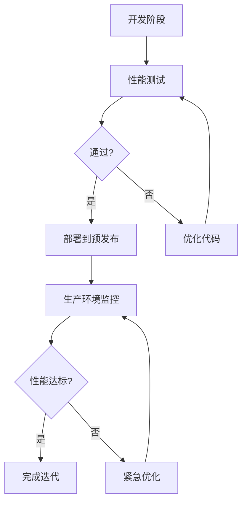

## 前言

在当今的软件开发环境中，快速交付已经成为DevOps的核心价值之一。然而，仅仅快速交付是不够的——应用还需要在性能方面达到预期标准，才能为用户提供良好的体验。性能问题往往在系统负载增加时才暴露出来，此时修复的成本远高于开发早期阶段。

本文将探讨如何将性能工程实践无缝融入DevOps流程，构建从开发到部署的全流程性能优化体系，确保应用不仅快速交付，而且在性能方面也经得起考验。

## DevOps与性能工程的融合

### 传统开发流程中的性能挑战

在传统的软件开发流程中，性能测试通常位于开发周期的末端，作为质量保障的一个环节。这种"测试后优化"的模式存在几个明显问题：

1. **问题发现晚**：性能问题往往在生产环境中才被发现，修复成本极高
2. **反馈周期长**：从发现性能问题到修复并验证效果，周期可能长达数周
3. **责任分散**：开发、运维、测试团队之间缺乏统一的性能目标

### DevOps视角下的性能工程

DevOps文化强调打破团队壁垒，建立持续反馈机制。将性能工程融入DevOps流程，意味着：

- **左移性能测试**：在开发早期就引入性能测试和基准
- **自动化性能监控**：建立持续的性能监控和预警机制
- **跨团队协作**：开发、运维、测试共同对系统性能负责
- **数据驱动决策**：基于性能数据做出架构和技术选型决策

## 性能测试自动化

### 单元性能测试

单元测试不仅验证功能正确性，也应包含性能指标验证：

```java
@Test
public void testPerformance() {
    long startTime = System.currentTimeMillis();
    // 执行被测试的方法
    someService.processData();
    long duration = System.currentTimeMillis() - startTime;
    
    // 验证执行时间在预期范围内
    assertTrue("方法执行时间过长", duration < 100);
}
```

### 集成性能测试

集成测试验证组件间的交互性能，可以使用工具如JMeter、Gatling等：

```yaml
# 使用JMeter进行性能测试的示例配置
jmeter:
  test_plan:
    threads: 100
    ramp_up: 30
    duration: 300
    throughput: 50
    transactions:
      - name: "API请求"
        request:
          url: "https://api.example.com/users"
          method: "GET"
        assertions:
          - response_time: < 500
          - success_rate: > 99.5%
```

### 基准测试与回归测试

建立性能基准，防止性能退化：

```bash
# 使用wrk进行基准测试
wrk -t12 -c400 -d30s http://localhost:8080/api

# 输出示例
Running 30s test @ http://localhost:8080/api
  12 threads and 400 connections
  Thread Stats   Avg      Stdev     Max   +/- Stdev
    Latency     5.23ms    1.12ms  15.34ms   68.23%
    Req/Sec   2456.78    123.45   3000.00    75.67%
  885678 requests in 30.01s, 1.23GB read
Requests/sec: 29515.23
Transfer/sec:     41.32MB
```

## 持续性能监控

### 监控指标体系

建立全面的性能指标体系：

| 指标类型 | 具体指标 | 工具示例 |
|---------|---------|---------|
| 应用性能 | 响应时间、吞吐量、错误率 | Prometheus, Grafana |
| 基础设施 | CPU、内存、磁盘I/O、网络 | Zabbix, Nagios |
| 用户感知 | 页面加载时间、首字节时间 | New Relic, Datadog |
| 业务指标 | 转化率、用户满意度 | Mixpanel, Amplitude |

### 分布式追踪

在微服务架构中，分布式追踪是定位性能瓶颈的关键：

```yaml
# Jaeger配置示例
jaeger:
  sampler:
    type: "const"
    param: 1
  reporter:
    logSpans: true
    queueSize: 100
    flushInterval: 1000
```

### 告警与自动化

设置合理的性能告警阈值，并实现自动化响应：

```yaml
# Prometheus告警规则示例
groups:
- name: performance.rules
  rules:
  - alert: HighLatency
    expr: http_request_duration_seconds{quantile="0.95"} > 0.5
    for: 5m
    labels:
      severity: warning
    annotations:
      summary: "High request latency detected"
      description: "95th percentile latency is {{ $value }}s"
      
  - alert: LowThroughput
    expr: rate(http_requests_total[5m]) < 100
    for: 10m
    labels:
      severity: critical
    annotations:
      summary: "Low request throughput detected"
      description: "Request rate is {{ $value }}req/s"
```

## 性能优化实践

### 代码级优化

- **算法优化**：选择时间复杂度更优的算法
- **资源管理**：合理使用连接池、缓存等
- **异步处理**：将非关键路径操作异步化

```java
// 使用连接池优化数据库访问
public class DatabaseService {
    private final DataSource dataSource;
    
    @Autowired
    public DatabaseService(DataSource dataSource) {
        this.dataSource = dataSource;
    }
    
    public List<User> findActiveUsers() {
        try (Connection conn = dataSource.getConnection();
             PreparedStatement stmt = conn.prepareStatement(
                 "SELECT * FROM users WHERE active = ?")) {
            stmt.setBoolean(1, true);
            // 执行查询...
        } catch (SQLException e) {
            // 处理异常
        }
        return users;
    }
}
```

### 架构级优化

- **缓存策略**：多级缓存、缓存预热
- **负载均衡**：智能路由、会话保持
- **扩展性设计**：水平扩展、无状态服务

```yaml
# Redis集群配置示例
redis:
  cluster:
    nodes:
      - "redis-node1:7000"
      - "redis-node2:7000"
      - "redis-node3:7000"
    max-redirects: 3
    timeout: 5000
```

### 基础设施优化

- **资源调度**：合理分配CPU、内存资源
- **网络优化**：CDN、负载均衡、连接复用
- **存储优化**：SSD、分布式存储、冷热数据分离

```hcl
# Terraform配置示例：优化AWS资源
resource "aws_elasticache_cluster" "redis" {
  cluster_id           = "production-redis"
  engine               = "redis"
  engine_version       = "6.x"
  node_type            = "cache.m4.large"
  num_cache_nodes      = 2
  parameter_group_name = "default.redis6.x"
  port                 = 6379
  subnet_group_name    = aws_elasticache_subnet_group.redis.name
  
  # 自动故障转移
  automatic_failover_enabled = true
  
  # 多可用区部署
  availability_zones = ["us-west-2a", "us-west-2b"]
}
```

## 性能测试策略

### 测试金字塔

建立多层次的性能测试策略：

```
        /\
       /  \
      /____\
     /      \
    /________\
   /          \
  /____________\
```

- **单元性能测试**：快速验证代码片段性能
- **集成性能测试**：验证组件交互性能
- **端到端性能测试**：模拟真实用户场景
- **生产环境测试**：蓝绿部署中的性能验证

### 测试环境管理

确保测试环境与生产环境的一致性：

```yaml
# 使用Docker Compose创建一致的测试环境
version: '3'
services:
  app:
    build: .
    environment:
      - SPRING_PROFILES_ACTIVE=test
      - DB_HOST=mysql
      - REDIS_HOST=redis
    depends_on:
      - mysql
      - redis
      
  mysql:
    image: mysql:8.0
    environment:
      MYSQL_ROOT_PASSWORD: secret
      MYSQL_DATABASE: testdb
    volumes:
      - mysql_data:/var/lib/mysql
      
  redis:
    image: redis:6.2
    command: redis-server --appendonly yes
    volumes:
      - redis_data:/data

volumes:
  mysql_data:
  redis_data:
```

### 性能测试数据管理

生成符合生产特征的测试数据：

```python
# 使用Faker生成测试数据
from faker import Faker
import json

fake = Faker()

# 生成用户数据
users = []
for i in range(10000):
    user = {
        "id": i + 1,
        "name": fake.name(),
        "email": fake.email(),
        "address": fake.address(),
        "created_at": fake.date_time_between(start_date='-2y').isoformat()
    }
    users.append(user)

# 写入JSON文件
with open('users.json', 'w') as f:
    json.dump(users, f)
```

## 持续性能改进

### 性能基准与目标

建立明确的性能基准和目标：

| 指标 | 当前基准 | 目标值 | 测量方法 |
|------|---------|--------|---------|
| API响应时间 | 200ms | <100ms | JMeter测试 |
| 页面加载时间 | 3s | <1.5s | Lighthouse审计 |
| 吞吐量 | 500req/s | >1000req/s | 负载测试 |
| 错误率 | 0.5% | <0.1% | 监控系统 |

### 性能回归检测

在CI/CD流程中集成性能回归检测：

```yaml
# GitHub Actions示例：性能测试
name: Performance Test
on: [pull_request]

jobs:
  performance-test:
    runs-on: ubuntu-latest
    steps:
    - uses: actions/checkout@v2
    
    - name: Set up JDK
      uses: actions/setup-java@v1
      with:
        java-version: 11
        
    - name: Build application
      run: mvn clean package
      
    - name: Start application
      run: java -jar target/app.jar &
      
    - name: Run performance test
      run: |
        ./scripts/run-performance-test.sh
        ./scripts/compare-with-baseline.sh
        
    - name: Comment on PR
      if: failure()
      uses: actions/github-script@v3
      with:
        script: |
          github.rest.issues.createComment({
            issue_number: context.issue.number,
            owner: context.repo.owner,
            repo: context.repo.repo,
            body: '⚠️ 性能测试未通过，请查看详情: ${{ github.server_url }}/${{ github.repository }}/actions/runs/${{ github.run_id }}'
          })
```

### 性能优化反馈循环

建立性能优化的持续反馈机制：



## 性能工程团队协作

### 跨团队协作模式

建立开发、运维、测试团队间的协作机制：

1. **性能工作组**：定期召开性能评审会议
2. **性能指标共享**：建立统一的性能指标看板
3. **知识共享**：定期分享性能优化案例
4. **联合演练**：组织性能故障模拟演练

### DevSecOpsPerf融合

将安全、性能与DevOps深度融合：

```yaml
# 综合评估示例
pipeline:
  stages:
    - name: 代码扫描
      checks:
        - security: SonarQube
        - performance: CodeNarc
    
    - name: 构建与测试
      checks:
        - unit_tests: JUnit
        - integration_tests: TestNG
        - performance_tests: JMeter
    
    - name: 部署与验证
      checks:
        - security: OWASP ZAP
        - performance: BrowserStack
        - monitoring: Prometheus
```

### 性能文化建设

培养全员性能意识：

1. **性能培训**：定期开展性能工程培训
2. **激励机制**：设立性能优化奖励机制
3. **最佳实践**：建立性能优化知识库
4. **工具链**：提供便捷的性能测试工具

## 结语

性能工程不应是DevOps流程中的事后补救，而应贯穿于整个软件开发生命周期。通过将性能测试自动化、监控持续化、优化常态化，我们可以构建真正高效能的应用系统。

在未来的DevOps实践中，性能工程将与安全、可靠性一样，成为不可忽视的核心要素。只有建立了完善的性能工程体系，我们才能在快速交付的同时，确保系统的高性能和高可靠性，为用户提供卓越的体验。

> 性能不是偶然的结果，而是持续优化的产物。将性能工程融入DevOps，让每一次迭代都向着更高性能迈进。