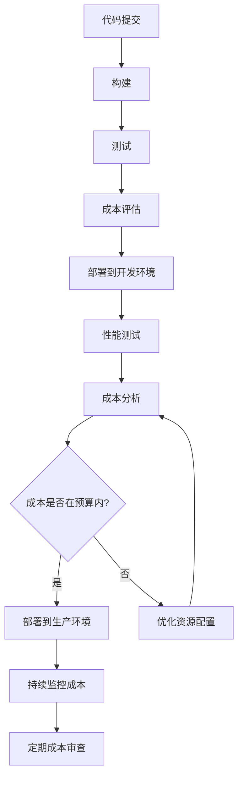

## 前言

在当今数字化转型的浪潮中，企业纷纷将工作负载迁移到云平台，以获得敏捷性、弹性和创新的能力。然而，随着云支出的快速增长，许多组织面临着"云成本失控"的挑战。根据Flexera的报告，约82%的企业在多云环境中遇到了成本超支问题。

📊 **惊人数据**：平均而言，企业浪费了约30%的云支出，这部分支出通常来自于未使用的资源、过度配置和低效的资源使用模式。

面对这一挑战，**FinOps**（Financial Operations）应运而生，它是一种将财务责任融入DevOps实践的文化、实践和能力集合。通过FinOps，团队可以更有效地管理云成本，实现技术与业务的平衡。

本文将深入探讨FinOps的核心概念、实践方法以及在DevOps流程中的集成策略，帮助您的团队实现"速度与成本"的双赢。

## FinOps概述

### 什么是FinOps？

**FinOps**是一种新兴的云财务管理框架，它通过将云成本数据提供给技术团队，让他们能够根据业务目标做出更明智的资源决策。FinOps不仅仅是关于成本削减，而是关于实现价值最大化——以合理的成本交付业务价值。

::: theorem
FinOps的核心原则：
1. **责任共担**：技术团队对云成本负有责任，而不仅仅是财务团队。
2. **数据驱动**：基于实时成本数据做出决策。
3. **持续优化**：将成本优化作为持续过程，而非一次性项目。
4. **价值导向**：关注业务价值，而非单纯追求成本最低。
:::

### FinOps与DevOps的关系

FinOps并非DevOps的替代品，而是对其的补充和增强。传统DevOps关注的是交付速度和质量，而FinOps则确保这一过程在合理的成本下进行。

```
DevOps + FinOps = 高效、经济、可持续的软件交付
```

通过将FinOps实践融入DevOps流程，团队可以实现：
- 更快的价值实现
- 更高的资源利用率
- 更好的业务决策
- 更强的财务透明度

## FinOps的关键实践

### 1. 成本可视化与监控

建立全面的云成本可视化系统是FinOps的第一步。这包括：

- **实时成本仪表板**：显示当前云支出、趋势和预测
- **成本分配标签**：为资源添加业务上下文标签，实现成本分摊
- **异常检测**：识别异常的成本波动和潜在浪费

```bash
# 示例：使用AWS CLI获取按标签分组的成本数据
aws ce get-usage-report --time-period Start=2023-01-01,End=2023-01-31 --metrics "BlendedCost" --group-by Type="TAG",Key="Project"
```

### 2. 成本分配与问责

建立清晰的成本分配机制，使技术团队能够看到自己的决策对成本的影响：

- **标签策略**：实施一致的资源标签策略
- **成本中心映射**：将云成本映射到业务部门或项目
- **预算与警报**：为团队设置预算并设置成本超支警报

### 3. 成本优化策略

将成本优化嵌入到DevOps流程的各个环节：

#### 开发阶段
- **开发环境优化**：设置自动闲置资源回收机制
- **预生产环境优化**：使用spot实例或预留实例降低成本
- **代码审查检查点**：在代码审查中增加成本影响评估

#### 部署阶段
- **资源自动缩放**：根据实际负载自动调整资源规模
- **存储优化**：定期清理未使用的存储资源
- **网络优化**：优化数据传输和带宽使用

#### 运维阶段
- **资源生命周期管理**：定期审查和清理闲置资源
- **预留实例与节省计划**：长期稳定工作负载的成本优化
- **Spot实例策略**：对可中断工作负载使用spot实例

### 4. FinOps工具链

构建支持FinOps实践的工具链：

- **成本监控工具**：AWS Cost Explorer, Azure Cost Management, Google Cloud Cost Management
- **FinOps平台**：CloudZero, Apptio Cloudability, CloudHealth
- **开源工具**：Kubecost, OpenCost, Prometheus成本插件
- **自定义解决方案**：基于内部需求的定制化成本管理系统

## 在DevOps流程中集成FinOps

### 将FinOps融入CI/CD流程



### 实施FinOps的步骤

1. **建立成本基准**：了解当前的云支出模式和结构
2. **实施标签策略**：为所有资源添加一致的标签
3. **创建可视化仪表板**：建立成本透明度
4. **建立团队责任制**：将成本责任分配给相应的技术团队
5. **集成到开发流程**：在CI/CD流程中加入成本评估环节
6. **定期审查与优化**：建立定期成本审查机制
7. **持续改进**：根据反馈调整FinOps策略和实践

## FinOps实施案例

### 案例1：电商平台的FinOps转型

某电商平台在实施FinOps后，取得了显著成果：

- **成本节约**：云支出减少35%
- **资源利用率**：从40%提升至75%
- **预算控制**：预算偏差从±20%降至±5%
- **决策速度**：资源决策时间从数天缩短至数小时

**关键措施**：
- 实施了详细的资源标签策略
- 开发了自动化的成本监控系统
- 将成本指标纳入团队绩效评估
- 建立了跨部门的FinOps工作组

### 案例2：金融科技公司的FinOps实践

一家金融科技公司通过FinOps实现了：

- **合规成本优化**：在满足严格合规要求的同时降低成本
- **环境友好**：通过优化资源使用减少碳排放
- **创新加速**：释放被浪费的云资源用于创新项目

**关键措施**：
- 开发了内部FinOps平台，集成成本与使用数据
- 实施了"成本即代码"实践，将成本控制纳入基础设施即代码
- 建立了FinOps卓越中心，推广最佳实践

## FinOps面临的挑战与解决方案

### 常见挑战

1. **数据孤岛**：成本数据与使用数据分散在不同系统
2. **文化阻力**：技术团队对成本责任缺乏认同
3. **技能缺口**：团队缺乏成本管理相关技能
4. **工具复杂性**：现有工具难以满足特定需求

### 解决方案

1. **统一数据平台**：构建集成的成本和使用数据平台
2. **文化变革**：通过培训和激励培养FinOps文化
3. **能力建设**：提供FinOps相关培训和认证
4. **简化工具**：选择适合团队需求的工具，必要时开发定制解决方案

## 结语

FinOps不是一时的潮流，而是云时代DevOps实践的必然演进。随着企业云应用的深入，成本管理将成为DevOps流程中不可或缺的一环。

通过将FinOps实践融入DevOps流程，组织可以实现：
- 更高的资源效率和更低的云支出
- 更好的业务决策和更快的价值实现
- 更强的财务透明度和更可持续的云战略

正如DevOps改变了软件交付的方式，FinOps将改变我们管理云资源的方式。在这个云原生时代，只有技术与财务的紧密结合，才能实现真正的数字化转型成功。

> "在FinOps的世界里，每个技术决策都是财务决策，每个财务决策都是技术决策。" —— FinOps基金会

---

希望这篇文章能够帮助您了解FinOps并将其应用到您的DevOps实践中。如果您有任何问题或经验分享，欢迎在评论区留言讨论！