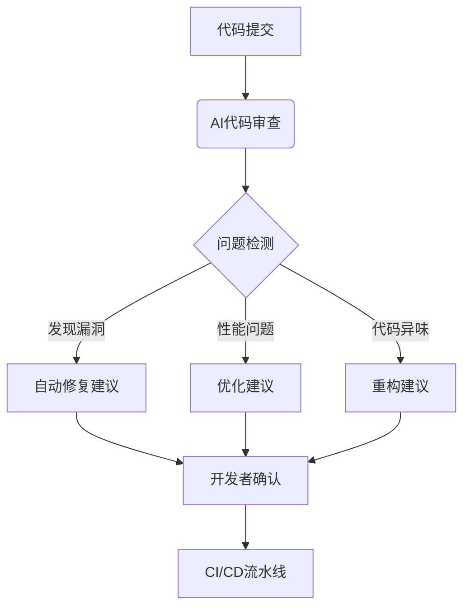

## 前言

在过去的几年里，DevOps已经彻底改变了软件开发和运维的方式。从基础设施即代码(IaC)到持续集成/持续部署(CI/CD)，我们见证了自动化带来的巨大变革。然而，随着人工智能(AI)技术的飞速发展，DevOps正迎来新一轮的智能化革命。

作为一名在DevOps领域摸爬滚打多年的从业者，我亲眼目睹了从手动运维到自动化，再到如今AI赋能的演进过程。今天，我想和大家探讨AI如何正在重塑DevOps的方方面面，以及我们如何在这个智能化时代保持竞争力。

::: tip
"AI不是要取代DevOps工程师，而是要成为他们的超级助手，将他们从重复性工作中解放出来，专注于更具创造性的任务。"
:::

## AI在DevOps中的价值

### 效率提升

传统的DevOps流程虽然已经实现了自动化，但仍然需要大量的人工干预和决策。AI的引入可以进一步优化这些流程：

- **预测性维护**：通过机器学习分析历史数据，预测系统可能出现的故障
- **智能资源分配**：根据应用负载和业务需求，自动调整计算资源
- **自动化决策**：基于预设规则和实时数据，做出部署回滚等关键决策

### 质量保障

AI正在改变我们确保软件质量的方式：

### 可观测性增强

传统的监控和日志分析往往需要人工解读大量数据。AI正在使可观测性变得更加智能：

- **异常检测**：自动识别偏离正常模式的行为
- **根因分析**：快速定位问题的根本原因
- **智能告警**：减少误报，只推送真正需要关注的问题

## AI在DevOps各阶段的应用

### 需求分析与规划

AI可以帮助团队更好地理解和规划需求：

- **需求分析**：通过自然语言处理(NLP)分析用户反馈和需求文档
- **工作量估算**：基于历史数据预测开发周期和资源需求
- **优先级排序**：根据业务价值和实现难度自动排序功能

### 开发阶段

在开发阶段，AI正在成为开发者的得力助手：

- **智能代码补全**：如GitHub Copilot，根据上下文提供代码建议
- **自动化测试**：生成测试用例，预测最可能出错的代码区域
- **代码质量分析**：实时提供代码改进建议

### 部署与运维

这是AI最能发挥价值的领域之一：

- **智能部署决策**：分析部署风险，推荐最佳部署策略
- **自愈系统**：自动检测并修复常见问题
- **容量规划**：预测未来资源需求，提前扩展基础设施

### 安全与合规

AI正在增强DevSecOps的能力：

- **漏洞检测**：扫描代码和基础设施中的安全漏洞
- **异常行为识别**：检测可能的安全威胁
- **合规性检查**：自动验证配置是否符合安全标准

## 实施AI驱动的DevOps的挑战

尽管AI带来了巨大潜力，但在DevOps中实施AI也面临诸多挑战：

### 数据质量与治理

AI系统的表现很大程度上依赖于训练数据的质量：

- **数据孤岛**：不同系统间的数据难以整合
- **数据一致性**：确保数据格式和定义的一致性
- **数据隐私**：在利用数据的同时保护用户隐私

### 技术复杂性

将AI集成到现有DevOps流程中并不简单：

- **技能缺口**：团队需要同时具备DevOps和AI知识
- **工具链整合**：将AI工具与现有DevOps工具无缝集成
- **模型维护**：持续监控和更新AI模型以确保其有效性

### 信任与可解释性

AI决策的"黑盒"特性带来了信任问题：

- **决策透明度**：理解AI为何做出特定决策
- **人类监督**：确定何时应该接受或否决AI建议
- **责任归属**：当AI决策导致问题时，如何确定责任

## 成功实施AI驱动DevOps的最佳实践

基于我在实践中的经验，以下是一些成功实施AI驱动DevOps的关键策略：

### 从小处着手

不要试图一次性重构整个DevOps流程：

- 选择一个具体的痛点，如异常检测或部署决策
- 实施小规模试点项目，验证价值
- 逐步扩展成功案例到其他领域

### 建立数据基础

高质量的数据是成功AI应用的基础：

- 实施数据治理策略，确保数据质量和一致性
- 建立数据湖或数据仓库，集中管理DevOps相关数据
- 自动化数据收集和清洗流程

### 培养复合型人才

未来的DevOps团队需要多元化的技能：

- 提供AI和机器学习培训
- 鼓励跨学科知识分享
- 招聘具有AI背景的DevOps工程师

### 人机协作

AI不是要取代人类，而是要增强人类能力：

- 设计AI系统时考虑人类监督和干预机制
- 建立清晰的决策流程，明确何时由AI做决定，何时由人类决定
- 开发直观的界面，使团队能够理解AI的决策过程

## 未来展望

随着AI技术的不断发展，DevOps将变得更加智能化和自主化：

### 自主运维系统

未来的DevOps系统可能能够：

- 自我诊断和修复问题
- 自我优化性能和资源使用
- 自我学习和适应新的环境和需求

### 预测性DevOps

AI将使DevOps从被动响应转向主动预测：

- 预测系统故障并提前预防
- 预测业务需求变化并相应调整资源
- 预测安全威胁并加强防护

### 意图驱动DevOps

未来的DevOps可能更加关注业务意图而非具体实现：

- 开发者只需描述业务目标，AI自动生成实现方案
- 系统自动将业务需求转化为技术实现
- 持续验证系统是否满足原始业务意图

## 结语

AI正在深刻改变DevOps的实践方式，从自动化走向智能化。作为DevOps从业者，我们不应抗拒这一变革，而应积极拥抱它，探索如何利用AI增强我们的能力。

记住，AI不是要取代DevOps工程师，而是要成为他们的超级助手。通过将重复性工作自动化，我们可以将更多精力投入到创新和解决复杂问题上，这正是DevOps精神的精髓。

> 正如一位行业专家所言："未来的DevOps工程师将更像是一名指挥家，而不是一名乐手。他们不会亲自演奏每一个音符，而是确保整个乐团和谐地演奏出美妙的乐章。"

在这个AI驱动的DevOps新时代，持续学习和适应将是我们保持竞争力的关键。让我们一起迎接这场智能化革命，共同构建更高效、更可靠、更智能的软件交付体系！

---

*本文由Jorgen原创，如需转载请注明出处*