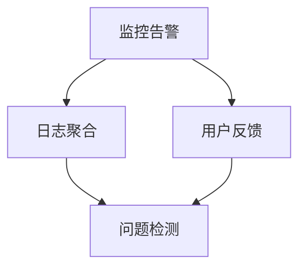

## 前言

作为一名在DevOps领域摸爬滚打多年的实践者，我经历过无数次半夜被电话惊醒的紧急情况。📱 当系统出现故障时，那种焦虑和压力只有经历过的人才懂。~~"这又是什么鬼问题？"~~ 每次系统崩溃，我都会问自己：我们是否准备好了？我们的响应流程是否足够高效？

今天，我想和大家分享的是DevOps中至关重要但常常被忽视的一环——事件响应与故障恢复。虽然我们投入大量时间在自动化部署和监控上，但当真正的问题出现时，我们的反应往往决定了用户体验和业务影响。

## 为什么事件响应与故障恢复如此重要？

在云原生和微服务架构盛行的今天，系统复杂度呈指数级增长。🏗️ 即使是最完善的系统也难免出现故障。研究表明，平均每家公司每年会经历15-20次重大故障，而有效的响应可以将业务影响减少高达90%。

::: tip
事件响应不仅仅是"修复问题"，而是一套完整的流程，从检测、分析、响应到事后复盘，形成闭环管理。
:::

## DevOps事件响应框架

### 1. 事件分级与分类

建立清晰的事件分级体系是有效响应的第一步。我通常采用以下分级标准：

- **P0 - 紧急**：系统完全不可用，影响所有用户，需要立即响应
- **P1 - 严重**：核心功能严重降级，影响大部分用户，15分钟内响应
- **P2 - 重要**：非核心功能问题，部分用户受影响，1小时内响应
- **P3 - 一般**：轻微问题，少数用户受影响，4小时内响应

### 2. 响应团队与角色

在DevOps环境中，响应团队通常包括以下角色：

- **值班工程师**：第一响应人，负责初步诊断和协调
- **技术专家**：特定领域专家，提供深度技术支持
- **产品经理**：评估业务影响，决定是否回滚或发布修复
- **沟通协调员**：负责内外部沟通，确保信息透明

### 3. 响应流程

::: theorem
有效的事件响应流程应遵循"检测-分析-响应-修复-验证-复盘"的闭环模式。
:::

#### 检测阶段

- **监控告警**：建立全面的监控体系，包括基础设施、应用性能和业务指标
- **日志聚合**：集中收集和分析系统日志，快速定位问题源头
- **用户反馈**：建立用户反馈渠道，及时发现用户体验问题



#### 分析阶段

- **问题复现**：尝试在隔离环境中复现问题
- **根因分析**：使用`5 Whys`等方法深入分析根本原因
- **影响评估**：确定问题影响范围和严重程度

#### 响应阶段

- **临时缓解**：实施临时措施恢复基本服务
- **决策沟通**：团队集体决策最佳响应策略
- **执行修复**：根据决策执行修复操作

#### 修复与验证

- **代码修复**：开发并部署修复代码
- **回归测试**：确保修复不会引入新问题
- **服务验证**：确认服务已恢复正常

#### 复盘阶段

- **事件记录**：详细记录事件全过程
- **根因分析**：深入分析根本原因
- **改进措施**：制定预防措施和流程改进

## 故障恢复策略

### 1. 自动化故障恢复

在DevOps实践中，自动化是提高响应速度的关键。我们可以通过以下方式实现自动化故障恢复：

- **健康检查**：实现应用和基础设施的健康检查机制
- **自动扩缩容**：根据负载自动调整资源
- **自动故障转移**：实现服务的自动故障转移

```bash
# 示例：使用Kubernetes实现健康检查
apiVersion: v1
kind: Pod
metadata:
  name: my-app
spec:
  containers:
  - name: my-app
    image: my-image
    livenessProbe:
      httpGet:
        path: /health
        port: 8080
      initialDelaySeconds: 30
      periodSeconds: 10
```

### 2. 蓝绿部署与金丝雀发布

这些部署策略可以有效降低故障风险：

- **蓝绿部署**：维护两个完全相同的生产环境，流量在两者间切换
- **金丝雀发布**：逐步将流量引导到新版本，监控指标后再全面推广

### 3. 灾难恢复计划

对于关键系统，需要制定完整的灾难恢复计划：

- **RTO (恢复时间目标)**：可接受的最长恢复时间
- **RPO (恢复点目标)**：可接受的数据丢失量
- **恢复策略**：详细的数据恢复和系统重建步骤

## 实践案例

让我分享一个真实的案例：去年，我们支付系统出现了一个间歇性故障，导致部分交易失败。由于我们建立了完善的事件响应流程，能够在15分钟内检测到问题并启动响应。

1. **检测**：监控系统检测到支付失败率突然上升
2. **分析**：日志分析显示是数据库连接池问题
3. **响应**：值班工程师立即重启了受影响的服务实例
4. **修复**：开发团队修复了连接池配置问题并部署更新
5. **验证**：监控系统确认支付成功率恢复正常
6. **复盘**：团队分析了根本原因，优化了连接池监控和告警

整个事件从检测到解决仅用了45分钟，避免了更大的业务影响。🎉

## 工具与平台推荐

以下是我在事件响应与故障恢复过程中常用的工具：

- **监控**：Prometheus, Grafana, Datadog
- **日志**：ELK Stack (Elasticsearch, Logstash, Kibana)
- **告警**：PagerDuty, OpsGenie
- **协作**：Slack, Microsoft Teams
- **文档**：Confluence, Notion
- **自动化**：Ansible, Terraform, Kubernetes

## 结语

事件响应与故障恢复是DevOps实践中不可或缺的一环。🚀 通过建立完善的响应流程、自动化工具和团队协作机制，我们可以显著提高系统的可靠性和韧性。

记住，最好的故障是永远不会发生的故障。但既然故障不可避免，那么高效的响应就是我们的安全网。~~"预防胜于治疗，但当问题发生时，速度就是一切。"~~

希望今天的分享能帮助大家在DevOps实践中更好地应对系统故障，构建更加可靠的服务。如果有任何问题或经验分享，欢迎在评论区交流！

> "在危机中，平庸的团队会崩溃，而优秀的团队会成长。" —— DevOps事件响应的黄金法则