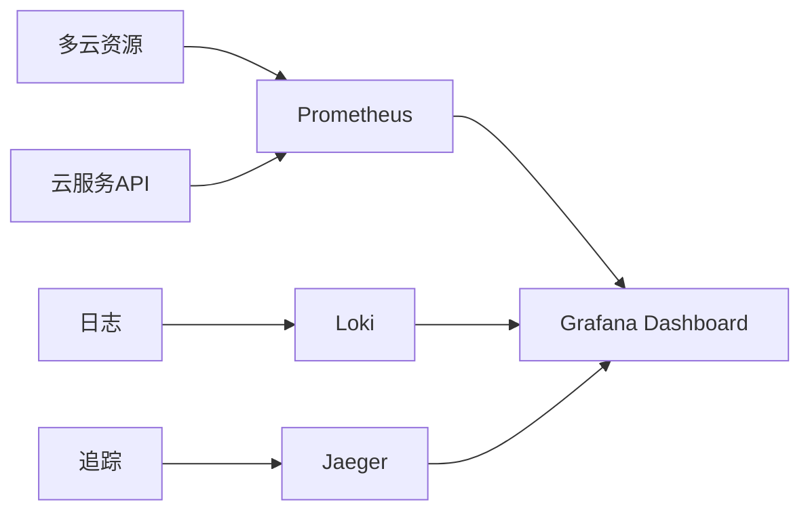

## 前言

随着企业数字化转型的深入，**多云战略**已成为IT基础设施的主流选择。当AWS、Azure、GCP等公有云与本地数据中心并存时，如何实现跨云环境的统一管理、成本优化和安全合规，成为DevOps团队面临的核心挑战。本文将深入探讨多云环境下的DevOps最佳实践，帮助构建真正云原生的交付体系。

::: tip
多云不是简单地将工作负载分散到不同云平台，而是通过统一策略实现资源的最优配置与风险的最小化。
:::

## 多云管理的核心挑战

### 1. 资源碎片化
不同云平台的API、服务模型和部署方式存在显著差异：
```yaml
# 示例：多云资源管理复杂性
AWS:   EC2 → ASG → ELB
Azure: VMSS → LB → Traffic Manager
GCP:   GCE → MIG → Global Load Balancer
```

### 2. 成本失控
跨云资源使用缺乏统一视图，导致：
- 资源闲置浪费
- 跨云数据传输成本激增
- 优惠折扣无法充分利用

### 3. 安全合规困境
- 策略难以统一实施
- 审计轨迹断裂
- 身份管理复杂度倍增

## 多云DevOps实践框架

### 🏗️ 基础设施即代码（IaC）的多云适配

使用抽象层实现跨云统一部署：
```hcl
# 示例：使用Crossplane统一多云资源
apiVersion: infrastructure.cluster.x-k8s.io/v1alpha3
kind: AWSCluster
metadata:
  name: multi-cluster
spec:
  region: us-east-1
---
apiVersion: infrastructure.cluster.x-k8s.io/v1alpha3
kind: AzureCluster
metadata:
  name: multi-cluster
spec:
  location: eastus
```

**关键工具**：
- **Crossplane**：Kubernetes原生多云控制平面
- **Terraform Provider**：多云资源统一管理
- **Pulumi**：编程式多云基础设施

### 💰 多云成本优化策略

#### FinOps在多云环境的应用
1. **统一成本监控**
```yaml
# 示例：多云成本分析工具集成
tools:
  - AWS Cost Explorer
  - Azure Cost Management
  - GCP Cost Analyzer
  - 第三方: CloudHealth, Apptio
```

2. **智能资源调度**
- 基于成本标签的自动伸缩
- 跨云工作负载迁移优化
- Spot实例与预留实例混合策略

### 🔒 多云安全合规体系

#### 策略即代码（PaC）实践
```python
# 示例：使用Open Policy Agent统一多云策略
package aws.restrictive

deny[msg] {
    input.type == "aws_s3_bucket"
    not input.bucket["encryption"]["enabled"]
    msg := "S3 bucket encryption is required"
}

deny[msg] {
    input.type == "azure_virtual_machine"
    not input.os_disk.caching
    msg := "Azure VM OS disk caching must be configured"
}
```

#### 关键措施：
- **统一身份认证**：使用AWS SSO + Azure AD集成
- **网络分段**：通过SD-WAN实现跨云网络隔离
- **合规自动化**：使用Compliance as Code工具（如OpenSCAP）

## 多云可观测性架构

### 1. 统一监控视图


### 2. 核心工具链
- **监控**：Prometheus + Thanos（跨云数据联邦）
- **日志**：Loki + Fluentd（多云日志收集）
- **追踪**：Jaeger + OpenTelemetry（分布式追踪）

## 实战案例：金融级多云DevOps

### 背景
某跨国银行需要同时满足：
- 欧盟GDPR合规
- 美国PCI DSS要求
- 全球低延迟访问

### 解决方案
1. **多云架构设计**
```
┌─────────────┐    ┌─────────────┐    ┌─────────────┐
│  AWS (EU)   │    │ Azure (US)  │    │  GCP (AP)   │
│   GDPR      │    │  PCI DSS    │    │   低延迟    │
└─────────────┘    └─────────────┘    └─────────────┘
       │                  │                  │
       └──────────────────┼──────────────────┘
                           │
                    ┌─────────────┐
                    │  统一控制平面│
                    │   Crossplane│
                    └─────────────┘
```

2. **关键成果**
- 资源利用率提升42%
- 合规审计时间缩短70%
- 跨云故障恢复时间<5分钟

## 结语

多云环境下的DevOps实践不是简单技术的堆砌，而是需要**战略思维**与**工程能力**的结合。通过统一的管理框架、智能的成本控制和严格的安全合规体系，企业才能在多云时代构建真正弹性的数字基础设施。未来，随着AI/ML在多云管理中的深度应用，DevOps团队将迎来更智能化的运维新纪元。

> 多云不是终点，而是企业数字化转型的必经之路。真正的价值在于通过统一策略实现资源的最优配置，而非简单追求技术多样性。

---

**思考题**：您的团队在多云管理中遇到的最大挑战是什么？欢迎在评论区分享您的实践经验！