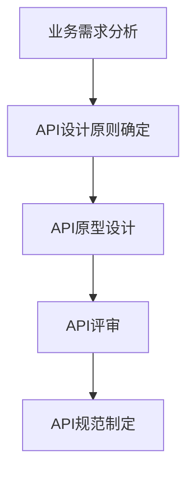
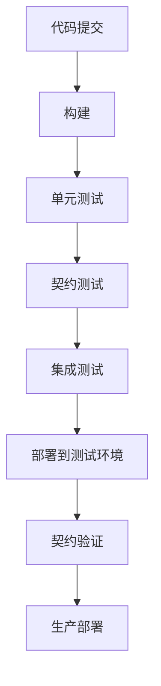
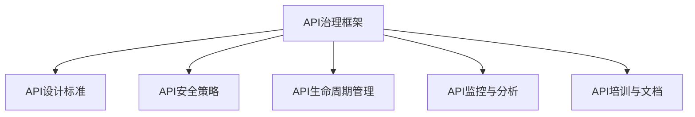

## 前言

在微服务架构盛行的今天，API已成为系统间通信的**核心桥梁**。作为一名在DevOps领域摸爬滚打多年的实践者，我深刻体会到，随着服务数量的爆炸式增长，如何有效管理API、确保服务间的契约一致性，已成为DevOps流程中不可或缺的一环。~~还记得几年前，我们团队因为API版本管理混乱导致的线上故障，那场面真是"惨不忍睹"啊~~。

本文将深入探讨DevOps中的API管理与服务契约实践，分享如何将API生命周期管理无缝集成到DevOps流水线中，构建可靠、高效的微服务通信体系。

## API管理的重要性

### 为什么API管理如此关键？

在微服务架构中，API就像是服务的"公共接口"，定义了服务如何与其他服务或客户端交互。没有良好的API管理，我们可能会面临以下问题：

- **API版本失控**：随着业务需求变化，API不断迭代，但缺乏版本管理机制，导致客户端调用混乱
- **文档缺失或不一致**：开发者难以获取准确的API信息，增加沟通成本
- **安全漏洞**：未经充分测试的API可能成为安全风险的入口
- **性能瓶颈**：未经验证的API可能导致系统性能问题

### API管理在DevOps中的定位

在DevOps文化中，API管理不应是独立的"孤岛"，而应与CI/CD流程紧密集成。理想情况下，API管理应该：

- 与代码库协同工作
- 在部署前自动验证API契约
- 提供实时监控和告警
- 支持自动化测试和文档生成

## API生命周期管理

### API设计阶段

API设计是整个生命周期的基础。在这一阶段，我们需要：



**最佳实践**：
- 遵循RESTful或GraphQL等标准设计模式
- 使用OpenAPI或Swagger规范进行定义
- 建立API设计评审流程，确保设计质量

### API实现阶段

在实现阶段，我们需要将API设计转化为实际代码：

::: tip
使用代码生成工具（如OpenAPI Generator）根据API规范自动生成客户端和服务器端代码，可以大大提高开发效率并减少人为错误。
:::

**关键活动**：
- 根据API规范实现端点
- 编写API单元测试和集成测试
- 实现API文档自动生成
- 设置API安全控制（认证、授权、限流等）

### API测试阶段

API测试是确保API质量和可靠性的关键环节：


**测试策略**：
- **契约测试**：验证API实现是否符合契约定义
- **契约回归测试**：确保API变更不会破坏现有客户端
- **性能测试**：验证API在高负载下的表现
- **安全测试**：检测潜在的安全漏洞

### API发布阶段

API发布需要谨慎管理，特别是对于生产环境：

::: theorem
API发布应该遵循"蓝绿部署"或"金丝雀发布"策略，确保新版本API的平稳过渡，降低对现有客户端的影响。
:::

**发布流程**：
- API文档同步更新
- 发布通知机制
- 版本兼容性声明
- 回滚计划准备

### API监控与维护

API发布后，持续的监控和维护至关重要：

**监控指标**：
- API调用频率和响应时间
- 错误率和异常情况
- 客户端使用情况分析
- 安全事件检测

**维护活动**：
- 定期审查API使用情况
- 废弃不常用API
- 优化性能瓶颈
- 更新文档和示例

## 服务契约测试

### 什么是服务契约测试？

服务契约测试是一种测试方法，验证服务实现是否符合其契约（通常以API规范的形式定义）。与传统的集成测试不同，契约测试关注的是服务间的接口约定，而不是具体实现。

::: tip
服务契约测试就像是服务间的"法律合同"，确保每个服务都遵守约定的接口规范，而不需要知道对方的具体实现细节。
:::

### 契约测试工具与框架

目前流行的契约测试工具包括：

- **Pact**：支持多种语言，提供强大的契约测试功能
- **Spring Cloud Contract**：专为Spring生态系统设计
- **Consumer-Driven Contracts (CDC)**：由消费者驱动的契约测试方法
- **OpenAPI验证工具**：如Spectral、Dredd等

### 契约测试在CI/CD中的集成

契约测试应该无缝集成到CI/CD流水线中：



**最佳实践**：
- 在每次代码提交时运行契约测试
- 在部署前验证服务是否符合最新契约
- 定期运行契约回归测试，确保向后兼容性

## API文档管理

### 自动化文档生成

良好的API文档是API成功的关键。现代API管理工具支持从代码或规范自动生成文档：

**文档内容应包括**：
- API概述和使用场景
- 端点详细说明
- 请求和响应示例
- 认证和授权说明
- 错误代码和处理方法

### 文档即代码

将API文档作为代码的一部分进行管理：

```markdown
# API文档示例

## 用户管理API

### 创建用户
**POST** `/api/v1/users`

**请求体**:
```json
{
  "username": "string",
  "email": "string",
  "password": "string"
}
```

**响应**:
```json
{
  "id": "uuid",
  "username": "string",
  "email": "string",
  "created_at": "timestamp"
}
```
```

### 文档版本控制

API文档应与API代码一起进行版本控制：

- 使用语义化版本控制（如v1, v2等）
- 明确标记废弃的API和替代方案
- 提供迁移指南和兼容性说明

## API安全与治理

### API安全最佳实践

API安全是DevOps流程中不可忽视的一环：

**安全措施**：
- 强制HTTPS
- 实施OAuth 2.0或JWT认证
- 设置API速率限制
- 实施请求签名验证
- 敏感数据加密

### API策略管理

API策略管理确保API使用符合组织规范：

**策略类型**：
- 访问控制策略
- 使用限制策略
- 监控和日志策略
- 合规性策略

### API治理框架

建立全面的API治理框架：



## 实施建议

### 逐步实施API管理

对于刚开始实施API管理的团队，建议采取渐进式方法：

1. **识别关键API**：首先识别系统中最重要的API
2. **建立基础规范**：定义API设计标准和文档要求
3. **集成工具链**：选择合适的API管理工具并集成到CI/CD流程
4. **培训团队**：确保团队成员了解API管理最佳实践
5. **持续改进**：根据反馈不断优化API管理流程

### 工具选择建议

选择API管理工具时，应考虑以下因素：

- **与现有工具链的集成能力**
- **支持的API标准和协议**
- **自动化测试能力**
- **监控和分析功能**
- **可扩展性和成本**

### 团队协作模式

API管理需要跨团队协作：

- **API产品经理**：负责API战略和规划
- **API开发团队**：负责API实现和测试
- **API运营团队**：负责监控和维护
- **API消费者团队**：提供反馈和使用指导

## 结语

API管理与服务契约是现代DevOps实践中的**核心组件**，它们确保了微服务架构中系统间通信的可靠性、一致性和安全性。通过将API生命周期管理无缝集成到DevOps流程中，我们可以构建更加健壮、高效的软件系统。

🤔 **思考一下**：你的团队是否已经建立了完善的API管理体系？如果没有，从哪个方面开始改进会带来最大的价值？

> API管理不是一次性的项目，而是一个持续演进的过程。随着业务的发展和技术的进步，我们的API策略也需要不断调整和优化。记住，良好的API管理最终将带来更好的用户体验和更高的开发效率。

---

希望这篇文章能为你的DevOps实践提供有价值的参考。如果你有任何问题或建议，欢迎在评论区分享你的经验！🚀