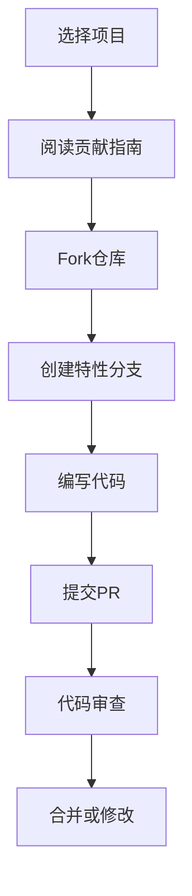

## 前言

在当今的DevOps实践中，开源软件已成为构建现代应用系统的基石。从容器编排到基础设施即代码，从CI/CD工具到监控解决方案，开源无处不在。然而，随着开源组件的广泛采用，我们面临着一个严峻的挑战：如何在享受开源带来便利的同时，确保软件供应链的安全与合规？

> "开源不是免费的午餐，而是需要精心维护的生态系统。"

本文将深入探讨DevOps环境下的开源治理与贡献策略，帮助团队构建既安全又可持续的开源生态。

## 开源治理的重要性

### 开源组件的普及与风险

根据调查，超过90%的现代软件包含开源组件。然而，开源组件也带来了诸多风险：

- **安全漏洞**：Heartbleed、Log4j等事件表明，开源组件可能存在严重的安全漏洞
- **许可证合规**：不同开源许可证（MIT、Apache、GPL等）有不同的使用限制
- **供应链攻击**：通过恶意代码注入开源组件进行攻击
- **维护依赖**：开源项目可能停止维护，带来长期风险

### 开源治理框架

有效的开源治理应包含以下关键组件：

::: theorem 开源治理四要素
1. **组件清单管理**：全面了解项目中使用的所有开源组件
2. **安全漏洞监控**：实时跟踪组件的安全更新和漏洞信息
3. **许可证合规检查**：确保组件使用符合组织政策
4. **贡献策略**：明确如何向开源项目贡献代码和反馈
:::

## 开源治理实践

### 1. 建立组件清单

使用软件物料清单(SBOM)是现代开源治理的第一步：

```bash
# 使用Trivy生成SBOM
trivy sbom --format cyclonedx your-image:latest > sbom.json
```

SBOM应包含以下信息：
- 组件名称和版本
- 组件来源（直接依赖或传递依赖）
- 许可证类型
- 已知漏洞信息

### 2. 漏洞扫描与监控

实施持续的漏洞扫描流程：

- **CI/CD集成**：在构建过程中自动扫描组件漏洞
- **依赖更新**：定期更新依赖以修复已知漏洞
- **监控服务**：订阅CVE服务，获取实时漏洞通知

```yaml
# GitHub Actions中的漏洞扫描示例
- name: Run Trivy vulnerability scanner
  uses: aquasecurity/trivy-action@master
  with:
    scan-type: 'fs'
    scan-ref: '.'
    format: 'sarif'
    output: 'trivy-results.sarif'
```

### 3. 许可证合规管理

不同许可证有不同的使用限制，常见的许可证类型包括：

| 许可证类型 | 描述 | 适用场景 |
|------------|------|----------|
| MIT | 宽松，允许商业使用 | 大多数开源项目 |
| Apache 2.0 | 类似MIT，但包含专利授权 | 企业级开源项目 |
| GPL | 要求衍生作品也开源 | 共享精神强的项目 |
| BSD | 类似MIT，但包含条款限制 | 系统软件 |

许可证管理工具：
- **FOSSA**：自动检测许可证并生成合规报告
- **WhiteSource**：企业级许可证管理平台
- **ScanCode**：开源许可证扫描工具

## 开源贡献策略

### 为什么应该贡献开源？

开源贡献不仅是对社区的回馈，还能带来诸多好处：

- **提升技术影响力**：通过贡献知名项目建立个人和团队声誉
- **获得前沿技术**：直接参与项目开发，了解最新技术趋势
- **问题解决**：遇到问题时可以更快速地获得支持
- **人才培养**：团队成员通过贡献提升技能

### 如何有效贡献开源

#### 1. 从小处着手

- **报告问题**：发现bug时提交详细的issue
- **文档改进**：修正文档错误或添加示例
- **翻译**：为项目提供多语言支持

#### 2. 代码贡献流程



#### 3. 高级贡献方式

- **维护者角色**：成为项目核心维护者
- **社区活动**：组织或参与meetup、conf
- **技术演讲**：分享项目使用经验
- **教育贡献**：编写教程、视频课程

## DevOps中的开源治理工具链

### 综合治理平台

| 工具名称 | 特点 | 适用场景 |
|----------|------|----------|
| Snyk | 集成CI/CD，实时漏洞检测 | 开发安全左移 |
| Mend | 全面的软件供应链安全 | 企业级治理 |
| Black Duck | 强大的组件分析 | 大型复杂项目 |
| FOSSA | 自动化许可证管理 | 合规要求高的组织 |

### 开源治理流程集成

```yaml
# GitHub Actions中的开源治理工作流
name: Open Source Governance
on: [push, pull_request]

jobs:
  sbom:
    runs-on: ubuntu-latest
    steps:
      - uses: actions/checkout@v2
      - name: Generate SBOM
        uses:anchore/sbom-action@v0
      - name: Upload SBOM
        uses: actions/upload-artifact@v2
        with:
          name: sbom
          path: sbom.json
  
  vulnerability-scan:
    runs-on: ubuntu-latest
    steps:
      - uses: actions/checkout@v2
      - name: Run vulnerability scan
        uses: securecodewarrior/github-action-add-sarif@v1
        with:
          sarif-file: 'snyk.sarif'
  
  license-check:
    runs-on: ubuntu-latest
    steps:
      - uses: actions/checkout@v2
      - name: Check licenses
        uses: jneen/ghast-action@v1
        with:
          config: .github/license-check.yml
```

## 开源治理案例研究

### 案例1：金融行业的开源治理

某全球金融机构实施了以下开源治理策略：

1. **建立开源委员会**：由安全、法务、技术专家组成
2. **分类管理**：将开源组件分为"允许使用"、"需审批"和"禁止使用"三类
3. **自动化扫描**：在CI/CD流程中集成Snyk和FOSSA
4. **定期审计**：每季度进行一次全面的合规审计

结果：组件使用合规性提升95%，安全漏洞发现时间平均缩短70%。

### 案例2：初创公司的开源贡献策略

一家SaaS初创公司通过以下策略建立开源影响力：

1. **内部开源项目**：将内部工具开源，吸引社区贡献
2. **有目标贡献**：选择与业务相关的知名项目进行贡献
3. **贡献激励机制**：将开源贡献纳入绩效评估
4. **技术博客分享**：定期分享开源项目使用和贡献经验

结果：品牌知名度提升，人才吸引力增强，社区反馈加速产品迭代。

## 结语

开源治理与贡献已成为现代DevOps实践不可或缺的一部分。有效的开源治理不仅能降低安全风险，确保合规性，还能通过社区贡献提升技术能力和影响力。

在数字化转型的浪潮中，组织需要将开源治理视为战略重点，而不仅仅是技术问题。通过建立完善的治理框架、集成自动化工具链、培养开源文化，组织可以在享受开源带来便利的同时，构建安全、可持续的开源生态。

正如Linux基金会所言："开源不是选择，而是现实。"拥抱开源，治理开源，贡献开源，这将是DevOps团队在未来竞争中的关键能力。

> "开源不仅仅是使用代码，更是参与创造。每一个贡献，无论大小，都在塑造我们共同的技术未来。"