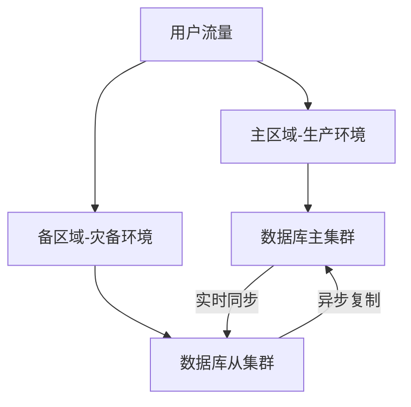
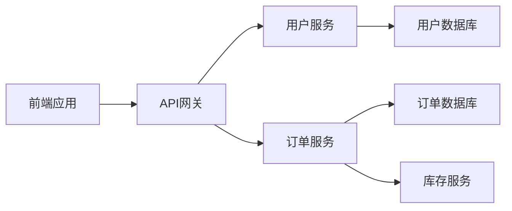

## 前言

在数字化转型浪潮中，企业对系统可用性的要求达到了前所未有的高度。上周我参与的一个项目中，客户的生产环境因一次意外的云服务商区域性故障导致服务中断长达4小时，直接造成了数十万美元的业务损失。🤯 这个案例让我深刻意识到，虽然我们专注于自动化部署和快速迭代，但往往忽略了最关键的"保命"能力——灾难恢复与业务连续性。

> "在DevOps实践中，我们常常沉迷于构建新功能，却忘了为系统装上安全带。" —— 这句话是我最近参加云原生大会时听到最扎心的一句话。

本文将深入探讨如何在DevOps体系中构建全面的灾难恢复与业务连续性方案，让我们的系统不仅跑得快，更能扛得住。

## 灾难恢复与业务连续性的核心概念

### 理解关键指标

在开始设计之前，我们需要明确两个核心概念：

- **恢复时间目标(RTO)**：系统中断后可接受的最长恢复时间
- **恢复点目标(RPO)**：系统可接受的最大数据丢失量

::: theorem
RTO和RPO是灾难恢复方案设计的基石，它们直接决定了技术实现复杂度和成本投入。例如，金融系统可能要求RTO<15分钟且RPO=0，而电商促销活动可能接受RTO<2小时且RPO<5分钟。
:::

### DevOps视角下的DR/BC

传统灾难恢复往往被视为运维的"后厨工作"，但在DevOps体系中，它应该是：

1. **开发团队的共同责任**：架构设计阶段就需考虑容灾能力
2. **自动化流程的核心组成部分**：通过自动化工具实现快速切换
3. **持续测试的必备环节**：定期进行故障演练验证恢复能力

## DevOps环境下的灾难恢复架构设计

### 多活架构模式

现代云原生环境中最常见的容灾架构包括：

- **双活数据中心**：两个数据中心同时处理业务流量
- **多区域部署**：跨多个地理区域部署服务实例
- **云服务商多区域**：利用AWS/Azure/GCP的多区域能力



### 数据一致性保障

数据同步是灾备架构的核心挑战，常见方案包括：

1. **同步复制**：零数据丢失但影响性能
2. **异步复制**：高性能但有数据丢失风险
3. **半同步复制**：折中方案，部分数据同步确认

::: tip
在金融场景中，我们采用"关键数据同步+非关键数据异步"的混合模式，在保证数据安全的同时维持系统性能。
:::

## 实践：自动化灾难恢复流程

### 基础设施即代码的灾备管理

使用IaC工具管理灾备环境配置示例：

```hcl
# terraform/DR/main.tf
resource "aws_route53_record" "failover" {
  zone_id = var.zone_id
  name    = var.app_domain
  type    = "A"
  
  # 主记录
  failover_routing_policy {
    type = "PRIMARY"
  }
  
  # 健康检查指向主环境
  health_check_id = aws_route53_health_check.primary.id
}
```

### 自动化故障检测与切换

通过Prometheus+Grafana构建故障检测系统：

```yaml
# prometheus-alerts.yml
groups:
- name: DR_Alerts
  rules:
  - alert: PrimaryRegionDown
    expr: up{job="primary-region"} == 0
    for: 2m
    labels:
      severity: critical
    annotations:
      summary: "Primary region down"
      description: "Primary region {{ $labels.instance }} has been down for more than 2 minutes"
```

### 故障演练自动化

使用Chaos Mesh进行定期故障演练：

```yaml
# chaos-mesh/chaos.yaml
apiVersion: chaos-mesh.org/v1alpha1
kind: NetworkChaos
metadata:
  name: network-latency
spec:
  action: delay
  delay: "100ms"
  duration: "10m"
  selector:
    labelSelectors:
      app: payment-service
  mode: one
```

## 业务连续性管理实践

### 依赖关系映射

构建应用依赖关系图：



通过依赖关系图识别关键路径，为不同服务设置不同的RTO/RPO。

### 降级策略设计

实现服务优雅降级的关键代码示例：

```java
// Spring Boot降级实现
@HystrixCommand(fallbackMethod = "fallbackOrder")
public Order createOrder(OrderRequest request) {
    // 正常业务逻辑
    return orderService.create(request);
}

public Order fallbackOrder(OrderRequest request) {
    // 降级逻辑：创建简单订单记录
    return new Order(request.getUserId(), "SIMPLE_ORDER", 0.0);
}
```

### 通信容错机制

使用服务网格实现服务间通信容错：

```yaml
# Istio VirtualService
apiVersion: networking.istio.io/v1alpha3
kind: VirtualService
metadata:
  name: payment-service-vs
spec:
  hosts:
  - payment-service
  http:
  - route:
    - destination:
        host: payment-service
      weight: 80
    - destination:
        host: payment-service-backup
      weight: 20
```

## 持续改进与度量

### 关键性能指标

建立DR/BC能力度量体系：

| 指标名称 | 计算方式 | 目标值 |
|---------|---------|-------|
| 故障恢复时间 | 从故障发生到恢复服务的时间 | < RTO |
| 数据丢失量 | 故障期间丢失的数据量 | < RPO |
| 故障演练频率 | 每月演练次数 | ≥ 2次 |
| 演练成功率 | 成功演练次数/总演练次数 | > 90% |

### 持续优化流程

1. **每次故障后进行复盘**：记录故障根因和改进措施
2. **定期更新RTO/RPO**：根据业务变化调整目标
3. **架构评审纳入DR检查**：每次架构变更评估容灾影响

## 结语

在DevOps实践中，灾难恢复与业务连续性不是"可有可无"的附加项，而是保障业务存续的生命线。🛡️ 通过将容灾能力融入开发流程、自动化故障检测与恢复、定期演练验证，我们才能真正构建起弹性业务体系。

正如我常对团队说的："代码可以重写，但丢失的用户信任无法挽回。" 希望每位DevOps实践者都能将DR/BC作为核心能力来建设，让我们的系统在风雨中依然屹立不倒。

> "真正的技术卓越不仅体现在构建新功能的能力，更体现在保护已有成果的智慧。" —— 这才是DevOps的终极追求。